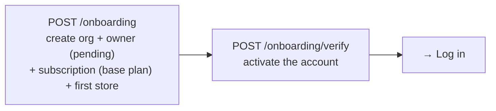
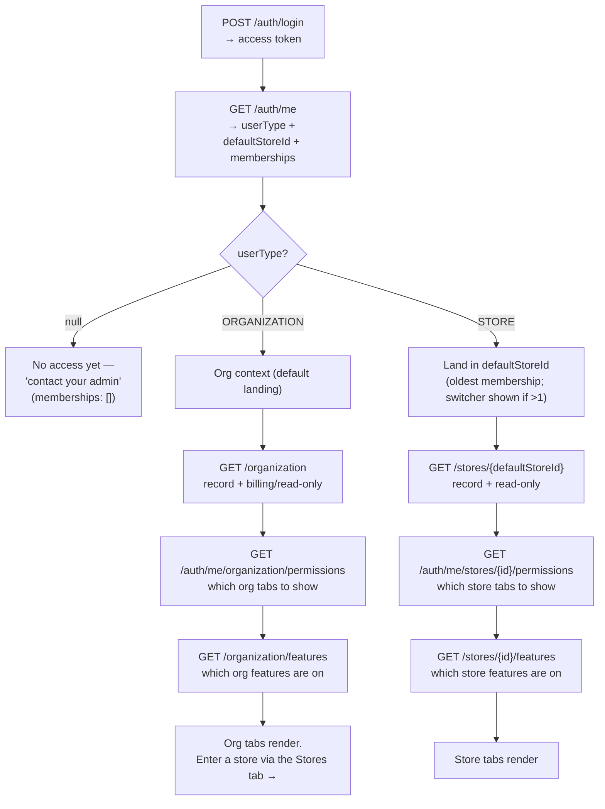
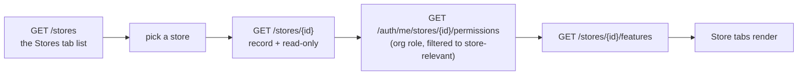
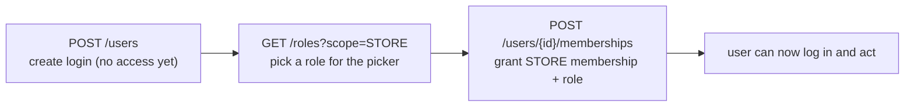
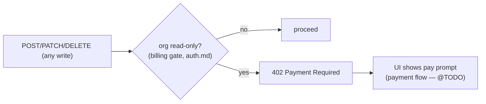
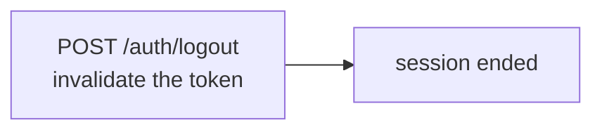

# TODO — Not Yet Specified

The structural work (auth, org, store, RBAC, billing reads) is specified below. These areas are
**operational CRUD, still to spec** — deferred so the designed parts can be reviewed and coded first:

| Area | Owner | Tables | Notes |
|---|---|---|---|
| Suppliers | Organization | `supplier` | Plain org CRUD. |
| Purchases | Organization | `purchase_order`, `purchase_order_product` | Status lifecycle + optional store attribution. |
| Expenses | Organization | `expense` | Optional store attribution. |
| Products | Stores | `store_product`, `product` | Dual-write sharing (per-store stock/price + org catalog). |
| Customers | Stores | `store_customer`, `customer` | Dual-write sharing (always shared org-wide). |
| Sales & Returns | Stores | `sales_order(+_product)`, `sales_order_return(+_product)` | Core money path: totals breakdown, status enums, refund flow. |

Also deferred (needs the payment/Stripe flow): change plan, add/remove add-ons, cancel subscription,
invoices, payment method — stubbed under *Organization → Plans, Add-ons & Features*.

# Summary

Every endpoint at a glance. Detail (headers, bodies, errors) is in each section below.

| Endpoint | Description | Scope |
|---|---|---|
| `GET /plans` | List the available base plans for the signup page. | public |
| `GET /addons` | List the available add-ons (stackable extras). | public |
| `POST /onboarding` | Create a tenant — org, owner (pending), subscription, first store. | public |
| `POST /onboarding/verify` | Verify the owner's email and activate the account. | public |
| `POST /auth/login` | Exchange email + password for an access token. | public |
| `GET /auth/me` | The current user and their memberships (self read). | any authenticated |
| `GET /auth/me/organization/memberships` | The caller's org membership + the roles they hold. | ORGANIZATION |
| `GET /auth/me/organization/permissions` | The caller's permissions in the org. | ORGANIZATION |
| `GET /auth/me/stores/{storeId}/memberships` | The caller's membership + roles at this store. | STORE |
| `GET /auth/me/stores/{storeId}/permissions` | The caller's permissions in this store. | STORE |
| `POST /auth/logout` | End the session and invalidate the token. | any authenticated |
| `GET /organization` | The org record + its billing state. | ORGANIZATION |
| `GET /organization/features` | The org-scoped features the org's offerings enable. | ORGANIZATION |
| `POST /users` | Create a user (login only, no membership). | ORGANIZATION |
| `GET /users` | List the org's users (identity only). | ORGANIZATION |
| `GET /users/{userId}` | One user's record + full memberships (admin detail). | ORGANIZATION |
| `PATCH /users/{userId}` | Update a user's profile (name, phone). | ORGANIZATION |
| `POST /users/{userId}/deactivate` | Turn a user account off (kill switch). | ORGANIZATION |
| `POST /users/{userId}/activate` | Turn a user account back on. | ORGANIZATION |
| `POST /users/{userId}/memberships` | Grant a membership + role. | ORGANIZATION |
| `DELETE /users/{userId}/memberships/{membershipId}` | Remove a membership entirely. | ORGANIZATION |
| `POST /users/{userId}/memberships/{membershipId}/deactivate` | Suspend a membership (org route, any membership). | ORGANIZATION |
| `POST /users/{userId}/memberships/{membershipId}/activate` | Restore a membership (org route). | ORGANIZATION |
| `GET /roles` | List assignable roles for the picker (`?scope=` filter). | ORGANIZATION |
| `GET /roles/{roleId}` | One role + the permissions it grants. | ORGANIZATION |
| `GET /permissions` | List the permission catalog (resource, action, elevated). | ORGANIZATION |
| `GET /stores` | List the org's stores (roster). | ORGANIZATION |
| `POST /stores` | Create a store (raises the per-store bill). | ORGANIZATION |
| `PATCH /stores/{storeId}` | Update a store's details. | ORGANIZATION |
| `DELETE /stores/{storeId}` | Soft-delete a store (not the default). | ORGANIZATION |
| `GET /stores/{storeId}` | One store's full record + read-only flag. | STORE |
| `GET /stores/{storeId}/features` | The store-scoped features the org's offerings enable. | STORE |
| `GET /stores/{storeId}/users` | The store's staff roster. | STORE |
| `POST /stores/{storeId}/users/{userId}/memberships/{membershipId}/deactivate` | Suspend a membership at this store (store route). | STORE |
| `POST /stores/{storeId}/users/{userId}/memberships/{membershipId}/activate` | Restore a membership at this store (store route). | STORE |

# Sections

The API is organized by **who owns the resource**. Four top-level sections; everything else nests under
the owner it belongs to.

| # | Section | Contains |
|---|---|---|
| 1 | **Onboarding** | Public signup — create tenant (base plan auto-assigned), verify email. Runs before auth. |
| 2 | **Auth** | The way in — login, the current-user (self) read, logout. |
| 3 | **Organization** | Org-owned (the tenant): the org itself, Users & Access, **managing the store set** (create/list/edit/delete stores), Suppliers, Purchases, Expenses, Plans, Add-ons & Features. |
| 4 | **Stores** | Acting *within* a single store (`/stores/{storeId}/...`): the store record, its staff roster, Products, Customers, Sales & Returns. |

Within a section, each area is a sub-section and each endpoint sits under it. A resource lives under the
section that **owns the action** (see `overview.md`) — e.g. products are store-owned selling data, so
they're under *Stores*; users and *managing stores* are org administration, so they're under
*Organization*. The split is: **the org manages the store set; a store is where selling happens.**

# Flows

How the endpoints connect in the real client journeys. Each flow is the ordered chain of calls, with a
diagram of how they branch.

## Sign up (new tenant)

Public, pre-auth. Create the tenant, verify the email — then the owner can log in. There's one base plan
today, so nothing to pick: the backend assigns it. (When multiple plans exist, a `GET /plans` step is
added here to choose one.)



## Log in & bootstrap

Get a token, read the self record, then branch on **user type** to load the right context. This is the
core branch of the whole app.



## Org admin enters a store

An org user has org reach but no store membership; they enter a store from the **Stores** tab, then load
that store's context (same three store reads a store user makes).



## Add an employee

Identity and access are separate calls: create the login, then place them with a role.



## Hitting a write while read-only (unpaid)

Any write when the org is overdue is refused server-side, regardless of the UI hint.



## Log out



---

## Onboarding

Onboarding is signup — it runs *before* auth and creates a whole tenant from nothing (org, owner, plan,
first store). All onboarding endpoints are **public** (no token; the user doesn't exist yet), so they're
a prime abuse target: rate-limit them, protect with a captcha, and gate account use behind email
verification. The owner account is created **pending** and cannot log in until verified.

### `GET /plans` — List base plans

- **Description:** Lists the available **base plans** (`offering.type = 'PLAN'`). There's one today, so
  signup doesn't call this (the backend auto-assigns it); it exists for the change-plan screen and for
  when multiple plans are offered. Add-ons are a separate catalog (`GET /addons`).
- **Security:** public and read-only, so low risk.
  - Rate-limit by IP.
  - Cache the response (offerings rarely change).
- **Method:** `GET`
- **URL:** `/plans`
- **Scope:** _(public — no token required)_
- **Permission:** _(none)_
- **Request Headers:** _(none)_
- **Request Body:** _(none)_
- **Response Status:** `200 OK`
- **Response Body:**

  ```json
  [
    {
      "offeringId": "off_pro",
      "name": "Pro",
      "description": "For growing chains",
      "pricePerStore": 150.00
    }
  ]
  ```

- **Errors:** _(none — public)_


### `GET /addons` — List add-ons

- **Description:** Lists the available **add-ons** (`offering.type = 'ADDON'`) — the stackable extras an
  org can turn on top of its base plan. Same shape as `GET /plans`; backs the in-app add-ons screen.
- **Security:** public and read-only, so low risk.
  - Rate-limit by IP.
  - Cache the response (offerings rarely change).
- **Method:** `GET`
- **URL:** `/addons`
- **Scope:** _(public — no token required)_
- **Permission:** _(none)_
- **Request Headers:** _(none)_
- **Request Body:** _(none)_
- **Response Status:** `200 OK`
- **Response Body:**

  ```json
  [
    {
      "offeringId": "off_marketing",
      "name": "Marketing",
      "description": "Email & SMS campaigns",
      "pricePerStore": 30.00
    }
  ]
  ```

- **Errors:** _(none — public)_


### `POST /onboarding` — Sign up - @TODO: investigate

- **Description:** Creates a new tenant in one transaction — the organization, its owner (pending email
  verification), a **subscription** to the base plan, and a first store. The base plan isn't chosen by the
  client: there's only one `PLAN` offering today, so the backend assigns it automatically (status
  `TRIALING`). Add-ons aren't picked here either — they're turned on later from the in-app add-ons screen.
  Sends a verification email and returns no token.
  > When more than one base plan exists, add a `offeringId` (a `type=PLAN` offering) to the request body
  > and validate it; until then the single plan is implicit.
- **Security:** public **and** it writes data, so this is the main abuse target. Layer these:
  - **Email verification** — the account is created *pending* and inert until verified; a background job hard-deletes unverified signups after ~24–48h.
  - **Rate-limit by IP and by email** — caps volume and prevents email-bombing a victim.
  - **CAPTCHA** — an invisible challenge (e.g. Cloudflare Turnstile / reCAPTCHA v3) to block bots.
  - **Block disposable-email domains** — reject known throwaway providers.
  - **WAF at the edge** — Cloudflare / AWS WAF for bot fingerprinting and DDoS mitigation.
  - **(Optional, strongest)** require a valid card up front — for a B2B money app this nearly eliminates spam.
  - **Honeypot field** — a hidden form field real users never fill; if filled, drop as a bot.
- **Method:** `POST`
- **URL:** `/onboarding`
- **Scope:** _(public — no token required)_
- **Permission:** _(none)_
- **Request Headers:**
  - `Content-Type: application/json`
- **Request Body:**

  ```json
  {
    "organizationName": "Acme Inc",
    "owner": {
      "email": "maria@acme.com",
      "password": "••••••••",
      "name": "Maria"
    },
    "store": {
      "name": "Downtown",
      "type": "PHYSICAL"
    }
  }
  ```

- **Response Status:** `201 Created`
- **Response Body:**

  ```json
  {
    "organizationId": "a3f9...",
    "message": "Check your email to verify your account before logging in."
  }
  ```

- **Errors:**
  - `400` — missing/invalid fields (e.g. weak password)
  - `409` — the email is already registered
  - `429` — too many attempts (rate-limited)

### `POST /onboarding/verify` — Verify email

- **Description:** Confirms the owner's email using the token from the verification email, activating the
  account.
- **Security:** public, so protect against token-guessing.
  - **Single-use, expiring tokens** — high-entropy, invalidated after first use, short lifetime.
  - **Rate-limit by IP** — stops brute-forcing verification tokens.
- **Method:** `POST`
- **URL:** `/onboarding/verify`
- **Scope:** _(public — no token required)_
- **Permission:** _(none)_
- **Request Headers:**
  - `Content-Type: application/json`
- **Request Body:**

  ```json
  {
    "token": "verify_abc123..."
  }
  ```

- **Response Status:** `200 OK`
- **Response Body:** _(none)_
- **Errors:**
  - `400` — token missing, invalid, or expired

---

## Auth

Auth endpoints are the way in, so they don't follow the usual scope/permission model — `login` is public
(you have no token yet), and `logout` only needs a valid token (any authenticated user)

### `POST /auth/login` — Login

- **Description:** Exchanges an email and password for an access token.
- **Method:** `POST`
- **URL:** `/auth/login`
- **Scope:** _(public — no token required)_
- **Permission:** _(none)_
- **Request Headers:**
  - `Content-Type: application/json`
- **Request Body:**

  ```json
  {
    "email": "maria@acme.com",
    "password": "••••••••"
  }
  ```
- **Response Status:** `200 OK`
- **Response Body:**

  ```json
  {
    "accessToken": "eyJhbGciOi...", //carries `userId` + `organizationId`
    "expiresIn": 900 //in seconds ?? TODO: maybe utc?
  }
  ```

- **Errors:**
  - `400` — missing email or password
  - `401` — invalid credentials (same response whether the email is unknown or the password is wrong)
  - `403` — the account is disabled (`user.is_active = false`)
  - `429` — too many attempts (rate-limited / locked out)

### `GET /auth/me` — Get current user

- **Description:** Returns the logged-in user and the memberships that decide where they land, as
  lightweight entries (type, id, name, role), without permissions. This is the **self** read (the
  singleton user tied to the token) — the caller sees their *own* memberships, needs no permission, and
  always may. The response carries a top-level **`userType`** (`"ORGANIZATION"` / `"STORE"` / `null`) so
  the client branches on one field, never by inspecting the array. It comes from `membership.scope` and is
  well-defined because the schema enforces a user holds **either** org **or** store memberships, never both
  (the one-kind rule). What comes back, matching the UI (`ui.md`):
    - **Org user** (has the ORGANIZATION membership) — just that one entry. Their per-store access isn't
      listed here: an org user lands in the org context and enters a store from the **Stores** tab
      (`GET /stores`), so `/auth/me` doesn't need to enumerate every store.
    - **Store user** (has STORE membership(s)) — their store membership(s). They land in the **oldest**
      one (earliest `created_at`); a multi-store user also gets a switcher.
    - **No memberships** — a user created but not yet placed returns an **empty** `memberships` array.
      This is neither an org nor a store user: the client shows a "no access yet — contact your admin"
      state, with no context to load. (This is a valid state, not an error — `200` with `memberships: []`.)

  (Seeing *another* user's memberships is the admin endpoint `GET /users/{userId}`, under
  *Organization → Users & Access*.)
- **Method:** `GET`
- **URL:** `/auth/me`
- **Scope:** _(any authenticated user)_
- **Permission:** _(none)_
- **Request Headers:**
  - `Authorization: Bearer <accessToken>`
- **Request Body:** _(none)_
- **Response Status:** `200 OK`
- **Response Body** (org user — the org membership only):

  ```json
  {
    "userId": "u1...",
    "name": "Maria",
    "email": "maria@acme.com",
    "organizationId": "acme...",
    "userType": "ORGANIZATION",
    "defaultStoreId": null,
    "memberships": [
      { "type": "ORGANIZATION", "organizationId": "acme...", "name": "Acme Inc", "roles": ["Org Admin"] }
    ]
  }
  ```

- **Response Body** (store user — their store membership(s)):

  ```json
  {
    "userId": "u2...",
    "name": "Bob",
    "email": "bob@acme.com",
    "organizationId": "acme...",
    "userType": "STORE",
    "defaultStoreId": "s1...",
    "memberships": [
      { "type": "STORE", "storeId": "s1...", "name": "Downtown", "roles": ["Cashier"] },
      { "type": "STORE", "storeId": "s2...", "name": "Uptown", "roles": ["Manager"] }
    ]
  }
  ```

  - **`userType`** — the single field the client branches on: `"ORGANIZATION"`, `"STORE"`, or `null` when
    the user has no memberships yet. Because the one-kind rule makes a user's memberships homogeneous, this
    is well-defined — the client never has to inspect the array to learn the type. `null` → show the "no
    access yet" state.
  - **`defaultStoreId`** — for a store user, the store to **land in**: the store of their **oldest**
    membership (earliest `created_at`). The client loads this store's context on login and never has to
    guess from array position. `null` for an org user (they land in the org context) and for a user with
    no memberships.
  - **`memberships`** — the list, for rendering names/roles and the store switcher (ordered oldest-first).
    Each entry carries its `type` (`ORGANIZATION` / `STORE`), the place's id and `name`, and the `roles` the
    user holds there (a membership can carry more than one role, so it's a list). An org user gets the single
    `ORGANIZATION` entry; a store user gets their store(s) with the store role(s) at each. Empty when
    `userType` is `null`. Permissions are not included.

- **Errors:**
  - `401` — not authenticated

### `POST /auth/logout` — Logout

- **Description:** Ends the current session and invalidates the token so it can no longer be used.
- **Method:** `POST`
- **URL:** `/auth/logout`
- **Scope:** _(any authenticated user)_
- **Permission:** _(none)_
- **Request Headers:**
  - `Authorization: Bearer <accessToken>`
- **Request Body:** _(none)_
- **Response Status:** `204 No Content`
- **Response Body:** _(none)_
- **Errors:**
  - `401` — not authenticated

---

## Organization

The organization is the tenant, and there's exactly one per caller — fixed in the token at login. It's a
**singleton** resource: the endpoints are id-less (`/organization`), because the token already says which
org. The resource, the caller's permissions, and the features its offerings enable are three separate endpoints.

### The Organization

The org resource itself, the caller's permissions in it, and the org-scoped features its offerings enable.

#### `GET /organization` — Get organization

- **Description:** Returns the organization — its name, default store, settings, and its **billing
  state** (its offerings: base plan + active add-ons). The org is the paying entity, so this is the source-of-truth surface for whether the account is
  read-only: `billing.status` (derived from the org's live subscriptions) and `billing.readOnly` (writes
  frozen when overdue), with a `message` prompting payment. The UI uses this on entering the org context
  to disable write actions and show a "pay now" banner.
- **Method:** `GET`
- **URL:** `/organization`
- **Scope:** `ORGANIZATION`
- **Permission:** `organization:read`
- **Request Headers:**
  - `Authorization: Bearer <accessToken>`
- **Request Body:** _(none)_
- **Response Status:** `200 OK`
- **Response Body:**

  ```json
  {
    "organizationId": "acme...",
    "name": "Acme Inc",
    "description": "Coffee chain",
    "defaultStoreId": "s1...",
    "allowShareProducts": false,
    "createdAt": "2026-01-05T12:00:00Z",
    "billing": {
      "status": "PAST_DUE",
      "readOnly": false,
      "message": "Your payment is overdue. Pay now to avoid losing write access.",
      "storeCount": 3,
      "subscriptions": [
        {
          "subscriptionId": "sub1...",
          "offeringId": "off_pro",
          "offeringName": "Pro",
          "type": "PLAN",
          "status": "ACTIVE",
          "pricePerStore": 150.00,
          "trialEndsAt": null,
          "currentPeriodEnd": "2026-08-01T00:00:00Z"
        },
        {
          "subscriptionId": "sub2...",
          "offeringId": "off_marketing",
          "offeringName": "Marketing",
          "type": "ADDON",
          "status": "ACTIVE",
          "pricePerStore": 30.00,
          "trialEndsAt": null,
          "currentPeriodEnd": "2026-08-01T00:00:00Z"
        }
      ]
    }
  }
  ```

  - **`billing`** — the org's overall billing state, plus its subscription detail (this is the Billing
    screen's data; there's no separate subscription endpoint):
    - `status` — the org's overall **payment** status (`organization.billing_status`), one of `ACTIVE` /
      `PAST_DUE` / `UNPAID` / `CANCELED`. Payment is org-level (one itemized bill for all subscriptions),
      so this is a single value — not per-subscription. (A free trial isn't a payment status; a trialing
      org shows `ACTIVE` here, and its trial is visible on the individual subscriptions' `status`.)
    - `readOnly` — `true` when writes are blocked (overdue: `UNPAID` / `CANCELED`). The UI disables write
      buttons and shows `message` when this is `true`.
    - `message` — a human prompt (with a "pay now" call to action when overdue); `null` when all is well.
    - `storeCount` — the org's active store count (the per-store billing quantity; see `plans.md` →
      *Billing & store count*).
    - `subscriptions` — the org's **live** subscriptions: one base plan plus any active add-ons. Each
      carries its offering (`offeringId`, `offeringName`, `type` `PLAN`/`ADDON`), a per-subscription
      `status` that is **lifecycle only** (`TRIALING` / `ACTIVE` / `CANCELED` — whether that offering is
      on, on trial, or off; never a payment state), `pricePerStore`, `trialEndsAt`, and
      `currentPeriodEnd`. The org's effective features are the union across all of them (see `plans.md`).
      The bill is `sum over ACTIVE subscriptions of pricePerStore × storeCount` (trials are free).
    - This is separate from features: `GET .../features` returns what the org's offerings *include* (a
      missed payment doesn't strip features — an unpaid org still lists its features), while `readOnly`
      says whether the org is *frozen from writing*. It's a UI hint; the server still enforces it — a
      write while read-only returns `402` (see `auth.md`'s billing gate).

- **Errors:**
  - `401` — not authenticated
  - `403` — lacks `organization:read`

#### `GET /auth/me/organization/memberships` — Get my organization membership

- **Description:** Returns the caller's ORGANIZATION membership and the **roles** they hold on it — so the
  user can see who they are in the org (e.g. "Org Admin"). A membership can carry more than one role
  (`membership ──< membership_assignment >── role`), so `roles` is a list. This is the *identity* read
  ("what roles do I hold here"); the separate `/permissions` endpoint is the *gating* read ("what may I
  do here").
- **Method:** `GET`
- **URL:** `/auth/me/organization/memberships`
- **Scope:** `ORGANIZATION`
- **Permission:** _(none beyond an org membership)_
- **Request Headers:**
  - `Authorization: Bearer <accessToken>`
- **Request Body:** _(none)_
- **Response Status:** `200 OK`
- **Response Body:**

  ```json
  {
    "membership": { "type": "ORGANIZATION", "organizationId": "acme...", "name": "Acme Inc", "roles": ["Org Admin"] }
  }
  ```

  - **`membership`** — the caller's ORGANIZATION membership: the place's `organizationId` and `name`, and the
    `roles` held there (one or more). Same membership the caller sees in `GET /auth/me`.

- **Errors:**
  - `401` — not authenticated
  - `403` — the caller has no organization membership

#### `GET /auth/me/organization/permissions` — Get my organization permissions

- **Description:** Returns the permissions the caller holds in the organization — the flat, resolved set the
  UI gates on. Used to show or hide org tabs and actions. (To see *which roles* the caller holds, use `GET
  /auth/me/organization/memberships`.)
- **Method:** `GET`
- **URL:** `/auth/me/organization/permissions`
- **Scope:** `ORGANIZATION`
- **Permission:** _(none beyond an org membership)_
- **Request Headers:**
  - `Authorization: Bearer <accessToken>`
- **Request Body:** _(none)_
- **Response Status:** `200 OK`
- **Response Body:**

  ```json
  {
    "permissions": ["organization:read", "user:create", "store:create", "product:edit", "order:refund"]
  }
  ```

- **Errors:**
  - `401` — not authenticated
  - `403` — the caller has no organization membership

#### `GET /organization/features` — Get organization features

- **Description:** Returns the **organization-scoped** feature codes the org's live offerings enable (e.g.
  billing, multi-store) — the union across its base plan and any active add-ons. Used by the UI to show or
  hide org-level features. Store-scoped features are not returned here — a store reads its own via `GET
  /stores/{storeId}/features`.
- **Method:** `GET`
- **URL:** `/organization/features`
- **Scope:** `ORGANIZATION`
- **Permission:** _(none beyond an org membership)_
- **Request Headers:**
  - `Authorization: Bearer <accessToken>`
- **Request Body:** _(none)_
- **Response Status:** `200 OK`
- **Response Body:**

  ```json
  {
    "features": ["billing", "multi_store", "cross_store_reports", "user_management"]
  }
  ```

- **Errors:**
  - `401` — not authenticated
  - `403` — the caller has no organization membership

### Users & Access

The RBAC admin. Three separate concerns, kept as separate endpoints so each stays single-responsibility:

- **Users** — the login/person (`/users`). A user is just an identity; on its own it can't act anywhere.
- **Memberships** — *where* a user can act: the whole organization, or one store (`/users/{userId}/memberships`).
- **Roles & permissions** — *what* they can do there: roles granted on a membership, built from permissions.

Everything here is org-administered — a store user manages neither users nor access. All ids in the path
must belong to the caller's org; anything else returns `404`. (The self read — a user seeing their *own*
account and memberships — is `GET /auth/me`, under **Auth**.)

#### `POST /users` — Create user

- **Description:** Creates a user (a login) in the caller's organization. Org-only. The user is created
  with **no memberships** — they exist but can't act anywhere until granted a membership (see *Grant
  membership*). The account starts active; `organizationId` is stamped from the caller's token, not the
  body.
- **Method:** `POST`
- **URL:** `/users`
- **Scope:** `ORGANIZATION`
- **Permission:** `user:create` _(elevated)_
- **Request Headers:**
  - `Authorization: Bearer <accessToken>`
  - `Content-Type: application/json`
- **Request Body:**

  ```json
  {
    "name": "Sara",
    "email": "sara@acme.com",
    "password": "••••••••",
    "phone": "+1 512 555 0300"
  }
  ```

  `name`, `email`, and `password` are required; `phone` is optional.

- **Response Status:** `201 Created`
- **Response Body:**

  ```json
  {
    "userId": "u3...",
    "name": "Sara",
    "email": "sara@acme.com",
    "phone": "+1 512 555 0300",
    "isActive": true,
    "createdAt": "2026-07-13T12:00:00Z"
  }
  ```

- **Errors:**
  - `400` — missing/invalid fields (e.g. weak password, malformed email)
  - `401` — not authenticated
  - `402` — org is read-only (overdue billing)
  - `403` — lacks `user:create`
  - `409` — the email is already registered (globally unique)

#### `GET /users` — List users

- **Description:** Lists the users in the caller's organization — identity fields only (no memberships;
  those are on the per-user detail). Org-only. Used for the Users admin screen. To list the staff of a
  single store, use `GET /stores/{storeId}/users` instead.
- **Method:** `GET`
- **URL:** `/users`
- **Scope:** `ORGANIZATION`
- **Permission:** `user:read`
- **Request Headers:**
  - `Authorization: Bearer <accessToken>`
- **Request Body:** _(none)_
- **Response Status:** `200 OK`
- **Response Body:**

  ```json
  [
    {
      "userId": "u1...",
      "name": "Maria",
      "email": "maria@acme.com",
      "phone": "+1 512 555 0100",
      "isActive": true,
      "createdAt": "2026-01-05T12:00:00Z"
    },
    {
      "userId": "u3...",
      "name": "Sara",
      "email": "sara@acme.com",
      "phone": "+1 512 555 0300",
      "isActive": true,
      "createdAt": "2026-07-13T12:00:00Z"
    }
  ]
  ```

- **Errors:**
  - `401` — not authenticated
  - `403` — lacks `user:read`

#### `GET /users/{userId}` — Get user

- **Description:** Returns one user's full record **plus their memberships** — the admin detail view for a
  single person. Org-only. Unlike the org user list (identity only)
  this returns the person's **complete** membership breakdown: their org membership, or every store they
  belong to, each with its role. Used for the user's detail/manage screen.
- **Method:** `GET`
- **URL:** `/users/{userId}`
- **Scope:** `ORGANIZATION`
- **Permission:** `user:read`
- **Request Headers:**
  - `Authorization: Bearer <accessToken>`
- **Request Body:** _(none)_
- **Response Status:** `200 OK`
- **Response Body:**

  ```json
  {
    "userId": "u4...",
    "name": "Maria",
    "email": "maria@acme.com",
    "phone": "+1 512 555 0400",
    "isActive": true,
    "createdAt": "2026-02-01T12:00:00Z",
    "memberships": [
      {
        "membershipId": "m1...",
        "type": "STORE",
        "storeId": "s1...",
        "name": "Downtown",
        "role": { "roleId": "role_cashier", "name": "Cashier", "expiresAt": null },
        "isActive": true
      },
      {
        "membershipId": "m2...",
        "type": "STORE",
        "storeId": "s2...",
        "name": "Uptown",
        "role": { "roleId": "role_manager", "name": "Manager", "expiresAt": null },
        "isActive": true
      }
    ]
  }
  ```

  - **`memberships`** — the user's complete set. Each entry carries its `membershipId` (needed to revoke
    it), `type`, the place's id + `name`, the `role` (with any `expiresAt`), and the membership's own
    `isActive`. An org user returns a single `ORGANIZATION` entry; a store user returns each store they're
    a member of. An empty array means the user has no memberships yet (created but not placed).

- **Errors:**
  - `401` — not authenticated
  - `403` — lacks `user:read`
  - `404` — the user is not in the caller's org

#### `PATCH /users/{userId}` — Update user

- **Description:** Updates a user's profile fields (name, phone). Org-only. A partial update — only the
  fields sent are changed. **Email is not editable here** — it's the unique login and changing it needs a
  separate verified flow (post-MVP); **password** is handled by its own reset/change flow, not this
  endpoint. To turn access on or off, use the activate/deactivate endpoint, not this one.
- **Method:** `PATCH`
- **URL:** `/users/{userId}`
- **Scope:** `ORGANIZATION`
- **Permission:** `user:edit` _(elevated)_
- **Request Headers:**
  - `Authorization: Bearer <accessToken>`
  - `Content-Type: application/json`
- **Request Body:** (any subset of the editable fields)

  ```json
  {
    "name": "Maria Gomez",
    "phone": "+1 512 555 0499"
  }
  ```

- **Response Status:** `200 OK`
- **Response Body:** the updated user (same shape as the **Create user** response — identity fields, no
  memberships).
- **Errors:**
  - `400` — invalid field values, or an attempt to change `email` / `password` here
  - `401` — not authenticated
  - `402` — org is read-only (overdue billing)
  - `403` — lacks `user:edit`
  - `404` — the user is not in the caller's org

#### `POST /users/{userId}/deactivate` — Deactivate user

- **Description:** Turns a user's account off (`is_active = false`) — the way to revoke access without
  deleting. Every membership is suspended at once and the user can't log in; existing tokens stop working
  because `is_active` is read fresh on each request (see `auth.md`). Org-only. Nothing is removed — the
  account and its history stay, and *Reactivate* restores access. This is preferred over deleting a user.
- **Method:** `POST`
- **URL:** `/users/{userId}/deactivate`
- **Scope:** `ORGANIZATION`
- **Permission:** `user:deactivate` _(elevated)_
- **Request Headers:**
  - `Authorization: Bearer <accessToken>`
- **Request Body:** _(none)_
- **Response Status:** `200 OK`
- **Response Body:** the user (identity fields, `isActive: false`).
- **Errors:**
  - `401` — not authenticated
  - `402` — org is read-only (overdue billing)
  - `403` — lacks `user:deactivate`
  - `404` — the user is not in the caller's org
  - `409` — the user is the organization's owner (the owner can't be deactivated)

#### `POST /users/{userId}/activate` — Reactivate user

- **Description:** Turns a deactivated user's account back on (`is_active = true`), restoring their
  logins and all their memberships as they were. Org-only.
- **Method:** `POST`
- **URL:** `/users/{userId}/activate`
- **Scope:** `ORGANIZATION`
- **Permission:** `user:activate` _(elevated)_
- **Request Headers:**
  - `Authorization: Bearer <accessToken>`
- **Request Body:** _(none)_
- **Response Status:** `200 OK`
- **Response Body:** the user (identity fields, `isActive: true`).
- **Errors:**
  - `401` — not authenticated
  - `402` — org is read-only (overdue billing)
  - `403` — lacks `user:activate`
  - `404` — the user is not in the caller's org

#### `POST /users/{userId}/memberships` — Grant membership

- **Description:** Grants a user a place to act — either the whole **organization** or one **store** — and
  assigns the initial role there. Org-only. A membership is meaningless without a role, so `roleId` is
  required. A user may hold **either** org memberships **or** store memberships, not both; granting the
  wrong kind is rejected. The role's scope must match the membership kind (a STORE role for a store
  membership, an ORGANIZATION role for an org membership). For a store membership, an optional register
  `pin` may be set (stored hashed). The role grant may carry an optional `expiresAt` (auto-expires the
  role; `null` = never).
- **Method:** `POST`
- **URL:** `/users/{userId}/memberships`
- **Scope:** `ORGANIZATION`
- **Permission:** `membership:assign` _(elevated)_
- **Request Headers:**
  - `Authorization: Bearer <accessToken>`
  - `Content-Type: application/json`
- **Request Body** (store membership):

  ```json
  {
    "scope": "STORE",
    "storeId": "s1...",
    "roleId": "role_cashier",
    "pin": "4821",
    "expiresAt": "2026-12-31T00:00:00Z"
  }
  ```

  An org membership omits `storeId` and `pin`:

  ```json
  {
    "scope": "ORGANIZATION",
    "roleId": "role_org_admin"
  }
  ```

  `scope` and `roleId` are always required; `storeId` is required for `STORE`; `pin` and `expiresAt` are
  optional.

- **Response Status:** `201 Created`
- **Response Body:**

  ```json
  {
    "membershipId": "m9...",
    "userId": "u3...",
    "scope": "STORE",
    "storeId": "s1...",
    "role": { "roleId": "role_cashier", "name": "Cashier", "expiresAt": "2026-12-31T00:00:00Z" },
    "isActive": true,
    "createdAt": "2026-07-13T12:05:00Z"
  }
  ```

- **Errors:**
  - `400` — invalid body: `STORE` without `storeId`, `ORGANIZATION` with `storeId`, unknown `scope`, or
    the role's scope doesn't match the membership kind (e.g. an org role on a store membership)
  - `401` — not authenticated
  - `402` — org is read-only (overdue billing)
  - `403` — lacks `membership:assign`
  - `404` — the user, store, or role is not in the caller's org
  - `409` — conflicts with the one-kind rule (user already has the other kind), or a live membership
    already exists at this store/org

#### `DELETE /users/{userId}/memberships/{membershipId}` — Revoke membership

- **Description:** Removes a membership entirely — the user no longer belongs to that place, and the role
  assignment is dropped. Org-only, and elevated: removing access org-wide is an admin action. To
  *temporarily* turn access off instead of removing it, use *Deactivate membership*. Use the
  `membershipId` from `GET /users/{userId}`.
- **Method:** `DELETE`
- **URL:** `/users/{userId}/memberships/{membershipId}`
- **Scope:** `ORGANIZATION`
- **Permission:** `membership:revoke` _(elevated)_
- **Request Headers:**
  - `Authorization: Bearer <accessToken>`
- **Request Body:** _(none)_
- **Response Status:** `204 No Content`
- **Response Body:** _(none)_
- **Errors:**
  - `401` — not authenticated
  - `402` — org is read-only (overdue billing)
  - `403` — lacks `membership:revoke`
  - `404` — the user or membership is not in the caller's org
  - `409` — the membership is the organization owner's org membership (can't be revoked)

#### `POST /users/{userId}/memberships/{membershipId}/deactivate` — Deactivate membership (org)

- **Description:** Suspends one membership (`is_active = false`) — access at that place is turned off, but
  the membership and its role are kept, ready to restore. Does **not** change the role. This is the
  **org** route: an org admin can deactivate *any* membership in the org. (Store admins have their own
  store-scoped route under *Stores → Store Users*, which can only reach their own store's memberships.)
- **Method:** `POST`
- **URL:** `/users/{userId}/memberships/{membershipId}/deactivate`
- **Scope:** `ORGANIZATION`
- **Permission:** `membership:deactivate`
- **Request Headers:**
  - `Authorization: Bearer <accessToken>`
- **Request Body:** _(none)_
- **Response Status:** `200 OK`
- **Response Body:** the membership (with `isActive: false`).
- **Errors:**
  - `401` — not authenticated
  - `402` — org is read-only (overdue billing)
  - `403` — lacks `membership:deactivate`
  - `404` — the user or membership is not in the caller's org
  - `409` — the membership is the organization owner's org membership (can't be deactivated)

#### `POST /users/{userId}/memberships/{membershipId}/activate` — Activate membership (org)

- **Description:** Restores a suspended membership (`is_active = true`) — access is turned back on, with
  its existing role unchanged. The **org** route: an org admin can activate *any* membership in the org.
  (Store admins use the store-scoped route under *Stores → Store Users*.)
- **Method:** `POST`
- **URL:** `/users/{userId}/memberships/{membershipId}/activate`
- **Scope:** `ORGANIZATION`
- **Permission:** `membership:activate`
- **Request Headers:**
  - `Authorization: Bearer <accessToken>`
- **Request Body:** _(none)_
- **Response Status:** `200 OK`
- **Response Body:** the membership (with `isActive: true`).
- **Errors:**
  - `401` — not authenticated
  - `402` — org is read-only (overdue billing)
  - `403` — lacks `membership:activate`
  - `404` — the user or membership is not in the caller's org

#### `GET /roles` — List roles

- **Description:** Lists the roles that can be assigned to memberships — used by the "assign role" picker.
  For MVP these are the **managed** roles we ship (e.g. Cashier, Manager, Org Admin); once custom roles
  exist, an org's own roles appear here too. Roles are **typed** (`STORE` / `ORGANIZATION`) and must match
  the membership they're assigned to, so the picker filters by `?scope=` — pass the kind of membership
  being granted to get only the roles valid for it.
- **Method:** `GET`
- **URL:** `/roles`
- **Query:** `?scope=STORE` or `?scope=ORGANIZATION` _(optional; omit to return all)_
- **Scope:** `ORGANIZATION`
- **Permission:** `role:read`
- **Request Headers:**
  - `Authorization: Bearer <accessToken>`
- **Request Body:** _(none)_
- **Response Status:** `200 OK`
- **Response Body:**

  ```json
  [
    { "roleId": "role_cashier", "name": "Cashier", "description": "Ring up sales", "scope": "STORE", "isManaged": true },
    { "roleId": "role_manager", "name": "Manager", "description": "Run a store", "scope": "STORE", "isManaged": true }
  ]
  ```

- **Errors:**
  - `400` — invalid `scope` value
  - `401` — not authenticated
  - `403` — lacks `role:read`

#### `GET /roles/{roleId}` — Get role

- **Description:** Returns one role plus **the permissions it grants** — the detail view for a role. The
  list endpoint returns role summaries; this is where you see a role's actual permission set, for the
  "view role" screen and the custom-role builder. Managed roles and (later) an org's custom roles are
  both readable.
- **Method:** `GET`
- **URL:** `/roles/{roleId}`
- **Scope:** `ORGANIZATION`
- **Permission:** `role:read`
- **Request Headers:**
  - `Authorization: Bearer <accessToken>`
- **Request Body:** _(none)_
- **Response Status:** `200 OK`
- **Response Body:**

  ```json
  {
    "roleId": "role_cashier",
    "name": "Cashier",
    "description": "Ring up sales",
    "scope": "STORE",
    "isManaged": true,
    "permissions": [
      { "permissionId": "p1...", "resource": "product", "action": "read", "isElevated": false },
      { "permissionId": "p4...", "resource": "sale", "action": "create", "isElevated": false },
      { "permissionId": "p5...", "resource": "order", "action": "read", "isElevated": false }
    ]
  }
  ```

- **Errors:**
  - `401` — not authenticated
  - `403` — lacks `role:read`
  - `404` — the role is not found (a managed role, or a custom role in the caller's org)

#### `GET /permissions` — List permissions

- **Description:** Lists the permission catalog — every `resource:action` the system defines, with its
  `isElevated` flag. Used to show what a role grants and to power the future custom-role builder.
  Elevated permissions are org-only (they can never sit in a store role); the flag lets the UI enforce
  that when building roles.
- **Method:** `GET`
- **URL:** `/permissions`
- **Scope:** `ORGANIZATION`
- **Permission:** `role:read`
- **Request Headers:**
  - `Authorization: Bearer <accessToken>`
- **Request Body:** _(none)_
- **Response Status:** `200 OK`
- **Response Body:**

  ```json
  [
    { "permissionId": "p1...", "resource": "product", "action": "read", "isElevated": false },
    { "permissionId": "p2...", "resource": "user", "action": "create", "isElevated": true },
    { "permissionId": "p3...", "resource": "membership", "action": "deactivate", "isElevated": false }
  ]
  ```

- **Errors:**
  - `401` — not authenticated
  - `403` — lacks `role:read`

### Stores

The org owns and manages the store set — creating, editing, and removing stores are org actions (see `overview.md`: the org *manages stores*). Reading or acting *within* a single store lives under the top-level **Stores** section.

#### `GET /stores` — List stores

- **Description:** Lists the stores in the caller's organization — the org's store roster. Org-only. Used
  for the Stores admin screen and the store switcher's management view. Returns each store's summary
  fields; the full record is on `GET /stores/{storeId}`.
- **Method:** `GET`
- **URL:** `/stores`
- **Scope:** `ORGANIZATION`
- **Permission:** `store:read`
- **Request Headers:**
  - `Authorization: Bearer <accessToken>`
- **Request Body:** _(none)_
- **Response Status:** `200 OK`
- **Response Body:**

  ```json
  [
    { "storeId": "s1...", "name": "Downtown", "type": "PHYSICAL", "city": "Austin", "isDefault": true },
    { "storeId": "s2...", "name": "Uptown", "type": "PHYSICAL", "city": "Austin", "isDefault": false }
  ]
  ```

  `isDefault` is derived by comparing each store to `organization.default_store_id`.

- **Errors:**
  - `401` — not authenticated
  - `403` — lacks `store:read`

#### `POST /stores` — Create store

- **Description:** Creates a new store in the caller's organization. Org-only — a store user can't create
  stores. The store starts empty (its own products, customers, and sales). A new store raises the org's
  per-store bill (see `plans.md` → *Billing & store count*).
  - **@TODO — how to collect payment for the new store.** A store add changes what the org owes, so
    creation must tie into billing (e.g. pay-first via Stripe Checkout + webhook, or charge the saved
    card). The exact payment flow is unsettled; decide and wire it before this ships.
- **Method:** `POST`
- **URL:** `/stores`
- **Scope:** `ORGANIZATION`
- **Permission:** `store:create` _(elevated)_
- **Request Headers:**
  - `Authorization: Bearer <accessToken>`
  - `Content-Type: application/json`
- **Request Body:**

  ```json
  {
    "name": "Westside",
    "type": "PHYSICAL",
    "description": "New location",
    "address": "456 West Ave",
    "city": "Austin",
    "state": "TX",
    "postalCode": "78703",
    "country": "US",
    "currency": "USD",
    "phone": "+1 512 555 0200",
    "email": "westside@acme.com"
  }
  ```

  Only `name` and `type` are required; everything else is optional.

- **Response Status:** `201 Created`
- **Response Body:** the created store (same shape as **Get store**).
- **Errors:**
  - `400` — missing/invalid fields (e.g. missing `name`, unknown `type`)
  - `401` — not authenticated
  - `402` — org is read-only (overdue billing) — see `auth.md`'s billing gate
  - `403` — lacks `store:create`

#### `PATCH /stores/{storeId}` — Update store

- **Description:** Updates a store's details (name, type, description, address, contact, currency).
  Org-only. A partial update — only the fields sent are changed. Does not affect billing (the store count
  is unchanged).
- **Method:** `PATCH`
- **URL:** `/stores/{storeId}`
- **Scope:** `ORGANIZATION`
- **Permission:** `store:edit`
- **Request Headers:**
  - `Authorization: Bearer <accessToken>`
  - `Content-Type: application/json`
- **Request Body:** (any subset of the editable fields)

  ```json
  {
    "name": "Westside Flagship",
    "phone": "+1 512 555 0299"
  }
  ```

- **Response Status:** `200 OK`
- **Response Body:** the updated store (same shape as **Get store**).
- **Errors:**
  - `400` — invalid field values (e.g. unknown `type`)
  - `401` — not authenticated
  - `402` — org is read-only (overdue billing)
  - `403` — lacks `store:edit`
  - `404` — the store is not in the caller's org

#### `DELETE /stores/{storeId}` — Delete store

- **Description:** Soft-deletes a store (`is_deleted = true`, `deleted_at` set) — kept for history since
  past sales reference it, so it's never hard-deleted. Org-only. The organization's **default store cannot
  be deleted** — reassign the default first. Removing a store lowers the org's per-store bill.
  - **@TODO — how to reflect the removal in billing.** A delete lowers what the org owes; tie into the
    same billing flow settled for Create store.
- **Method:** `DELETE`
- **URL:** `/stores/{storeId}`
- **Scope:** `ORGANIZATION`
- **Permission:** `store:delete` _(elevated)_
- **Request Headers:**
  - `Authorization: Bearer <accessToken>`
- **Request Body:** _(none)_
- **Response Status:** `204 No Content`
- **Response Body:** _(none)_
- **Errors:**
  - `401` — not authenticated
  - `402` — org is read-only (overdue billing)
  - `403` — lacks `store:delete`
  - `404` — the store is not in the caller's org
  - `409` — the store is the org's default store (reassign the default before deleting)

### Plans, Add-ons & Features

Billing lives on the org. The current offerings (base plan + active add-ons), status, trial, period,
store count, and live subscriptions are already returned in **`GET /organization`** under `billing` —
that's the Billing screen's read, so there's no separate "get subscription" endpoint. What those
offerings *include* is on **`GET /organization/features`** (org-scoped) and **`GET
/stores/{storeId}/features`** (store-scoped). To pick a base plan (e.g. when changing), plans are listed
by **`GET /plans`**; the add-on catalog is **`GET /addons`** (both public; reused here).

The **management** actions below all move money, so they're blocked on the payment/Stripe flow (the same
`@TODO` as *Create store*) and are left as stubs:

#### Change plan — @TODO (needs payment flow)

- **URL:** `POST /organization/subscription` (subscribe to a base `PLAN` offering — upgrade/downgrade)
- Blocked on the payment design: a plan change reprices via Stripe (proration). Decide the flow before
  speccing (redirect to Checkout, or charge the saved card).

#### Add an add-on — @TODO (needs payment flow)

- **URL:** `POST /organization/addons` with `{ "offeringId": "off_marketing" }` (subscribe to an `ADDON`
  offering; a new `subscription` row stacks on the base plan)
- Same payment/Stripe dependency as *Change plan* — turning an add-on on raises the per-store rate and
  reprices via Stripe. Spec once payment is settled.

#### Remove an add-on — @TODO (needs payment flow)

- **URL:** `DELETE /organization/addons/{offeringId}` (end the live subscription to that add-on)
- Lowers the per-store rate; Stripe credits the proration. Its features disappear for the org immediately.

#### Cancel subscription — @TODO (needs payment flow)

- **URL:** `POST /organization/subscription/{subscriptionId}/cancel`
- Ends a live subscription — a plan or an add-on (immediately or at period end). Interacts with the
  read-only/billing gate and Stripe. Spec once payment is settled.

#### Invoices / billing history — @TODO (needs payment flow)

- **URL:** `GET /organization/invoices`
- Past invoices and payment history — sourced from Stripe. Spec once payment is settled.

#### Payment method — @TODO (needs payment flow)

- **URL:** `GET/PUT /organization/payment-method` (or a Stripe billing-portal redirect)
- Add/update the card on file. Almost certainly a Stripe-hosted portal rather than fields we collect.

---

## Stores

A store is where selling happens. These endpoints act *within* one store — they live under
`/stores/{storeId}/...`, and the store must belong to the caller's org (any other id returns `404`).
Managing the store set itself (create, list, edit, delete) is an org action and lives under
*Organization → Stores*.

### The Store

The store record and the store-scoped features its org's offerings enable.

#### `GET /stores/{storeId}` — Get store

- **Description:** Returns a single store's full record — name, type, description, address, contact, and
  currency. Used for the store's detail and edit screens. The store must be in the caller's org, and a
  store user must have access to it. Also carries a **`billing.readOnly`** flag so a store user (who can't
  call the org endpoint) learns on entering the store whether the account is frozen. This is the **org's**
  billing state mirrored down — a store never pays on its own; it's read-only only because its org is
  overdue. Store users get just the flag and a generic message, not the org's billing internals.
- **Method:** `GET`
- **URL:** `/stores/{storeId}`
- **Scope:** `STORE`
- **Permission:** `store:read`
- **Request Headers:**
  - `Authorization: Bearer <accessToken>`
- **Request Body:** _(none)_
- **Response Status:** `200 OK`
- **Response Body:**

  ```json
  {
    "storeId": "s1...",
    "name": "Downtown",
    "type": "PHYSICAL",
    "description": "Flagship location",
    "address": "123 Main St",
    "city": "Austin",
    "state": "TX",
    "postalCode": "78701",
    "country": "US",
    "currency": "USD",
    "phone": "+1 512 555 0100",
    "email": "downtown@acme.com",
    "isDefault": true,
    "createdAt": "2026-01-05T12:00:00Z",
    "billing": {
      "readOnly": true,
      "message": "This store is read-only. Contact your Organization Admin."
    }
  }
  ```

- **Errors:**
  - `401` — not authenticated
  - `403` — lacks `store:read`
  - `404` — the store is not in the caller's org, or a store user has no access to it (existence not leaked)

#### `GET /stores/{storeId}/features` — Get store features

- **Description:** Returns the **store-scoped** feature codes the org's live offerings enable (e.g.
  returns, AI recommendations) — the union across its base plan and any active add-ons. The store inherits
  its org's offerings, but only store-applicable features are returned —
  a store user never sees the org's features (like billing). Used by the UI to show or hide store tabs.
- **Method:** `GET`
- **URL:** `/stores/{storeId}/features`
- **Scope:** `STORE`
- **Permission:** _(none beyond access to the store)_
- **Request Headers:**
  - `Authorization: Bearer <accessToken>`
- **Request Body:** _(none)_
- **Response Status:** `200 OK`
- **Response Body:**

  ```json
  {
    "features": ["reports", "returns", "ai_recommendations"]
  }
  ```

- **Errors:**
  - `401` — not authenticated
  - `403` — the caller has no access to this store
  - `404` — the store is not in the caller's org

#### `GET /auth/me/stores/{storeId}/memberships` — Get my store membership

- **Description:** Returns the caller's membership **at this store** and the **roles** they hold on it — so
  the user can see who they are here (e.g. "Cashier", "Manager"). A store membership can carry more than one
  role, so `roles` is a list. Which membership answers depends on how the caller reaches the store: a
  **store user** gets their `STORE` membership at this store; an **org user** (who has no store membership)
  gets their `ORGANIZATION` membership, whose roles reach every store — so `type` tells the client whether
  the roles come from the store directly or from the org. This is the *identity* read; the separate
  `/permissions` endpoint is the *gating* read.
- **Method:** `GET`
- **URL:** `/auth/me/stores/{storeId}/memberships`
- **Scope:** `STORE`
- **Permission:** _(none beyond access to the store)_
- **Request Headers:**
  - `Authorization: Bearer <accessToken>`
- **Request Body:** _(none)_
- **Response Status:** `200 OK`
- **Response Body** (store user — their membership at this store):

  ```json
  {
    "membership": { "type": "STORE", "storeId": "s1...", "name": "Downtown", "roles": ["Cashier", "Manager"] }
  }
  ```

- **Response Body** (org user reaching in — their org membership grants the access):

  ```json
  {
    "membership": { "type": "ORGANIZATION", "organizationId": "acme...", "name": "Acme Inc", "roles": ["Org Admin"] }
  }
  ```

  - **`membership`** — the membership that grants the caller access to this store, with the `roles` held on
    it. `type` distinguishes a direct `STORE` membership from an `ORGANIZATION` membership reaching in.

- **Errors:**
  - `401` — not authenticated
  - `403` — the caller has no access to this store
  - `404` — the store is not in the caller's org

#### `GET /auth/me/stores/{storeId}/permissions` — Get my store permissions

- **Description:** Returns the permissions the caller holds **in this store** — used by the UI to show or
  hide store tabs and actions (the store counterpart of `GET /auth/me/organization/permissions`). Reach is
  resolved from whichever membership grants access: a **store user** gets the permissions from their store
  role; an **org user** (who has no store membership) gets the permissions from their org membership,
  which reaches every store. In the org-user case the result is **filtered to store-relevant permissions**
  — the non-elevated, store-applicable ones (e.g. `product:edit`, `order:refund`), never org-only elevated
  ones like `user:create` or `billing:*`, even though the org role holds them. This keeps the response
  shape identical for both kinds of caller, so the store UI renders from one flat permission list. Either
  way, it's the caller's effective set *for this store*.
- **Method:** `GET`
- **URL:** `/auth/me/stores/{storeId}/permissions`
- **Scope:** `STORE`
- **Permission:** _(none beyond access to the store)_
- **Request Headers:**
  - `Authorization: Bearer <accessToken>`
- **Request Body:** _(none)_
- **Response Status:** `200 OK`
- **Response Body:**

  ```json
  {
    "permissions": ["store:read", "product:read", "sale:create", "order:read", "order:refund"]
  }
  ```

- **Errors:**
  - `401` — not authenticated
  - `403` — the caller has no access to this store
  - `404` — the store is not in the caller's org

### Store Users

The staff roster of a single store.

#### `GET /stores/{storeId}/users` — List store users

- **Description:** Lists the users who have a membership at this store — the store's staff roster, with
  each person's role(s) there (a membership can carry more than one role, so `roles` is a list). A store
  admin can list **their own** store's roster; an org user can list any store's in the org. Identity fields
  plus the store role(s) only — no other-store or org membership info is exposed. (Uses the same `user:read`
  permission as the org user list; the store scope limits a store admin to their own store.)
- **Method:** `GET`
- **URL:** `/stores/{storeId}/users`
- **Scope:** `STORE`
- **Permission:** `user:read`
- **Request Headers:**
  - `Authorization: Bearer <accessToken>`
- **Request Body:** _(none)_
- **Response Status:** `200 OK`
- **Response Body:**

  ```json
  [
    {
      "userId": "u3...",
      "name": "Sara",
      "email": "sara@acme.com",
      "isActive": true,
      "roles": ["Cashier"]
    },
    {
      "userId": "u4...",
      "name": "Marcus",
      "email": "marcus@acme.com",
      "isActive": true,
      "roles": ["Manager", "Inventory Manager"]
    }
  ]
  ```

- **Errors:**
  - `401` — not authenticated
  - `403` — lacks `user:read`, or (store user) the store isn't theirs
  - `404` — the store is not in the caller's org

#### `POST /stores/{storeId}/users/{userId}/memberships/{membershipId}/deactivate` — Deactivate store membership

- **Description:** Suspends a membership **at this store** (`is_active = false`) — the member loses access
  here, but the membership and its role are kept, ready to restore. Does **not** change the role. This is
  the **store** route: it's `STORE`-scoped, so the store rulebook confines it to the caller's own store,
  and the `{storeId}` in the path is the store — a store admin has **no route** to another store's
  memberships (that's why this is split from the org route). The target must be a membership *at this
  store*; an org membership can never be reached here. Lets a store admin turn a member off without
  contacting the org.
- **Method:** `POST`
- **URL:** `/stores/{storeId}/users/{userId}/memberships/{membershipId}/deactivate`
- **Scope:** `STORE`
- **Permission:** `membership:deactivate`
- **Request Headers:**
  - `Authorization: Bearer <accessToken>`
- **Request Body:** _(none)_
- **Response Status:** `200 OK`
- **Response Body:** the membership (with `isActive: false`).
- **Errors:**
  - `401` — not authenticated
  - `402` — org is read-only (overdue billing)
  - `403` — lacks `membership:deactivate`, or the store isn't the caller's
  - `404` — the store, user, or membership isn't found at this store (existence not leaked)

#### `POST /stores/{storeId}/users/{userId}/memberships/{membershipId}/activate` — Activate store membership

- **Description:** Restores a suspended membership **at this store** (`is_active = true`) — access here is
  turned back on, with its existing role unchanged. The **store** route, mirror of *Deactivate store
  membership*: `STORE`-scoped, confined to the caller's own store by the path `{storeId}` and the store
  rulebook.
- **Method:** `POST`
- **URL:** `/stores/{storeId}/users/{userId}/memberships/{membershipId}/activate`
- **Scope:** `STORE`
- **Permission:** `membership:activate`
- **Request Headers:**
  - `Authorization: Bearer <accessToken>`
- **Request Body:** _(none)_
- **Response Status:** `200 OK`
- **Response Body:** the membership (with `isActive: true`).
- **Errors:**
  - `401` — not authenticated
  - `402` — org is read-only (overdue billing)
  - `403` — lacks `membership:activate`, or the store isn't the caller's
  - `404` — the store, user, or membership isn't found at this store (existence not leaked)
