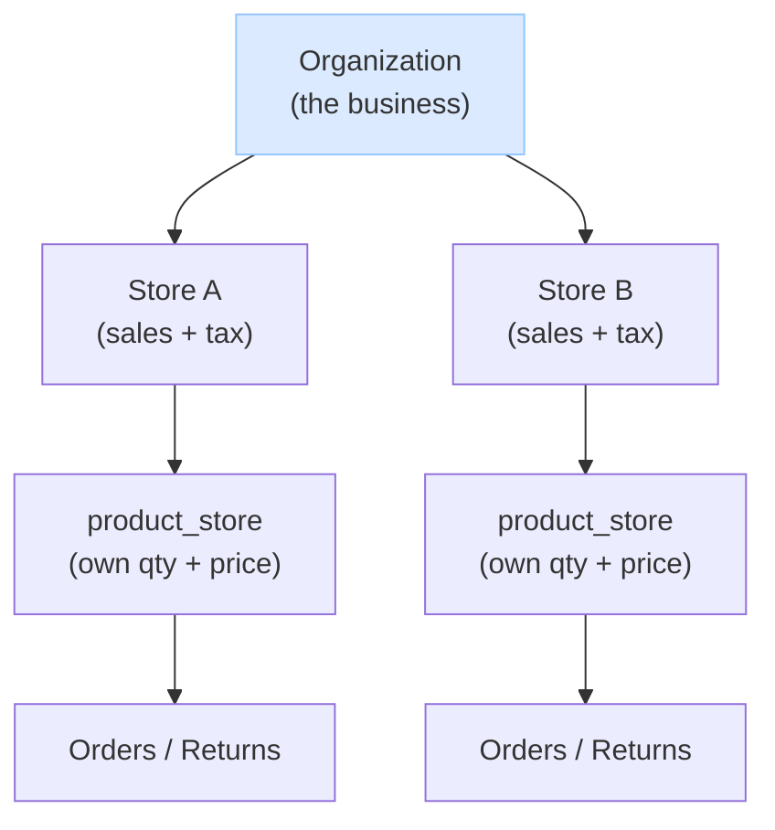
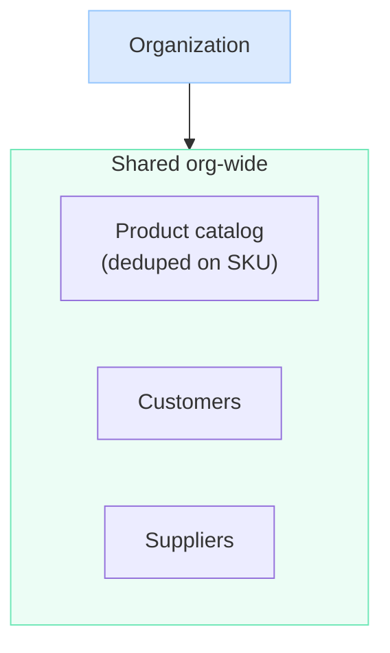
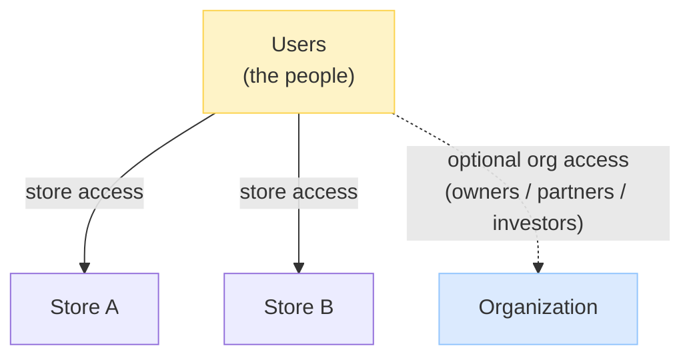

Author: Salman Hoosein
Version : 1.0
Project:
Description: A multi-store POS where one organization onboards its people, grants them access to stores (and optionally the org itself), and runs sales through each store as a business unit.

# System Overview

In plain terms, the system works like this:

- An **organization** onboards its **users** and gives each one access to one or more **stores** — and **optionally to the organization level** too (for people who oversee the whole business, like owners, partners, or investors who need a cross-store view without working a register).
- **Org-level users see everything** across the business — all stores, and the org-wide **customers**, **suppliers**, and **product catalog**.
- **Selling always happens through a store.** A store is the real **business unit** — it's where sales, tax, and money live — so you can't sell "at the org"; you sell at a store. The org is the umbrella that owns the stores.
- Each **store manages and overrides its own products** — it sets its own quantity and price from the shared catalog — so stores run their own day-to-day operation.
- But stores don't start from scratch: they easily **reuse the org's shared customers and suppliers**, so the same customer account or vendor works at any store without re-entering it.

So the org is the shared backbone (people, catalog, customers, suppliers, oversight), and each store is an independent selling unit on top of it. The rest of this document explains how each piece works.

**1. The ownership tree — org owns stores, each store runs its own sales.**



**2. Shared org-wide data — one catalog, customers, and suppliers for the whole org.**



Each store draws from this shared data: it stocks products from the one catalog (setting its own qty/price in `product_store`), and reuses the org's customers and suppliers — nothing is re-entered per store.

**3. User access — people are onboarded by the org and granted access to places.**



# Features
- Organzation can have many stores
- Stores have plans

# Target Niche
We serve small and mid-size businesses running a multi-store POS. A typical organization has up to ~100 stores. At this scale we keep the design simple with a monolith application and single database.

These are **tightly-coupled single companies** — one business that owns and runs all its stores — **not franchise systems** where each location is an independent business. The users are **non-technical**, so the system is deliberately simple over flexible:

- One organization owns many stores; the org admin sees everything across all of them (customers, suppliers, products, stores).
- **Customers and suppliers are shared org-wide** — one customer account / one vendor record works at every store. A customer can walk into any store and use the same account.
- There is **one product catalog** for the org (deduped on SKU), and each store **overrides its own quantity and price** for what it sells.

Because the stores belong to the same company, we don't build per-store walls, visibility toggles, or franchise-style isolation between locations — that would add complexity our users don't want. Features that imply looser coupling (per-store customer privacy, cross-store inventory sharing, regions/districts as managed entities) are deferred unless a concrete need appears; see `post-mvp.md`.

# Constraints
- Organization must have minimum one store to sell products
    - On onboarding, create a **default ("main") store** automatically — the store the org sells and purchases through by default.
    - `organization.default_store_id` points at it. The owner can promote a different store to main later.

# FAQ

## What is the user login flow?

## How to create a user in a store but not in the organization level?

A user's **identity** and their **access** are separate things:

- The `user` table is the **global identity** for the whole system — one login per person. It is not owned by an org or a store; creating a user is a single insert into this one table.
- **Access** is expressed only through `membership` rows. Belonging to a store is a `store` membership; belonging to the org is an `organization` membership.

So to create a user *in a store but not at the org*: insert the `user`, then add **only** a store membership. No org membership is created, so they have no org-level access — exactly as intended. (Per the [blast-radius rule](#how-do-we-verify-which-stores-a-user-can-act-on-given-his-org-role), org access is the thing that reaches all stores; a store-only user never gets it.)

**Knowing where a user came from (provenance).** Because access lives in memberships and memberships can be removed, a user could end up with *no* memberships and become an orphan. To prevent losing their origin, the `user` row carries provenance set once at creation:

- `organization_id` — their **home org** (a store always belongs to an org, so even a store-created user has one). This permanently answers "where did this user belong," regardless of membership churn.
- `origin_store_id` — the store they were created at, if any.
- `created_by_user_id` / `created_at` — who made the account and when.

These are immutable history on the identity, *not* access — removing every membership never erases where the user originated.

**Removing access keeps history.** Memberships are **soft-deleted** (`deleted_at` set, row retained), so you keep an audit trail of where a user used to have access. Every access query filters `deleted_at IS NULL`, so a removed membership grants nothing — but the record (and the user) remain for history.


## How do we ensure a store admin can never assign an organization admin roles?

Every role carries a `role_level` (`STORE` or `ORGANIZATION`) — the level it's meant for, and the only level it can be granted at. Two layers keep a store admin from handing out an org role:

1. **The UI hides them.** A store's "assign role" screen only lists `role_level = STORE` roles, so org roles never even appear as an option.

2. **The write path rejects them — this is the real guard.** Hiding a role in the UI isn't security; someone could still call the API directly. So when a role is granted, the server checks the role's `role_level` against the place before writing the `membership_role` row:

   - granting at a **store** → the role must be `role_level = STORE`
   - granting at an **organization** → the role must be `role_level = ORGANIZATION`

   If they don't match, the request is rejected — no row is written. So a store admin calling the grant endpoint with an org role's id gets turned away, regardless of what the UI showed.

```
grant request: give role R to membership M

  M is a STORE membership, R.role_level = STORE          -> allowed
  M is a STORE membership, R.role_level = ORGANIZATION    -> REJECTED
  M is an ORG membership,  R.role_level = ORGANIZATION     -> allowed
  M is an ORG membership,  R.role_level = STORE            -> REJECTED
```

The rule is simple: **the role's level must equal the membership's place type.** The UI filter is the convenience; the write-path check is the enforcement.


## How do products, prices, and stock work across stores?

There is **one product catalog for the whole organization** — a product (its SKU, name, description) is an org-level identity, deduped on SKU, so "Coke SKU-123" is a single catalog entry the whole org shares. No duplicating the same product in every store.

Each store then sets its **own price and quantity** for the products it carries. That per-store stock and price live in `product_store` (one row per product per store), independent of every other store:

```
product (org catalog)        product_store (per store)
 sku       name               store    sku        qty   price
 -------   -----              ------   --------    ---   -----
 SKU-123   Coke               StoreA   SKU-123     40    1.50
                              StoreB   SKU-123     12    1.75
```

So the *identity* is shared (one SKU across the org), but the *stock and price* are each store's own — selling at Store A doesn't touch Store B's quantity. (Cross-store stock sharing — e.g. an online store deducting a physical store — is deferred to the future workflow engine; see `post-mvp.md`.)


## Are customers and suppliers per-store or shared across the organization?

**Org-level and visible to every store.** A customer is one account for the whole organization — walk into any store and use the same account. A supplier is one vendor record the whole org deals with. Neither is duplicated per store, and the org admin sees all customers and suppliers across all stores at once.

This fits the niche (a tightly-coupled single company, not independent franchises): stores naturally work with the same customers and suppliers, so there's no per-store wall or visibility toggle — it's deliberately simple for non-technical users. Per-store customer/supplier data (e.g. different reward tiers, store-specific vendor terms) is intentionally **not** modeled now; if it's ever needed it's an additive change, not a rework.


## How do store funds work, and how does a store buy inventory?

**The organization is the single source of funds.** There's no per-store bank account or balance — these are small businesses with one business account, and a store is just a selling front that operates against the org's money. The real money lives in the company's own bank (outside this system); we record what happens, we don't hold funds.

**Stores still operate on their own — that's permissions, not money.** A store manager can sell and buy inventory without the owner approving each action, because they hold store-level roles with the right permissions (`store:sell`, `store:purchase`, etc.). The owner delegates once by granting the role; they don't micromanage.

**Two kinds of spending — inventory vs. expenses.** A store spends money two ways, and we keep them separate because they're different for accounting:

- **Inventory** it resells — recorded as a `purchase_order` (with product lines, affects stock). This is cost-of-goods.
- **Expenses** — non-resale things like furniture, computers, utilities — recorded as an `expense` (a category + amount, a vendor like Amazon/Staples, no product, no stock effect). These are operating expenses. An expense can belong to a **store** (location overhead, depletes that store's `expense_balance`) **or to the org directly** (HQ overhead with no store — the POS subscription, the accountant, company-wide software). Inventory (`purchase_order`) is always store-located; expenses can be org-level because some costs aren't tied to a location.

**Bounding a store's spending — two optional balances.** To control how much a store can spend without micromanaging, each store has two optional allowances the org admin sets:

- **`purchase_balance`** — caps inventory buying.
- **`expense_balance`** — caps non-inventory expense spending.

Each works the same way and **depletes independently**: when a store records a purchase (or expense), the system writes the record **and** subtracts its total from the matching balance, in one transaction. The action is **rejected if it exceeds the remaining balance**; at zero the store can't spend in that category until the owner raises the number ("tops up"). **`NULL` = unlimited** for either — a store the owner fully trusts has no cap.

So the owner sets each store's purchasing and expense power separately, the store spends autonomously, every purchase and expense is recorded (so the balances always reconcile to real records), and the money itself is always the org's. Actually paying suppliers and settling card sales (real money movement) is a separate concern, deferred to a future payments/accounting integration — see `post-mvp.md`.


## How does an organization owner see everything across all stores?

We don't keep a separate org-wide copy of the data. Instead, the owner's view is built on demand in two steps:

1. Find the stores that belong to the organization.
2. Read the products, orders, returns, and customers for those stores, and combine them into one list.

This works because every store knows which org it belongs to, and every record (a product, an order, etc.) knows which store it belongs to.

At ~100 stores this is fast. If it ever gets slow, we can keep a pre-built copy of the data for quick reading (a search index or summary table), while the real records still live in each store.


## How do we know what a user can do, and where?

A user's access always has two parts: a **place** (a store, or the organization) and **what they can do there**.

We store this with a few small pieces:

- A **user** is one account (one login).
- A **role** is a named set of permissions, like "Cashier" or "Manager."
Access has two layers, like an IAM user:

- A **membership** record says a user *belongs to one place* — for example, "John is at Store B." It names the place with one of two fields: `store_id` for a store, or `organization_id` for the organization. Exactly one is filled in — that tells us both the place and whether it's a store or the org. A membership carries no role on its own.
- A **membership-role** record grants a *role on a membership* — "John, at Store B, is a Manager." A membership can have several roles, or none.

Keeping these separate means a user can belong to a place with **no roles** (still listed there, just no access), and removing a role simply deletes that one membership-role record — the membership, the user's other roles, and the account all stay.

A person can have several memberships — one per place they work — so they can be a Cashier at one store and a Manager at another. When the user logs in, we gather all their memberships and the roles on each, and produce one simple list of where they can go and what they can do at each place:

```
John's access
 place    type    name             can do
 ------   -----   --------------   ----------------------------------
 org_1    ORG     Acme Inc         organization:read
 StoreA   STORE   Acme Seattle     store:read, store:sell
 StoreB   STORE   Acme Portland    store:read, store:sell, store:refund
```

Because each record points at a real store or a real organization (a proper database link), a record can never refer to a place that doesn't exist, and deleting a place automatically removes its access records.


## How do we verify which stores a user can act on, given his org role?

A user can act on a store two ways, and we never copy memberships into each store — we resolve access at check time:

1. **Direct** — the user has a **store membership** at that store, with a role granting the permission.
2. **Inherited** — the user has an **organization membership** whose role contains the `store:*` permission. An org role reaches **every store under that org**, so the permission applies to each of them without a per-store membership.

To check *"can this user do `store:edit` on Store 47?"* the server asks two things:

```
ALLOW if:
  (A) a store membership at Store 47 has a role containing store:edit
   OR
  (B) an org membership at Store 47's org has a role containing store:edit
      (the org role reaches down to every store in that org)
```

Branch **(B)** is the inheritance: we take the user's org memberships, expand each to all stores in that org (`store.organization_id = the org`), and apply the org role's `store:*` permissions to them. So an OrgAdmin with `store:edit` can edit any of the org's stores — including stores created *after* the role was granted — with no extra setup.

To list **every store a user can act on**: take the stores from his direct store memberships, plus all stores under any org he has an org membership in (filtered to org roles that actually carry a `store:*` permission). The direct set and the inherited set are combined; a store can appear in both, which is fine — access is the union.

This is the same federated pattern as the org-owner view: the org's reach is computed by joining the org grant to the org's stores on demand, not by storing a copy per store.


## How does an organization or store create its own custom roles?

Besides the built-in roles we ship (like Root Admin and Cashier), customers can create their own roles. A custom role can belong to a whole **organization** (every store in the org can use it) or to a single **store** (only that store uses it). It is visible only to its owner — no other org or store sees it.

All roles live in one `Role` table — built-in and custom, org-level and store-level together. A few fields describe each role, and two of them mean different things:

- **`is_managed`** — *who owns it.* `true` means we built and maintain it; `false` means a customer created it.
- **`role_level`** — *what level it's for.* Either `STORE` or `ORGANIZATION`. This is also the **only level the role can be granted at**: a `STORE` role can only go to a store user, an `ORGANIZATION` role only to an org user.
- **`organization_id`** / **`store_id`** — the owner, set only on *custom* roles. A built-in role has neither (we own it); a custom role has exactly the one that matches its level.
- **`created_user_id`** — the user who created it (empty for built-in roles we ship).

`is_managed` and `role_level` are independent: a role we ship can be either a store role or an org role. For example a built-in "Cashier" is `is_managed = true, role_level = STORE`, while a built-in "Org Owner" is `is_managed = true, role_level = ORGANIZATION`.

```
Role
 name           is_managed  role_level    organization_id  store_id   meaning
 ------------   ----------  ------------  ---------------  --------   --------------------------------
 OrgOwner       true        ORGANIZATION  (empty)          (empty)    built-in, org-level
 Cashier        true        STORE         (empty)          (empty)    built-in, store-level
 NightManager   false       ORGANIZATION  org_1            (empty)    custom, used across all of org_1
 WeekendOpener  false       STORE         (empty)          StoreA     custom, used only at Store A
```

To make a custom role, the owner creates a `Role` row (`is_managed = false`) with a `role_level` and the matching owner field (`organization_id` for an org role, `store_id` for a store role), then chooses its permissions. Names only need to be unique within the owner, so two different orgs (or stores) can each have a "Manager" role without clashing.

**Role level decides where the role is granted — which sets its blast radius.** `role_level` is not "which permissions are allowed in the role." It's where the role attaches, and that determines how far its permissions reach:

- A **STORE** role is granted at one store; its permissions reach **only that store**.
- An **ORGANIZATION** role is granted at the org; its `store:*` permissions reach **every store in that org**, and its `organization:*` permissions act on the org itself.

So the *same* permission has a different reach depending on the role's level. `store:edit` in a store role edits that one store; `store:edit` in an org role edits any store in the org. This is the whole point of an org role — it's a store power with org-wide reach.

**Which permissions a role may hold:**

- A **STORE** role may hold **only `store:*`** permissions (a store role has no business holding `organization:*`).
- An **ORGANIZATION** role may hold **both `store:*` and `organization:*`** — `store:*` to act on the org's stores, `organization:*` to act on the org itself.

Permissions are explicit, not inherited by wildcard: an org role that should manage stores must actually list `store:edit`, `store:read`, etc. If an org role does **not** contain a given `store:*` permission, it **cannot** do that store operation — there's no implicit "org role can do everything to stores." You grant exactly the store powers you intend.

**Why this is safe.** Two write-path checks:

1. **Building a role** — a `STORE` role's permissions must all be `store:*` (reject `organization:*` in a store role). An `ORGANIZATION` role may hold either.
2. **Granting a role** — the role's level must equal the place it's granted at (a store user can't be given an org role, and vice versa).

Together, a store admin can never gain org-level power: an `organization:*` permission can't live in a store role, and an org role can't be granted at a store. The UI also hides mismatched options for convenience, but the write-path checks are the real enforcement.


## What happens to existing users when a built-in role's permissions change?

Users don't keep their own copy of permissions — they point at a role, and the role points at its permissions. So if we change a built-in (managed) role, **everyone who has that role gets the change immediately**, in every organization. There's nothing to re-apply.

This is convenient, but it means an org can't freely edit a built-in role without affecting everyone. So we give them two things:

1. **A heads-up.** When an admin assigns a built-in role, the app notes that we manage it and its permissions may change over time.

2. **A "Clone" option.** An admin can copy a built-in role's permissions into a new custom role of their own. They assign the copy instead — now they can edit it freely, and our future changes to the built-in role won't touch it.

**Example.** Org_1 wants its own Root Admin it fully controls. It clones, rather than editing the shared built-in one:

```
Role
 name        is_managed  organization_id   meaning
 ---------   ----------  ----------------  ------------------------------
 RootAdmin   true        (empty)           built-in, still shared, untouched
 RoleAdmin   false       org_1             org_1's own copy, edits freely
```

Org_1 assigns its members to `RoleAdmin`. The built-in Root Admin keeps working unchanged for every other org.


## How to ensure a store admin does not assign a organization level role to a user?

## How does a store get the features in its plan?

Billing is **per store**, so each **store** is on one **plan** (like "Pro"), and each plan includes a set of **features** (like reports or multi-store). The store gets its features *through its plan*. The organization itself has no plan — it's just the container; the bill is the sum of its stores' plans, and different stores can be on different plans.

```
Store → Plan → Features

StoreA is on the "Pro" plan, StoreB is on "Basic"
Pro includes:   multi_store, reports, returns
Basic includes: returns
So StoreA has multi_store, reports, returns — StoreB has only returns
```

To check a feature ("can StoreA use reports?"), we look at whether its plan includes that feature.

**One plan per store** — a store has exactly one plan at a time.

**New features spread automatically.** Because features are read through the plan, adding a feature to a plan instantly gives it to **every store on that plan** — no per-store updates. For example, adding "AI Analytics" to the Pro plan means every store on Pro now has it, automatically. Removing a feature works the same way in reverse.


## (Optional) Can products, users, and orders be created at the org level, or only inside a store?

Yes — but only as a **UI convenience**, not a change to where the data lives. The data still always belongs to a store. When an org-level user creates a product (or a user, etc.) from an org-wide screen, the UI asks them to pick **which store or stores** to save it into, and then writes a copy into each chosen store.

So an org user can bulk-update many stores at once without logging into each one. Under the hood there's no org-level copy of the data — every record is still owned by a store, exactly as before. The org screen is just an easy way to fan one action out across several stores.


## (Optional) Can one store search another store's products, read-only?

Yes, if the user is allowed to. It uses the same two-step approach as the org-wide owner view: find the sibling stores in the same org, then read their products. It only ever **reads** other stores — it never changes them, and each store still fully owns its own products.

Two things keep it safe:

- The user must have a cross-store read permission (such as `product:read_cross_store`).
- The search is read-only by design — it can look at other stores but never edit them.

If it ever gets slow, the same pre-built read copy mentioned in the owner-view answer can speed it up.
