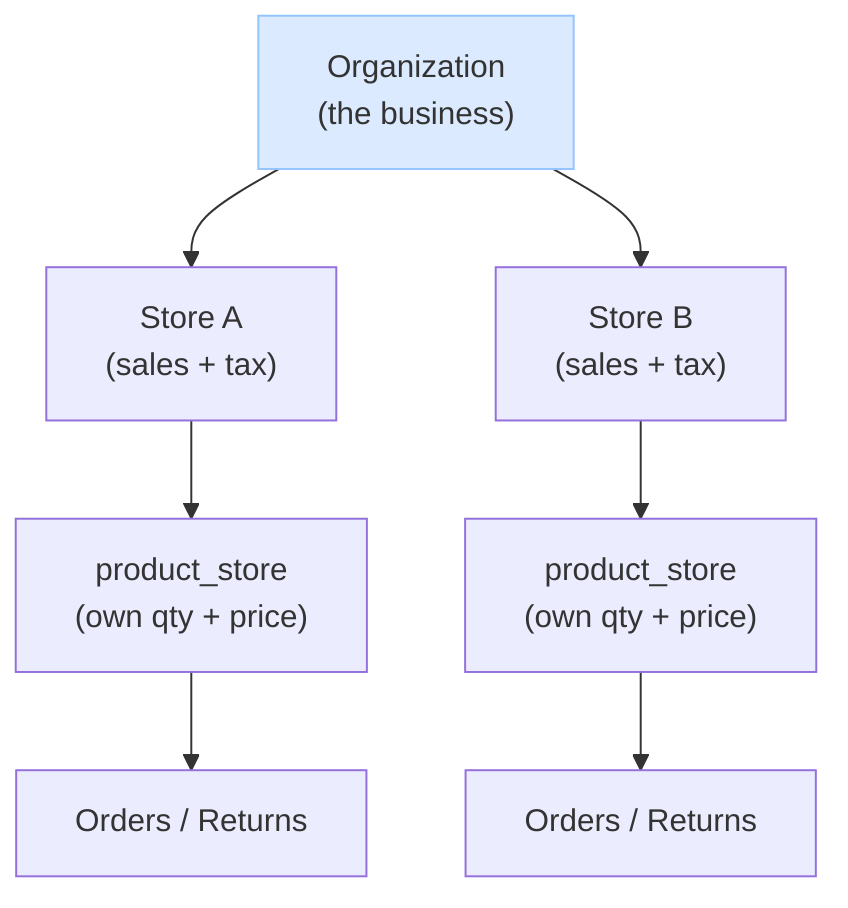
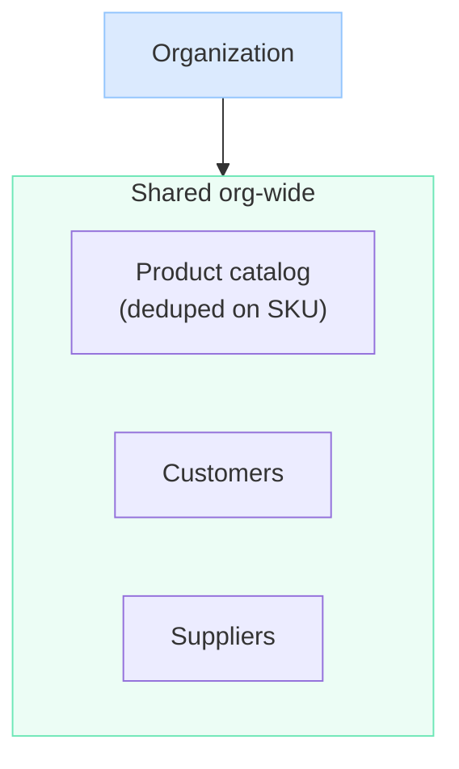
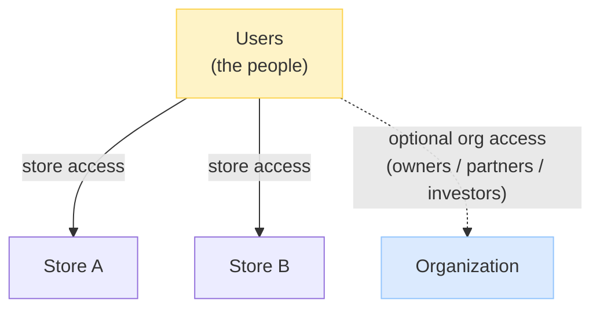

Author: Salman Hoosein
Version : 1.0
Project:
Description: A multi-store POS where one organization onboards its people, grants them access to stores (and optionally the org itself), and runs sales through each store as a business unit.

# System Overview

In plain terms, the system works like this:

- An **organization** onboards its **users** and gives each one access to one or more **stores** — and **optionally to the organization level** too (for people who oversee the whole business, like owners, partners, or investors who need a cross-store view without working a register).
- **Org-level users see everything** across the business — all stores, and the org-wide **customers**, **suppliers**, and **product catalog**.
- **Selling always happens through a store.** A store is the real **business unit** — it's where sales, tax, and money live — so you can't sell "at the org"; you sell at a store. The org is the umbrella that owns the stores.
- Each **store manages and overrides its own products** — it sets its own quantity and price from the shared catalog — so stores run their own day-to-day operation.
- But stores don't start from scratch: they easily **reuse the org's shared customers and suppliers**, so the same customer account or vendor works at any store without re-entering it.

So the org is the shared backbone (people, catalog, customers, suppliers, oversight), and each store is an independent selling unit on top of it. The rest of this document explains how each piece works.

**1. The ownership tree — org owns stores, each store runs its own sales.**



**2. Shared org-wide data — one catalog, customers, and suppliers for the whole org.**



Each store draws from this shared data: it stocks products from the one catalog (setting its own qty/price in `product_store`), and reuses the org's customers and suppliers — nothing is re-entered per store.

**3. User access — people are onboarded by the org and granted access to places.**




# Target Niche
We serve small and mid-size businesses running a multi-store POS. A typical organization has up to ~100 stores. At this scale we keep the design simple with a monolith application and single database.

These are **tightly-coupled single companies** — one business that owns and runs all its stores — **not franchise systems** where each location is an independent business. The users are **non-technical**, so the system is deliberately simple over flexible:

- One organization owns many stores; the org admin sees everything across all of them (customers, suppliers, products, stores).
- **Customers and suppliers are shared org-wide** — one customer account / one vendor record works at every store. A customer can walk into any store and use the same account.
- There is **one product catalog** for the org (deduped on SKU), and each store **overrides its own quantity and price** for what it sells.


# FAQ

> Authentication and authorization (users, memberships, roles, permissions, access) are documented separately in `auth.md`.

## How do products, prices, and stock work across stores?

@TODO: add how a store can create a product and it updates master catalog

There is **one product catalog for the whole organization** — a product (its SKU, name, description) is an org-level identity, deduped on SKU, so "Coke SKU-123" is a single catalog entry the whole org shares. No duplicating the same product in every store.

Each store then sets its **own price and quantity** for the products it carries. That per-store stock and price live in `product_store` (one row per product per store), independent of every other store:

```
product (org catalog)        product_store (per store)
 sku       name               store    sku        qty   price
 -------   -----              ------   --------    ---   -----
 SKU-123   Coke               StoreA   SKU-123     40    1.50
                              StoreB   SKU-123     12    1.75
```

So the *identity* is shared (one SKU across the org), but the *stock and price* are each store's own — selling at Store A doesn't touch Store B's quantity. (Cross-store stock sharing — e.g. an online store deducting a physical store — is deferred to the future workflow engine; see `post-mvp.md`.)


## Are customers and suppliers per-store or shared across the organization?

@TODO: a store can add a customer and supplier that updates master list 

**Org-level and visible to every store.** A customer is one account for the whole organization — walk into any store and use the same account. A supplier is one vendor record the whole org deals with. Neither is duplicated per store, and the org admin sees all customers and suppliers across all stores at once.

This fits the niche (a tightly-coupled single company, not independent franchises): stores naturally work with the same customers and suppliers, so there's no per-store wall or visibility toggle — it's deliberately simple for non-technical users. Per-store customer/supplier data (e.g. different reward tiers, store-specific vendor terms) is intentionally **not** modeled now; if it's ever needed it's an additive change, not a rework.


## How do store funds work, and how does a store buy inventory?

**The organization is the single source of funds.** There's no per-store bank account or balance — these are small businesses with one business account, and a store is just a selling front that operates against the org's money. The real money lives in the company's own bank (outside this system); we record what happens, we don't hold funds.

**Stores still operate on their own — that's permissions, not money.** A store manager can sell and buy inventory without the owner approving each action, because they hold store-level roles with the right permissions (`store:order:sell`, `store:purchase:create`, etc.). The owner delegates once by granting the role; they don't micromanage. (See `auth.md` for how roles and permissions work.)

**Two kinds of spending — inventory vs. expenses.** A store spends money two ways, and we keep them separate because they're different for accounting:

- **Inventory** it resells — recorded as a `purchase_order` (with product lines, affects stock). This is cost-of-goods.
- **Expenses** — non-resale things like furniture, computers, utilities — recorded as an `expense` (a category + amount, a vendor like Amazon/Staples, no product, no stock effect). These are operating expenses. An expense can belong to a **store** (location overhead, depletes that store's `expense_balance`) **or to the org directly** (HQ overhead with no store — the POS subscription, the accountant, company-wide software). Inventory (`purchase_order`) is always store-located; expenses can be org-level because some costs aren't tied to a location.

**Bounding a store's spending — two optional balances.** To control how much a store can spend without micromanaging, each store has two optional allowances the org admin sets:

- **`purchase_balance`** — caps inventory buying.
- **`expense_balance`** — caps non-inventory expense spending.

Each works the same way and **depletes independently**: when a store records a purchase (or expense), the system writes the record **and** subtracts its total from the matching balance, in one transaction. The action is **rejected if it exceeds the remaining balance**; at zero the store can't spend in that category until the owner raises the number ("tops up"). **`NULL` = unlimited** for either — a store the owner fully trusts has no cap.

So the owner sets each store's purchasing and expense power separately, the store spends autonomously, every purchase and expense is recorded (so the balances always reconcile to real records), and the money itself is always the org's.


## How does a store get the features in its plan?

Billing is **per store**, so each **store** is on one **plan** (like "Pro"), and each plan includes a set of **features** (like reports or multi-store). The store gets its features *through its plan*. The organization itself has no plan — it's just the container; the bill is the sum of its stores' plans, and different stores can be on different plans.

```
Store → Plan → Features

StoreA is on the "Pro" plan, StoreB is on "Basic"
Pro includes:   multi_store, reports, returns
Basic includes: returns
So StoreA has multi_store, reports, returns — StoreB has only returns
```

To check a feature ("can StoreA use reports?"), we look at whether its plan includes that feature.

**One plan per store** — a store has exactly one plan at a time.

**New features spread automatically.** Because features are read through the plan, adding a feature to a plan instantly gives it to **every store on that plan** — no per-store updates. For example, adding "AI Analytics" to the Pro plan means every store on Pro now has it, automatically. Removing a feature works the same way in reverse.

