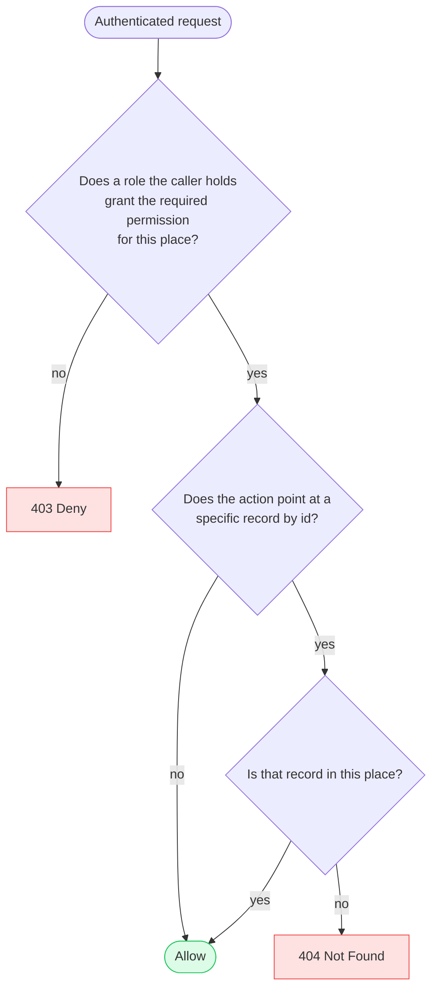
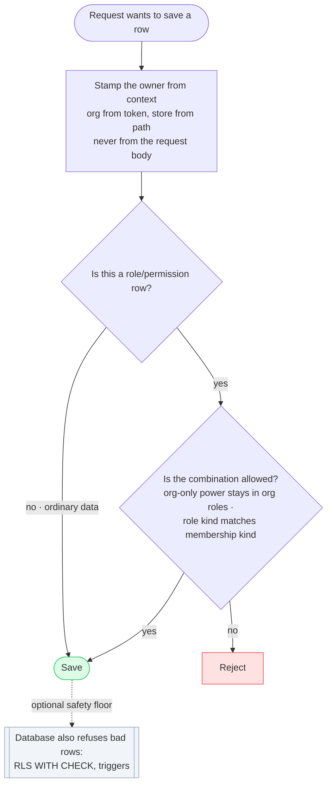

# Overview

> A user is just a login. *Where* they can act comes from the **memberships** they hold; *what* they
> can do there comes from the **roles** on those memberships.

A user isn't labelled "an org person" or "a store person" — that's decided entirely by **which
places they have a membership to**. The same person can belong to a store, to the organization, or to
both, and that's what sets their reach. Roles, on the other hand, *are* typed (store or organization),
so you can't attach an organization-level role to a store membership. Any role holding an
`is_elevated = true` permission is necessarily an organization-level role.

```
user  ──<  membership  ──<  membership_assignment  >──  role  ──<  role_permission  >──  permission
```

- **user** — one login per person (organization identity). A user is placed by the memberships they
  hold; the `user` row itself carries no org-vs-store distinction.
- **membership** — a user's membership is either at the `ORGANIZATION` or at a `STORE`.
    - Every membership carries an `organization_id` (the tenant boundary).
    - A **store** membership sets `store_id` (the one store it's at) and sets `user_type` to `STORE`.
    - An **organization** membership leaves `store_id` NULL and sets `user_type` to `ORGANIZATION`.
- **membership_assignment** — a role given to that membership (optionally with an expiration).
- **role** — a named bundle of permissions we ship. Each role has a `user_type` (`STORE` or
  `ORGANIZATION`) — its level. A role's type must match the membership it's attached to: store roles
  go on store memberships, org roles on org memberships.
- **permission** — one allowed action, like `product:read`. Carries an `is_elevated` flag: an
  elevated permission is a company-level action that may only live in an organization role (and so is
  only ever reachable through an organization membership).

So an "org user" is simply **a person who holds an organization membership**; a "store user" is
someone who holds only store memberships. 

---

# FAQ

## How is a user created and given access?

A person's login and what they can do are two separate things. Creating a user just makes the login —
they can do nothing until you give them a place and a role there.

An org admin sets someone up in three steps:

1. **Create the user** — make their login. That's all. A fresh user belongs nowhere and can do
   nothing.
2. **Give them a membership** — add them to a place: the **organization** if they should oversee the
   whole business, or one or more **stores** if they're an employee. This single choice is what makes
   someone an org person or a store person.
3. **Give them a role** — choose what they can do at that place. The role's type must match the
   membership: store roles on store memberships, org roles on org memberships.

A person can hold an org membership *and* store memberships (unless the org's cross-membership setting
forbids it — see *Can a user be both an org and a store user?*).

**Example**
Maria is added to the Seattle store as a Cashier, then later to Portland as a Manager — one login, two
store memberships, a different role at each. If the owner later wants Maria to oversee the whole
company, they **add an organization membership** with an org role; she now belongs at the org too,
with no change to the user record itself.


## How do I revoke or suspend someone's access?

You can remove access by how permanent you want it — without ever deleting the person.

- **Take away one role** — delete the `membership_assignment` (or let `expires_at` end it). They still
  belong at the place, just with less ability there.
- **Suspend at one place (temporary)** — `membership.is_active = false`. Switches their access off at a
  single place but keeps everything, so you can switch it back on.
- **Disable the whole account (temporary)** — `user.is_active = false`. One switch turns the person off
  *everywhere* at once. Effective access needs both `user.is_active` and the place's
  `membership.is_active`.
- **Remove from a place (permanent)** — soft-delete the membership (`deleted_at`). The record is kept
  for history; the `user` row itself is never deleted.


## What is a role, and where do roles come from?

A role is a named bundle of things a person is allowed to do (like "Cashier" or "Org Admin"). We build
and ship the roles; customers assign them — they don't author their own yet.

- A **permission** is one allowed action — e.g. read a product, refund an order, create a user.
- A **role** is a set of permissions, plus a **type**: every role is either a **store role** or an
  **organization role**. That type sets where the role may be attached and the system rejects any invalid role assignments, for example assigning an organization level role to a user with a store membership. 
- We don't do "allow everything" — a role lists its permissions explicitly, so a new feature reaches
  nobody until it's deliberately added to a role.


## What does `is_elevated` permission mean?

`is_elevated` is a single true/false flag on each **permission** answering one question: *is this a
powerful, company-level action, or an everyday one?* It splits every permission into two piles:

| Permission        | `is_elevated` | Why                                                   |
|-------------------|---------------|-------------------------------------------------------|
| `product:read`    | **false**     | A cashier does this all day. Everyday store work.     |
| `order:refund`    | **false**     | A store manager does this. Everyday store work.       |
| `customer:create` | **false**     | Happens at the register. Everyday store work.         |
| `store:create`    | **true**      | Creating a whole store is a company-owner action.     |
| `user:create`     | **true**      | Making new logins is a company-owner action.          |
| `supplier:create` | **true**      | Managing the org's suppliers is company-level.        |

- **`is_elevated = false`** → an ordinary action; fine for a store employee.
- **`is_elevated = true`** → a company-level action; only someone acting *for the whole org* may do it.

So `is_elevated` marks *which permissions are org-only*, independently of any role.


## How does `is_elevated` keep org-only powers out of stores?

Two guards work together — the role's type, and the permission's flag — so the bad combination can't
even be built:

> An **elevated permission can only sit in an org role.** And an **org role can only be attached to an
> organization membership.** So an elevated permission can never reach a store.

It's a one-way gate enforced on the write path:

- **Building a role:** adding an elevated permission to a role requires that role to be an org role.
  A store role simply can't contain `user:create` or `store:create`.
- **Assigning a role:** an org role can only be attached to an org membership; a store role only to a
  store membership. The role type must match the membership kind.

**Example.** `store:create` is elevated, so it can only live in an org role:

- A "Cashier" (store role) **cannot contain** `store:create` — the write path rejects it. So a cashier
  can never hold it, on any membership. ✅ safe.
- Diego's "Org Admin" (org role) contains `store:create` and sits on his **Acme org** membership →
  it works. He's acting for the whole company, which is exactly who may create stores. ✅ correct.

The two checks reinforce each other: even if one were misconfigured, the other still stands between a
store and an org-only power.


## Can a store user ever gain organization-level access?

Only by being **given an organization membership** — which only an org admin can do, by assigning an
org role to an org membership. Someone with only store memberships has no org reach: store roles can't
hold elevated permissions, and org roles can't be attached to their store memberships. So an everyday
employee can never act on the organization.

**Example**
A cashier who belongs only to Store A, can't be handed "Org Admin," because that's an org role and they
have no org membership to attach it to.


## Can a user be both an org and a store user?

That's an **org-level choice**, controlled by one setting:

> **`allow_user_cross_memberships`** (an organization setting)
> - **ON** — a user may hold an organization membership *and* store memberships at the same time.
> - **OFF (the default)** — each user is locked to a single kind: at the moment a membership is
>   *added*, the write path enforces —
>   - if the user already has an **org** membership → refuse to add a **store** membership;
>   - if the user already has any **store** membership → refuse to add an **org** membership.

With it **OFF** (the default) an org person is an org person and a store employee is a store employee,
never both — the simplest thing for non-technical customers. With it **ON**, one person can span both
levels — handy for a small business where an owner also works a register, or where a store employee is
later given an org membership to help oversee the company.

**Note:** Toggling on and off can result in Organization Admin setting having to choose what membership a user should keep if he has two memberships.

## How far does a role reach? (store vs org)

Reach follows the **membership the role hangs on**:

- A role on a **store** membership reaches that **one store**.
- A role on the **organization** membership reaches the **whole org and every store in it**.

The *same* permission reaches differently depending on the membership it's exercised through:
`order:refund` in a Cashier role on the Seattle membership refunds at Seattle only; `order:refund` in
an Org Admin role on the org membership refunds at *any* store. An org admin acts everywhere not
because of special permissions, but because their membership is at the org — org reach includes all
the stores.

**Example**
- Store Manager at Seattle with `product:edit` → edits Seattle's products only.
- Org Admin with `product:edit` → edits any store's products.


## Who is the owner, and can their access be taken away?

The person who signs up and creates the organization is its **owner**. They have full access, and no
one else can take it from them.

The owner is marked on the organization itself — `organization.owner_user_id`, a column, not a
`membership_assignment` — so it can't be deleted out from under them. The only way ownership changes is
a deliberate **transfer**: the current owner hands it to someone who's already an org admin. No other
admin can revoke the owner's access or seize ownership. Transfer is a privileged, audited action.


## How do we know everything a user can do, and where?

At login we gather every membership and the roles on each, and flatten it into one list: where they
can go, and what they can do there.

```
Maria's access
 place        kind    can do
 ----------   -----   -------------------------------------------
 Acme Inc     org     manage stores, manage users, suppliers, purchases   (org membership)
 Seattle      store   read products, sell                                 (store membership)
 Portland     store   read products, sell, refund                         (store membership)
```


## Showing the right roles in the UI

When an org admin attaches a role to a membership, the role picker should only offer roles that fit
that place. Because each role carries a `user_type`, this is a direct filter — no guessing from a
role's permissions:

- Attaching to a **store** membership → list only **store roles** (`role.user_type = STORE`).
- Attaching to an **organization** membership → list only **org roles** (`role.user_type =
  ORGANIZATION`).

---

# API Authentication and Authorization Flow

This section is the request lifecycle: what happens, in order, from the moment an API call arrives to
the moment it's allowed to touch data. Everything above described the *model* (users, memberships,
roles); this describes how a single request is checked against it.


Every request passes through the same pipeline:

```
request
  │
  ├─ 1. Authenticate ──  Who are you?  Validate the JWT, load the account, build the request context.
  │                      Fail → 401.
  │
  └─ 2. Authorize ─────  May you do THIS, HERE?  Runs in two halves:
         │
         ├─ Read-time security  ── decide allow/deny and which rows come back (the permission
         │                          check and scoping the data to what the caller may see).
         │
         └─ Write-time security ── when the action saves data, keep invalid rows out of the
                                    database in the first place (tenant stamping, RBAC integrity).
```

The two authorization halves exist because a request has two distinct moments to protect: **reading**
(deciding whether to serve the request and what data it may see) and **writing** (making sure whatever
gets saved is valid and correctly owned). 

## 1. Authentication — validate the JWT, load identity, build context

A middleware validates the JWT — signature, expiry, **pinned algorithm** (reject `alg: none`), a
strong **rotated** signing key, and **real revocation / short-lived tokens + refresh** so a suspended
user's token stops working promptly. If anything fails, stop and return **401**.

On success, read **`is_active` fresh from the `user` row** — one DB read per request — so a disabled
account is judged on what's true now, never on a stale token. If the user is not active then return 401, else build the request **context**:


```
if context.isActive = false                 →  401
else:
  context = {
    userId,            // from the token
    organizationId,    // from the token — the tenant boundary, never client input
    isActive           // account kill switch — read FRESH from the user row
  }
```

The context holds only **verified identity** — who the user is, their home org (the tenant), and the
freshly-read account status. It carries **no target**: the thing being acted on comes from the route,
not from a header the client set.

## 2. Authorization — may this user do this action, here?

1. A person is just a login. By itself, an account can do nothing.
2. Access comes from "memberships" — a membership is a place you belong (a specific store, or the organization as a whole).
3. On each membership you're given a role, and a role is just a named bundle of permissions (a permission is one allowed action,
like "refund an order").
4. A person can have several memberships at once — Cashier at one store, Manager at another, maybe an org-wide membership too.
5. Every request carries a signed token that says who you are and which company you're in. The company is read from the token,
never from anything the client can type — so nobody can pretend to be in a different company.
6. To decide "can you do this?", the system looks at every membership you currently have and checks each one on its own: is it
live, is it the right kind of place for this action, is it in your company, and does its role actually grant the permission needed?
If any one membership passes all of that, you're allowed. If none do, you're denied.
7. A store membership can only touch its own store; an org membership reaches every store in the company. That difference is the entire store-vs-org model.
8. When you save data, the row is stamped with your company from the token — so you can only ever write into your own company, never someone else's.

Each endpoint declares the one permission it needs. Store actions carry the store in the **path**
(`/stores/{storeId}/...`); org actions (`/organization/...`) carry no place id — the org comes from
the token.

Selling and everything a store owns (its products, customers, sales) are **store actions**.
Procurement, suppliers, expenses, and managing stores/users are **org actions**.

- `POST /stores/{storeId}/products`   → permission `product:create` (store action)
- `POST /stores/{storeId}/refunds`    → permission `order:refund`    (store action)
- `POST /organization/purchases`      → permission `purchase:create` (org action)

**Error convention:** anything outside the user's organization — a store in another org, or a resource
not in the acted-on place — returns **404, never 403**, so existence isn't leaked. 403 is reserved for
"this is yours, but you lack the permission."

## 2a. Read-time security

**Purpose:** decide whether the request is allowed, and scope every read so it can only return rows
the caller is entitled to. It has two parts: the **authorization query** (does the caller hold the
required permission, at the right place?) and **resource scoping** (when a specific record is named by
id, make sure it belongs to that place).



**Reading the diagram, box by box:**

- **Authenticated request** — we've already checked *who* the caller is (step 1). Now we check what
  they may do.
- **"Does a role the caller holds grant the required permission for this place?"** — the
  **authorization query**. Every endpoint declares one permission it needs (e.g. `order:refund`). This
  asks whether the caller has that permission, through a role, at the store or org the request targets.
  If not → **403 Deny** (you're a valid user, but you can't do this here).
- **"Does the action point at a specific record by id?"** — some requests are general ("list my
  orders"); others name one exact record ("refund order 4382"). Only the second kind needs the next
  check.
- **"Is that record in this place?"** — **resource scoping**. It makes sure the named record actually
  belongs to the store/org in the request, so nobody can reach another store's order by guessing its
  id. If it doesn't belong here → **404 Not Found** (we don't even admit it exists).
- **Allow** — reached only by passing every check on the path.

The two failure colors mean different things: **403** = "this is a real thing but not yours to do,"
**404** = "as far as you're concerned, it doesn't exist." Using 404 (not 403) for another tenant's data
avoids leaking that it exists at all.

### The authorization query

A user can have **several memberships at once** (Cashier at one store, Manager at another, maybe an org
membership too). So the check isn't "look at *the* membership" — it's:

> **Go through every membership the user currently has. If *any one* of them grants the required
> permission for the place being acted on, allow the request. If none do, deny.**

Each membership is checked **on its own, end to end** — its own role, its own store. A permission that
comes from one membership can't be combined with the store of another. One membership has to satisfy
*everything* by itself.

**Pseudocode.** Written as a loop so the "check each membership" part is explicit — in practice this is
one SQL query, but it behaves exactly like this:

The order is: first weed out memberships that can't apply (dead, malformed, or wrong place), then — of
the ones that survive — check whether any actually grants the permission.

```
allowed = false

for each membership M the user holds:                     -- every membership, checked separately
    role = the role on M for this request

    # ── (1) live? skip anything removed, suspended, or expired ──
    if M.is_active is false:            continue
    if M.deleted_at is set:             continue
    if role is missing or expired:      continue

    # ── (2) internally consistent? role and membership must be the same kind ──
    if role.user_type != M.user_type:   continue     -- rejects any bad/mismatched data

    # ── (3) does this membership even apply to this request (right kind, place, and org)? ──
    if M.user_type == 'STORE':
        # a store membership: only store actions, only at ITS store, only everyday permissions
        if not ( request is a STORE action
                 and M.store_id == {storeId from the path}
                 and M.organization_id == context.organizationId
                 and requiredPermission.is_elevated == false ):
            continue

    if M.user_type == 'ORGANIZATION':
        # an org membership: org actions, OR a store action on ANY store in its org (elevated ok)
        if not ( M.organization_id == context.organizationId
                 and ( request is an ORG action
                       or ( request is a STORE action
                            and store({storeId}).organization_id == context.organizationId ) ) ):
            continue

    # ── (4) the real question: does this membership's role actually grant the permission? ──
    if role has requiredPermission:
        allowed = true; break

return allowed        # true = one membership passed everything → allow ; false → 403
```

**What each step means:**

The **loop** is the key idea — we test *each* membership on its own; the first one that clears every
step wins, and we stop. Steps (1)–(3) ask *"is this membership even a candidate?"*; step (4) is the
real permission check, asked last.

- **(1) Live?** — Skip any membership that's been removed (`deleted_at`), switched off
  (`is_active = false`), or whose role assignment has expired. A dead membership grants nothing, so
  there's no point looking further at it.

- **(2) Internally consistent? (role kind == membership kind).** Every membership has a *kind*
  (`STORE` or `ORGANIZATION`), and so does every role. This step requires them to match — a store role
  only counts on a store membership, an org role only on an org membership. Normally this is already
  guaranteed when the role is assigned; re-checking here means a *mismatched* record (say, an org role
  somehow attached to a store seat) is simply ignored, so it can't grant the store seat org-level power.

- **(3) Does this membership apply to this request?** — This is where a **store** membership and an
  **organization** membership are checked differently, because they can do different things:

  - A request is either a **store action** (it targets a specific store — the URL is
    `/stores/{storeId}/...`) or an **org action** (it targets the organization — e.g.
    `/organization/...`).
  - A **STORE** membership may satisfy *only a store action*, and *only for its own store*
    (`M.store_id` must equal the `{storeId}` in the URL), and *only with an non elevated permission*
    (`is_elevated == false`). It can never do org actions and never reach another store.
  - An **ORGANIZATION** membership may satisfy an *org action*, **or** a store action on *any* store —
    as long as that store is inside its own org (`store.organization_id == M.organization_id`). It may
    also use elevated permissions.
  - In *both* cases, `M.organization_id == context.organizationId` must hold — this is the wall that
    keeps every caller inside their own company; a store or org in another company never matches.

  A membership that doesn't fit the request (wrong kind, wrong store, another company) is skipped here,
  before we ever look at its permissions.

- **(4) Does its role actually grant the permission?** — Of the memberships that survived (1)–(3),
  this asks the real question: does one hold `requiredPermission`? The first that does → **allow**.

**Why steps (2) and (3) double as safety nets.** The role-kind match in (2) and the
`is_elevated == false` guard in (3) re-verify rules that are *also* enforced when data is saved (see
*Write-time security*). If a bad record ever slipped into the database — an org-only permission inside
a store role, or a role on the wrong kind of seat — these steps make the loop ignore it. The check
never trusts that the stored data is already correct; it re-proves it on every request.

---

**Example 1 — a user with two store memberships.**

Maria has two store memberships and no org membership:

| membership | kind  | store    | roles it grants          |
|------------|-------|----------|--------------------------|
| M1         | STORE | Seattle  | Cashier — has `order:refund` |
| M2         | STORE | Portland | Stocker — has `product:read`, *not* `order:refund` |

**Request A — she calls `POST /stores/{Seattle}/refunds`** (a store action, needs `order:refund`). The
loop tries her memberships:

**M1 — Seattle / Cashier:**
- (1) Live? — yes, active and not removed → continue.
- (2) Same kind? — store role on a store membership → yes → continue.
- (3) Applies? — it's a store action ✅, `M1.store_id` (Seattle) matches the URL's `{Seattle}` ✅,
  same company ✅, and `order:refund` is non-elevated ✅ → this membership applies → continue.
- (4) Has the permission? — Cashier holds `order:refund` ✅ → **allow.** The loop stops here.

M2 is never reached. (Even if it were, it applies only to *Portland*, so it wouldn't help a Seattle
request.)

→ **Allowed.**

**Request B — she calls `POST /stores/{Portland}/refunds`** (same permission, different store):

**M1 — Seattle / Cashier:**
- (3) Applies? — `M1.store_id` is Seattle, but the URL asks for Portland → **doesn't apply → skip.**
  (A Seattle membership can't act on Portland.)

**M2 — Portland / Stocker:**
- (3) Applies? — it's Portland ✅ and a store action ✅ → applies → continue.
- (4) Has the permission? — Stocker does **not** hold `order:refund` ❌ → skip.

No membership cleared every step → **403.** Correct: at Portland she's only a Stocker. Notice a
permission from her *Seattle* role can't be combined with the *Portland* store — each membership is
judged whole, on its own.

---

**Example 2 — an organization user reaching into a store.**

Diego has a single **organization** membership with the Org Admin role (which holds `product:edit`). He
calls `POST /stores/{Portland}/products/91` (a store action, needs `product:edit`).

**M — Diego's org membership:**
- (1) Live? — yes → continue.
- (2) Same kind? — org role on an org membership → yes → continue.
- (3) Applies? — it's an ORGANIZATION membership, so it may act on a store action at *any* store,
  provided that store is in his company: `store(Portland).organization_id == his org` ✅, and it's his
  own company ✅ → applies → continue.
- (4) Has the permission? — Org Admin holds `product:edit` ✅ → **allow.**

→ **Allowed — with no Portland membership at all.** That's the whole point of an org membership: it
reaches every store in the org. The identical request from Maria (store-only) would be skipped at step
(3) unless she had a Portland membership.

---

**Example 3 — a store cashier creating a *shared* customer.**

Sara is a Cashier at Store A, and her org has `share_customers` turned **on**. She calls
`POST /stores/{StoreA}/customers` (a store action, needs `customer:create`). The important point:
authorization runs exactly like any other store action — "shared" changes nothing here.

**M — Sara's Store A membership:**
- (1) Live? — yes → continue.
- (2) Same kind? — store role on a store membership → yes → continue.
- (3) Applies? — store action ✅, `M.store_id` = Store A = the URL's store ✅, same company ✅, and
  `customer:create` is non-elevated (an everyday action) ✅ → applies → continue.
- (4) Has the permission? — her role holds `customer:create` ✅ → **allow.**

→ **Allowed** by the ordinary store check. The *only* thing the `share_customers` setting affects is
what gets **written** afterward: with sharing on, the save records both the store's own copy and the
org-wide shared copy (see *Write-time security → Working with Shared Resources*). The permission check
is identical whether sharing is on or off.

The "shared" part changes only what gets *written*, not who's allowed: because sharing is on, the save
writes both the store's own copy and the org-wide shared record (see *Write-time security → Working
with Shared Resources*). The permission check is identical whether sharing is on or off.


### Resource scoping (IDOR)

The permission check above answers "may you do this *kind* of action here?" But many actions name a
**specific record by id** — refund *order 4382*, edit *product 91*. We must also ensure that record
actually belongs to the place in the request, or a caller could pass someone else's id (an *insecure
direct object reference*, IDOR).

The rule: **scope every by-id query with the place**, so a foreign record simply isn't found rather
than being fetched and then checked.

```
UPDATE / SELECT ... WHERE order_id = {orderId} AND store_id = {storeId}
  → no row → 404
```

An order belonging to another store doesn't match `store_id = {storeId}`, so it returns **404** with no
special handling — the isolation is the `WHERE` clause, not something a developer must remember after
loading. For an **organization** action the same idea scopes to the org (`... AND organization_id =
context.organizationId`). **Every endpoint that takes a resource id must do this.**


## 2b. Write-time security

**Purpose:** when a request *saves* data, make sure whatever gets written is valid and correctly owned
— because everything read-time does depends on the stored data being trustworthy in the first place.

A useful way to see it: read-time security is the guard at the door checking each visitor; write-time
security is what makes sure no bad visitor was ever let into the building. If a corrupt row reaches the
database, read-time has to keep catching it forever; if we stop it at write, it never exists.

This half has two concerns:

1. **Tenant ownership** — every new row must be stamped with the caller's own org (never a value the
   client supplied), so nobody can write into another tenant. *(Setting the tenant on writes.)*
2. **RBAC integrity** — the role/permission rows the authorization query walks must themselves be
   valid (e.g. an org-only permission never lands in a store role). *(Write-path invariants.)*



**Reading the diagram, box by box:**

- **Request wants to save a row** — the caller has already passed authorization (read-time) and is now
  writing something.
- **Stamp the owner from context** — before saving, the system sets *who owns this row* itself, from
  trusted sources: the **org** comes from the caller's signed token, and the **store** comes from the
  URL path (`/stores/{storeId}/...`). Neither is taken from the request body. The store id is safe to
  use here because authorization already ran and *proved the caller may act on that store* — a store
  they don't belong to would have been rejected (403) long before this write. So a caller can only ever
  write a row into their own org, and into a store they're actually entitled to.
  *(This is "Setting the tenant on writes" below.)*
- **"Is this a role/permission row?"** — most saves are ordinary business data (a customer, an order).
  A few saves change the access rules themselves — giving a role a permission, or assigning a role to a
  person. Only those need the next check.
- **"Is the combination allowed?"** — for those access-rule rows, we verify the pairing is legal: an
  org-only power can only go into an org role, and a role can only go on a matching kind of membership.
  A bad pairing is **Reject**ed. *(This is "Write-path invariants" below.)*
- **Save** — the row is written.
- **Database also refuses bad rows (optional)** — a last-resort floor *inside* the database (RLS write
  checks and triggers) that rejects a bad row even if the app code above ever slipped. Dotted because
  it's optional defense-in-depth, not the primary guard.

So: everything gets the right owner stamped; only access-rule rows get the extra legality check; and
the database can optionally back up both.


### Setting the tenant on writes

**The rule:** when inserting a new row, its `organization_id` is always taken **from the context (the
token)** — never from the request body. (`store_id`, on store routes, comes from the `{storeId}` in
the path, already validated by the authorization query — likewise never from the body.)

```
row.organization_id = context.organizationId    // ✅ from the token, always
// NOT: row = request.body   → a client could slip in "organization_id": <another org>
```

**Why this matters:** if the code lazily copies the whole request into the new row (`save(request.body)`),
a client could include `"organization_id": <some other org>` in their request and have their data
written into a *different* company. The token says org 7, but the saved row lands in org 9. Reads can't
catch this afterward — the row genuinely looks like it belongs to org 9 — so it has to be prevented at
write time.

Two ways to make the rule impossible to break:

- **Don't let the client send it at all.** The request's data shape has no `organization_id` /
  `store_id` field, so there's nothing for code to accidentally copy onto the row. (Main defense.)
- **Have the database refuse it too (optional).** Add `WITH CHECK (organization_id = app.current_org)`
  to each table's RLS policy. This is the write-side version of the read filter: Postgres rejects any
  insert whose org doesn't match the caller's, even if the app code got it wrong. See `database.md`.


### Keeping role data valid

When the authorization query reads a user's roles and permissions, it *assumes* those were set up
correctly — it doesn't stop to ask "should this role even be allowed to have this permission?" That
"should" is guaranteed here instead: at the moment someone builds a role or assigns one, we block the
bad combinations so they never get saved.

**1. An org-only permission can only go into an org role.**
- When saving: `addPermissionToRole()` refuses to add an `is_elevated` permission to a store role.
- Also caught when reading: the query requires `permission.is_elevated = false` for a store person.
- Why it matters: without it, a store role could hold `user:create`, and a cashier could create users.

**2. A role can only be assigned to a membership of the same kind.**
- When saving: `assignRoleToMembership()` refuses to put an org role on a store seat (or vice versa).
- Also caught when reading: the query requires `role.user_type = membership.user_type`.
- Why it matters: without it, an org role on a store seat would give a store employee org-wide reach.

**Optional: enforce these in the database too (triggers).** The two service methods above are the main
guard, and the query re-checks them. If we also want the database itself to refuse a bad row — so even
a migration or a raw SQL script can't create one — we add a **trigger** on each table. 

```sql
-- Invariant 1: an elevated permission may only sit in an ORGANIZATION role.
CREATE FUNCTION enforce_elevated_in_org_role() RETURNS trigger AS $$
BEGIN
  IF (SELECT p.is_elevated FROM permission p WHERE p.permission_id = NEW.permission_id)
     AND (SELECT r.user_type FROM role r WHERE r.role_id = NEW.role_id) = 'STORE'
  THEN
    RAISE EXCEPTION 'elevated permission % cannot be added to STORE role %',
      NEW.permission_id, NEW.role_id;
  END IF;
  RETURN NEW;
END;
$$ LANGUAGE plpgsql;

CREATE TRIGGER role_permission_elevated_guard
  BEFORE INSERT OR UPDATE ON role_permission
  FOR EACH ROW EXECUTE FUNCTION enforce_elevated_in_org_role();

-- Invariant 2: a role's type must match the membership it's assigned to.
CREATE FUNCTION enforce_role_matches_membership() RETURNS trigger AS $$
BEGIN
  IF (SELECT r.user_type FROM role r       WHERE r.role_id       = NEW.role_id)
   <> (SELECT m.user_type FROM membership m WHERE m.membership_id = NEW.membership_id)
  THEN
    RAISE EXCEPTION 'role % type does not match membership % type',
      NEW.role_id, NEW.membership_id;
  END IF;
  RETURN NEW;
END;
$$ LANGUAGE plpgsql;

CREATE TRIGGER membership_assignment_type_guard
  BEFORE INSERT OR UPDATE ON membership_assignment
  FOR EACH ROW EXECUTE FUNCTION enforce_role_matches_membership();
```

So each rule can be guarded in up to three places: the **service method** (main check, gives a clear
error), the **authorization query** (catches a bad row when reading), and — if we add it — the
**trigger** (the database refuses to store a bad row at all).

**Other rules that could use the same trigger pattern later (noted, not built yet):**
- **One-membership-kind-per-user (Q3)** — stop a user getting both an org and a store membership when
  the org has that turned off. Trigger sketched in *Security Review Notes → Q3* below.
- **Permission limits, e.g. refund caps (post-MVP)** — a chosen limit must stay within the allowed
  range we ship. Same two-table shape; add when that feature is built.
- **Setting the tenant on writes** is *not* here — it only checks one column against the caller's org,
  so the database handles it with an RLS `WITH CHECK` (above), not a trigger.


### Working with Shared Resources (Product/Customer/..)

Normally a store's products and customers are its own. But an org can turn on **sharing**, and then a
customer or product created at one store is visible to *every* store in the org (see `tenancy.md`).

1. **The org setting is the switch — nothing else changes.** The store user's create is only allowed
   to write the *shared* (org-level) record when the org's **`share_customers` / `share_products`
   setting is on**. Off (the default) → the item stays the store's own. 
   
2. **The permission stays non-elevated.** `customer:create` / `product:create` are **non-elevated**, so
   they can live in a **store role** — a cashier can hold them. (If they were elevated they couldn't be
   in a store role at all, which is the opposite of what sharing wants.) So the only thing gating a
   store user is whether their role includes the permission — not the permission's level, and not the
   membership kind.

3. **The check is the ordinary authorization query** — no branch for "is this shared?", no branch on
   the membership kind. A **store membership** at `{storeId}` *or* an **org membership** qualifies, as
   long as a live role on it holds the permission and the place is inside the caller's org (the tenant
   boundary the query already bakes in). A store cashier and an org admin pass through the identical
   check.

4. **`organization_id` comes from the token, never the request body.** The new record's
   `organization_id` is set server-side from `context.organizationId`, and its `store_id` is the
   `{storeId}` from the path (already validated by the query). So a store user can only ever create
   within *their own* org and *their own* store — they can't pass a different org or store id to write
   into another tenant. This is what makes the ordinary permission check safe here.

5. **RLS matches the two tables' scope.** The store-level copy (`store_customer` / `store_product`) is
   **store-scoped** — a store only ever reads its own rows. The shared record (`customer` / `product`)
   is **org-scoped** — every store in the org resolves it. So sharing-on shows the item org-wide,
   sharing-off keeps it to the store, and neither can leak across orgs (see `database.md`).

Mechanically that means the store-level row is **always** written, and when sharing is on the shared
row is written too — in the **same transaction**, with the store row linking up to it:

```
create customer on /stores/{storeId}/customers:
  share_customers OFF → INSERT store_customer (links to no shared row)
  share_customers ON  → INSERT customer (shared) , then INSERT store_customer linked to it   -- one txn
```

> **⚠️ Open risk — editing/deleting a *shared* record is not yet specified.** The above covers
> **create**. Once a customer or product is shared org-wide, a store user at Store A editing it changes
> a record **every** store sees, and deleting it could pull a record Store B is actively using. The
> `customer:edit` / `product:edit` / `delete` paths on a *shared* row need an explicit rule — probably
> the same check as create (an everyday permission plus the tenant boundary), but "probably" is where bugs
> hide. Questions to resolve: can any store with the permission edit a shared record, or only the store
> that created it? Can a shared record be deleted while another store references it? **Decide before
> shipping sharing.** Tracked in *Security Review Notes* below.


## Safety nets — making mistakes fail closed

Everything above is correct only if every endpoint remembers to apply it. Developers forget: a new
route ships without its permission check, or a query is written without its tenant `WHERE` clause. So
we don't rely on memory — two system-wide safety nets make the *default* outcome "denied," so a
forgotten check fails closed instead of leaking.

**1. Deny-by-default routing — a route must declare its permission, or it's blocked.**

- *ASP.NET Core* — create a global **`FallbackPolicy`** (`RequireAuthenticatedUser`) so any endpoint with no
  authorization attribute is denied by default (public routes need explicit `[AllowAnonymous]`); 

**2. Row-Level Security — the database refuses foreign rows.** Even if a hand-written query forgets its
`store_id` / `organization_id` filter, Postgres RLS filters it out. RLS is set per request from the
verified context (`app.current_org`, and `app.current_store` for store actions) and applies to every
query automatically.

> **RLS only protects you if it's deployed exactly right — it fails *silently* if not.** Two conditions
> must hold, or RLS runs but does nothing:
> - **The app connects as a non-superuser, non-owner role.** Postgres superusers and table owners
>   *bypass* RLS entirely. Run migrations/admin as a separate privileged role; the request path must
>   use a restricted role.
> - **The tenant setting is transaction-scoped** (`SET LOCAL app.current_*`, set per request inside its
>   transaction). Otherwise a pooled connection can carry one request's tenant into the next request —
>   the classic pooling leak.
>
> Both failure modes look fine in normal testing (data still comes back), so they must be verified
> explicitly. See `database.md` for the exact setup.

**3. Never cache roles/permissions in the token.** Authorization runs the query above **live** on every
request, reading the user's current roles from the database — that's what makes revocation immediate.
Do **not** put a user's roles, permissions, or flattened access list in the JWT: a token that carries
its own permissions can't be revoked, so a suspended or demoted user keeps their old access until the
token expires. The token holds only immutable identity (`userId`, `organizationId`); everything about
*what they can do* is read fresh.


---

# Security Review Notes (open items — not yet in the design above)

An adversarial review of this doc. The authorization **model** is strong (tenant boundary from the
token, structural IDOR, deny-by-default, single-chain, RLS floor, and now explicit write-time
invariants with read-time backstops). The remaining gaps are mostly in **authentication** — an
attacker would target the login, not the permission chain. Ranked by severity.

## Critical / High — authentication is under-specified (the real attack surface)

- **Password hashing is not specified.** Must be a slow, salted KDF (argon2id or bcrypt). Without it a
  DB dump = every account cracked. Biggest single omission.
- **No brute-force protection** — login rate-limiting, account lockout/backoff. Credential stuffing is
  the realistic entry for a money app with many low-privilege cashier accounts.
- **No MFA**, especially for org admins and the owner — the accounts that can drain the whole company.
- **Token revocation mechanism is undecided** (the doc says "revocation / short-lived + refresh" but
  doesn't commit). Until decided, `user.is_active` / membership kill switches are cosmetic — a fired
  employee's JWT keeps working until it expires. Pick one: short TTL + refresh, or a deny-list.
- **`store_pin` (register PIN) has zero coverage here.** It's an auth path in the schema — needs its
  own hashing, rate-limit, and scope treatment, or it's a weak-secret backdoor.

## High — privilege-escalation controls

- **No subset (escalation-ceiling) rule on role assignment.** Nothing stops an org admin from granting
  a role more powerful than their own, or granting `role:assign` / minting another org admin. A single
  compromised admin account = full org takeover with no ceiling. Add "you may only grant permissions
  you already hold."
- **User-create + role-assign is the real crown-jewel path** and isn't specially protected the way the
  owner column is. Guard "admin account compromised → creates a new org admin."
- **Owner "can't be stripped" is asserted, not enforced in the flow.** Add explicit guards: the owner's
  effective admin access can't be removed, and the org can't be left with zero admins.

## Medium — enforcement that an implementer can get wrong

### Write-path invariants

The write-path integrity rules (elevated-in-org-role, role-matches-membership, tenant-from-token) are
now documented in the design under **Write-time security** — see *Write-path invariants* and *Setting
the tenant on writes*. Q1, Q2, and Q4 from the original review are **resolved** there (write chokepoint
+ read-time backstop). One item remains open:

**Q3. How do we enforce the cross-membership rule when `allow_user_cross_memberships` is OFF?**
- Bad row if skipped: a user with a store membership is given an org membership (or vice versa) while
  the org setting is OFF.
- Breaks: the "one kind per person" guarantee the org chose is silently violated.
- Spans: `membership` (vs sibling `membership` rows + the `organization` setting).
- Note: this is a **policy** invariant, not a privilege escalation — each membership is individually
  valid and correctly scoped, so there's no unsafe row to neutralize at read time (a blanket 403 would
  wrongly deny the user's legitimate access too). Treatment: a write-time chokepoint on membership
  creation, plus optionally a consistency report for admins rather than a per-request block.
- *(Optional DB backstop — trigger, if we build Q3.)* Like invariants 1–2, this spans rows/tables a
  `CHECK` can't reach (sibling `membership` rows + the `organization` setting), so the DB-level version
  is a trigger:
  ```sql
  -- Reject a membership whose kind conflicts with one the user already holds, when the org disallows crossing.
  CREATE FUNCTION enforce_cross_membership() RETURNS trigger AS $$
  BEGIN
    IF NOT (SELECT o.allow_user_cross_memberships
              FROM organization o WHERE o.organization_id = NEW.organization_id)
       AND EXISTS (SELECT 1 FROM membership m
                    WHERE m.user_id = NEW.user_id
                      AND m.organization_id = NEW.organization_id
                      AND m.deleted_at IS NULL
                      AND m.user_type <> NEW.user_type)
    THEN
      RAISE EXCEPTION 'user % already holds a % membership; cross-membership is disabled for org %',
        NEW.user_id, (SELECT m.user_type FROM membership m WHERE m.user_id = NEW.user_id
                       AND m.organization_id = NEW.organization_id AND m.deleted_at IS NULL LIMIT 1),
        NEW.organization_id;
    END IF;
    RETURN NEW;
  END;
  $$ LANGUAGE plpgsql;

  CREATE TRIGGER membership_cross_guard
    BEFORE INSERT OR UPDATE ON membership
    FOR EACH ROW EXECUTE FUNCTION enforce_cross_membership();
  ```
  (A trigger is a *good* fit here specifically because it checks sibling rows atomically — safer
  against a race than an app-level "check then insert".)
- **Status: open.**

### Other medium items

- ~~**RLS is a guarantee only if deployed exactly right.**~~ **RESOLVED** — callout added in *Reducing
  Developer Auth Errors* (non-superuser role + transaction-scoped tenant setting; fails silently).
- ~~**Never trust roles/permissions from the token.**~~ **RESOLVED** — stated in *Reducing Developer
  Auth Errors* (item 3): roles read live, never cached in the JWT.
- **`customer:edit` / `product:edit` / `delete` on a *shared* record — OPEN.** Create is specified;
  editing/deleting an org-wide shared record is flagged as an open risk in *Working with Shared
  Resources*. Decide the rule (who may edit — any store or only the creator; delete while referenced?)
  before shipping sharing.

## Low — clarity (ambiguity is a liability in a security spec)

- **No Audit section** (still open), though "audited" actions are referenced (owner transfer, etc.).
  Require audit logging for security-relevant events: role grant/revoke, user create/delete, owner
  transfer, membership changes, sharing-setting flips.

## Scorecard

| Area | Grade | Notes |
|---|---|---|
| Tenant isolation / IDOR | A | token-sourced org, structural WHERE-scoping, RLS floor |
| Authorization model | A− | deny-by-default, single-chain, two membership cases |
| Write-path invariant rigor | B+ | write chokepoints + read-time backstops (Q3 policy item open) |
| Privilege-escalation controls | C+ | no subset/ceiling rule on role assignment |
| Authentication (login) | D | hashing, lockout, MFA, revocation, PIN all unspecified |
| Auditing | D | referenced but not required anywhere |

**Bottom line:** the authorization design is genuinely strong, and the write-path invariants now have
the same rigor as the authz query. Overall auth posture is capped at ~B− until **authentication**
(hashing, lockout, MFA, committed revocation, PIN handling) and the **escalation-ceiling rule** get
the same treatment — those are now the top open risks.


