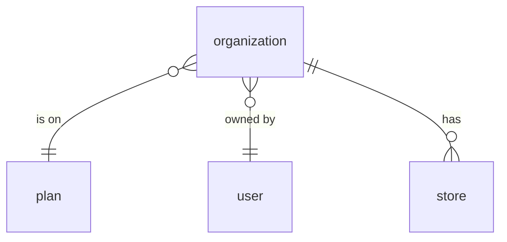
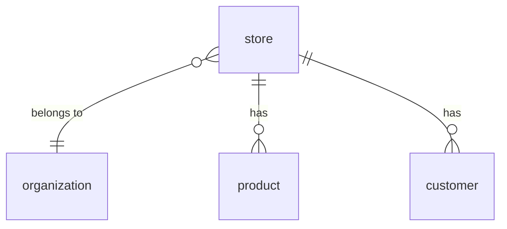
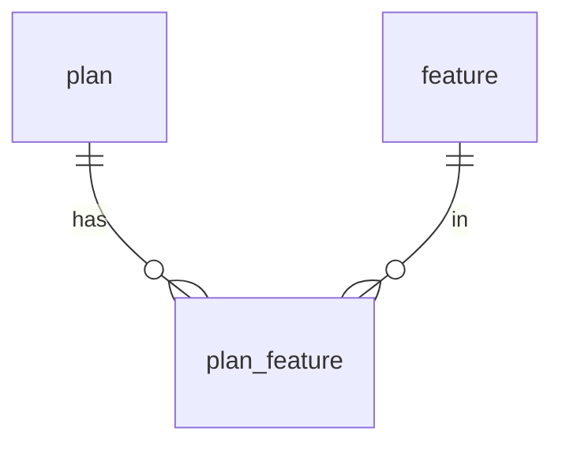
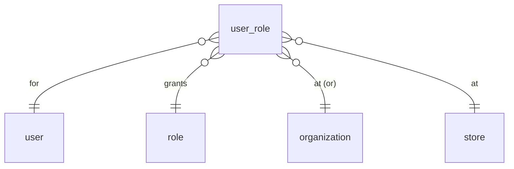
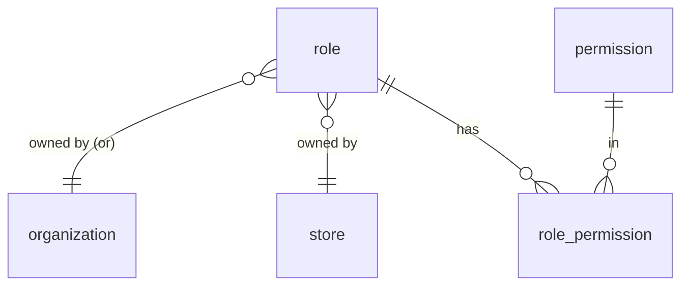
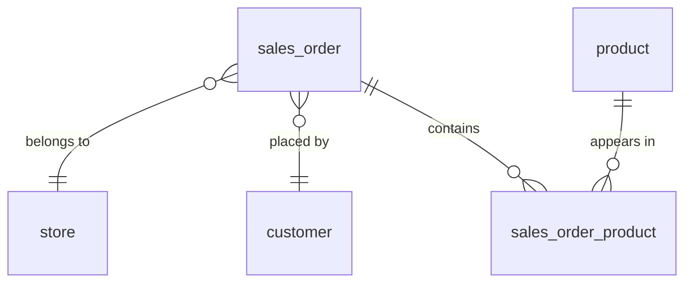
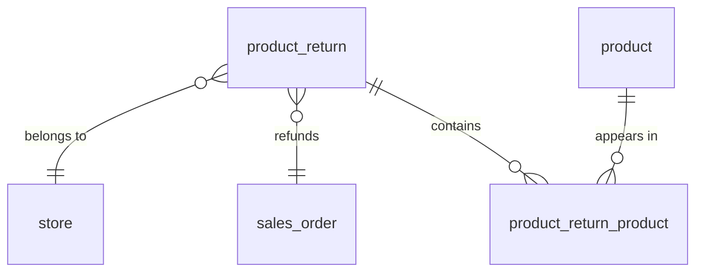

## Tables

PostgreSQL `CREATE TABLE` statements. Only keys and structurally-important fields are
included; descriptive columns (name, description, address, etc.) are added later.

Note: `user` is a reserved word in Postgres, so the table name is quoted as `"user"` in DDL.

## Auth / RBAC

```sql
CREATE TABLE "user" (
    user_id BIGINT GENERATED ALWAYS AS IDENTITY PRIMARY KEY
);

CREATE TABLE role (
    role_id         BIGINT GENERATED ALWAYS AS IDENTITY PRIMARY KEY,
    organization_id BIGINT REFERENCES organization (organization_id),
    store_id        BIGINT REFERENCES store (store_id),
    is_managed      BOOLEAN NOT NULL DEFAULT FALSE,
    -- owner is organization_id OR store_id, or neither when is_managed = true
    CHECK (
        (is_managed = TRUE  AND organization_id IS NULL AND store_id IS NULL)
        OR (is_managed = FALSE AND (organization_id IS NOT NULL) <> (store_id IS NOT NULL))
    )
);

CREATE TABLE permission (
    permission_id BIGINT GENERATED ALWAYS AS IDENTITY PRIMARY KEY,
    subject       TEXT NOT NULL,   -- e.g. store, organization
    action        TEXT NOT NULL,   -- e.g. refund, edit
    UNIQUE (subject, action)
);

CREATE TABLE user_role (
    user_role_id    BIGINT GENERATED ALWAYS AS IDENTITY PRIMARY KEY,
    user_id         BIGINT NOT NULL REFERENCES "user" (user_id),
    role_id         BIGINT NOT NULL REFERENCES role (role_id),
    organization_id BIGINT REFERENCES organization (organization_id),
    store_id        BIGINT REFERENCES store (store_id),
    -- the place is organization_id OR store_id (exactly one set)
    CHECK ((organization_id IS NOT NULL) <> (store_id IS NOT NULL))
);

CREATE TABLE role_permission (
    role_id       BIGINT NOT NULL REFERENCES role (role_id),
    permission_id BIGINT NOT NULL REFERENCES permission (permission_id),
    PRIMARY KEY (role_id, permission_id)
);
```

## Plans / Features

```sql
CREATE TABLE plan (
    plan_id BIGINT GENERATED ALWAYS AS IDENTITY PRIMARY KEY
);

CREATE TABLE feature (
    feature_id BIGINT GENERATED ALWAYS AS IDENTITY PRIMARY KEY
);

CREATE TABLE plan_feature (
    plan_id    BIGINT NOT NULL REFERENCES plan (plan_id),
    feature_id BIGINT NOT NULL REFERENCES feature (feature_id),
    PRIMARY KEY (plan_id, feature_id)
);
```

## Organization

```sql
CREATE TABLE organization (
    organization_id BIGINT GENERATED ALWAYS AS IDENTITY PRIMARY KEY,
    plan_id         BIGINT REFERENCES plan (plan_id),
    owner_user_id   BIGINT REFERENCES "user" (user_id)
);
```

## Store

```sql
CREATE TABLE store (
    store_id        BIGINT GENERATED ALWAYS AS IDENTITY PRIMARY KEY,
    organization_id BIGINT NOT NULL REFERENCES organization (organization_id)
);

CREATE TABLE product (
    product_id BIGINT GENERATED ALWAYS AS IDENTITY PRIMARY KEY,
    store_id   BIGINT NOT NULL REFERENCES store (store_id),
    sku        TEXT,
    UNIQUE (store_id, sku)   -- sku is unique within a store
);

CREATE TABLE customer (
    customer_id BIGINT GENERATED ALWAYS AS IDENTITY PRIMARY KEY,
    store_id    BIGINT NOT NULL REFERENCES store (store_id)
);

CREATE TABLE sales_order (
    order_id    BIGINT GENERATED ALWAYS AS IDENTITY PRIMARY KEY,
    store_id    BIGINT NOT NULL REFERENCES store (store_id),
    customer_id BIGINT REFERENCES customer (customer_id),
    status      TEXT NOT NULL   -- e.g. open / paid / refunded
);

CREATE TABLE sales_order_product (
    order_id   BIGINT NOT NULL REFERENCES sales_order (order_id),
    product_id BIGINT NOT NULL REFERENCES product (product_id),
    quantity   INTEGER NOT NULL,
    unit_price NUMERIC(12, 2) NOT NULL,   -- snapshots the price at sale time
    PRIMARY KEY (order_id, product_id)
);

CREATE TABLE product_return (
    return_id BIGINT GENERATED ALWAYS AS IDENTITY PRIMARY KEY,
    store_id  BIGINT NOT NULL REFERENCES store (store_id),
    order_id  BIGINT NOT NULL REFERENCES sales_order (order_id)
);

CREATE TABLE product_return_product (
    return_id  BIGINT NOT NULL REFERENCES product_return (return_id),
    product_id BIGINT NOT NULL REFERENCES product (product_id),
    quantity   INTEGER NOT NULL,
    PRIMARY KEY (return_id, product_id)
);
```


# ER Diagrams

One diagram per entity, showing that entity's own relationships. Legend: `}o--||` means **many-to-one** — the crow's-foot (`}o`) side is the "many," the `||` side is the "one."


## Organization




## Store




## Plan




## User Role




## Role




## Order




## Return




# Queries

Each query returns flat joined rows with all the columns a screen needs. The API layer
groups/combines these rows (e.g. collapsing a user's many roles into one object), so the
SQL stays plain joins — no aggregation here.

Bind parameters: `:organization_id`, `:store_id`, `:user_id`, `:order_id`.

These examples use descriptive columns (`name`, `email`, `phone`, `price`, etc.) that
are added to the tables later — the schema above lists keys only.


## Products for every store in an organization

Each product with its price/stock and which store it's in.

```sql
SELECT p.product_id,
       p.name,
       p.sku,
       p.price,
       p.quantity,
       s.store_id,
       s.name AS store_name
FROM product p
JOIN store s ON s.store_id = p.store_id
WHERE s.organization_id = :organization_id
ORDER BY s.name, p.name;
```


## A user's full access (everything the app loads at login)

One row per permission, tagged with the place it applies to (a store or the org) and
that place's name. The API groups these by place to build the per-place permission lists.

```sql
SELECT ur.organization_id,
       o.name AS organization_name,
       ur.store_id,
       s.name AS store_name,
       p.subject,
       p.action
FROM user_role ur
JOIN role_permission rp ON rp.role_id = ur.role_id
JOIN permission p       ON p.permission_id = rp.permission_id
LEFT JOIN organization o ON o.organization_id = ur.organization_id
LEFT JOIN store s        ON s.store_id        = ur.store_id
WHERE ur.user_id = :user_id;
```


## Users in a store (with their info and roles)

For a store's "staff" screen. One row per user-role, with the user's details. A user with
two roles at the store returns two rows; the API groups them into one user with a role
list.

```sql
SELECT u.user_id,
       u.name,
       u.email,
       u.phone,
       r.role_id,
       r.name AS role_name
FROM "user" u
JOIN user_role ur ON ur.user_id = u.user_id
JOIN role r       ON r.role_id  = ur.role_id
WHERE ur.store_id = :store_id
ORDER BY u.name;
```


## Users in an organization (with info, and where they work)

Every person in the org — at the org level, or at any store under it — one row per grant
with the user's details, the role, and the place. The API groups by user.

```sql
SELECT u.user_id,
       u.name,
       u.email,
       u.phone,
       r.name AS role_name,
       ur.organization_id,
       o.name AS organization_name,
       ur.store_id,
       s.name AS store_name
FROM "user" u
JOIN user_role ur        ON ur.user_id = u.user_id
JOIN role r              ON r.role_id  = ur.role_id
LEFT JOIN organization o ON o.organization_id = ur.organization_id
LEFT JOIN store s        ON s.store_id        = ur.store_id
WHERE ur.organization_id = :organization_id
   OR s.organization_id   = :organization_id
ORDER BY u.name;
```


## Roles available to a store (with their permissions)

The built-in (managed) roles plus this store's own custom roles. One row per
role-permission; the API groups by role.

```sql
SELECT r.role_id,
       r.name,
       r.is_managed,
       p.subject,
       p.action
FROM role r
LEFT JOIN role_permission rp ON rp.role_id = r.role_id
LEFT JOIN permission p       ON p.permission_id = rp.permission_id
WHERE r.is_managed = TRUE          -- built-in roles
   OR r.store_id   = :store_id     -- this store's custom roles
ORDER BY r.is_managed DESC, r.name;
```


## Roles available to an organization (with their permissions)

The built-in roles plus the org's own custom roles. One row per role-permission; the API
groups by role.

```sql
SELECT r.role_id,
       r.name,
       r.is_managed,
       p.subject,
       p.action
FROM role r
LEFT JOIN role_permission rp ON rp.role_id = r.role_id
LEFT JOIN permission p       ON p.permission_id = rp.permission_id
WHERE r.is_managed      = TRUE                -- built-in roles
   OR r.organization_id = :organization_id    -- this org's custom roles
ORDER BY r.is_managed DESC, r.name;
```


## An order with its line items (receipt / order detail)

The order, who placed it, and one row per line item. The API groups the lines under the
order and sums the total.

```sql
SELECT so.order_id,
       so.status,
       c.customer_id,
       c.name AS customer_name,
       p.product_id,
       p.name AS product_name,
       sop.quantity,
       sop.unit_price
FROM sales_order so
LEFT JOIN customer c         ON c.customer_id = so.customer_id
JOIN sales_order_product sop ON sop.order_id = so.order_id
JOIN product p               ON p.product_id = sop.product_id
WHERE so.order_id = :order_id;
```
