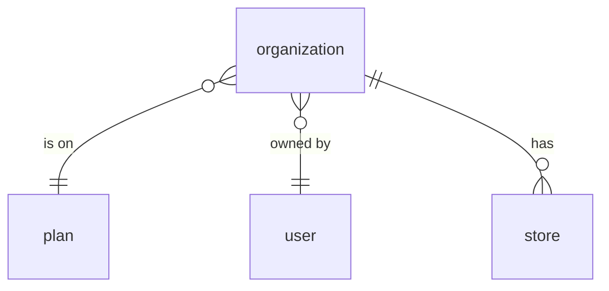
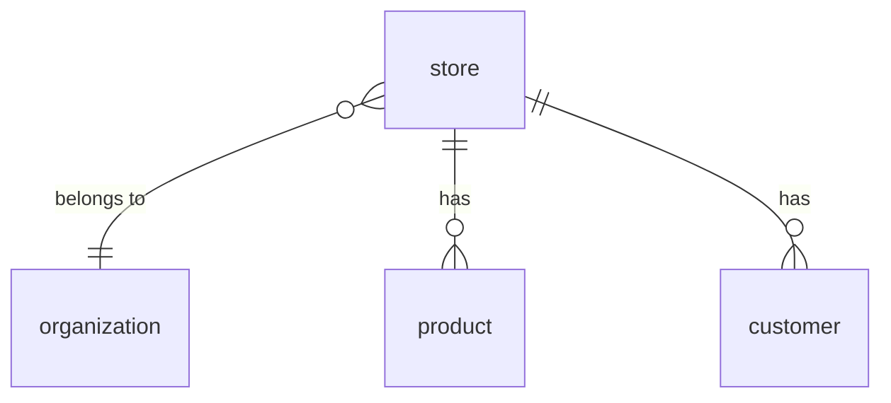
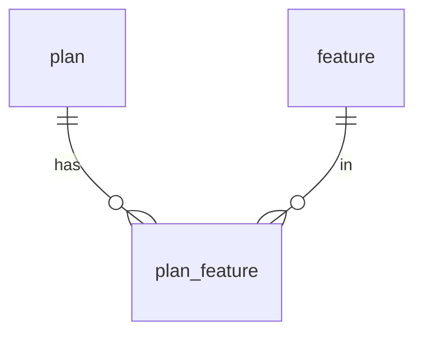
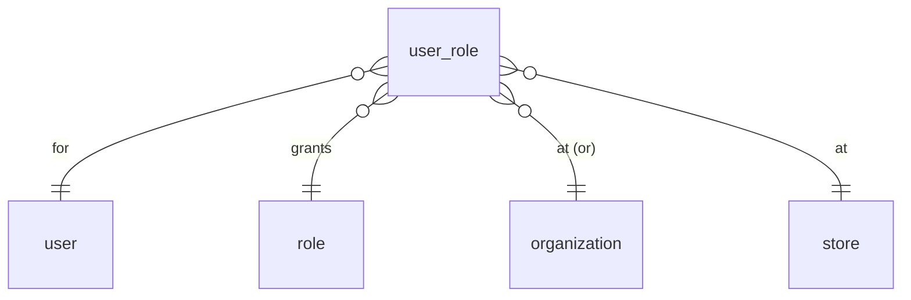
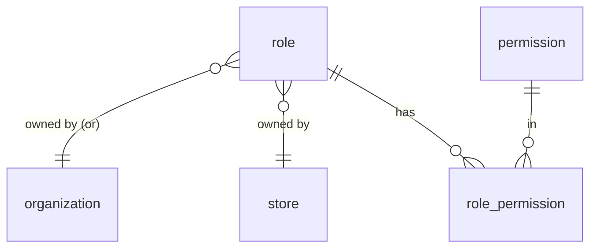
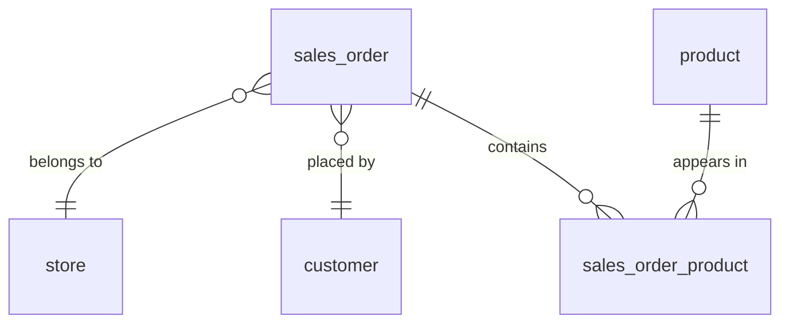
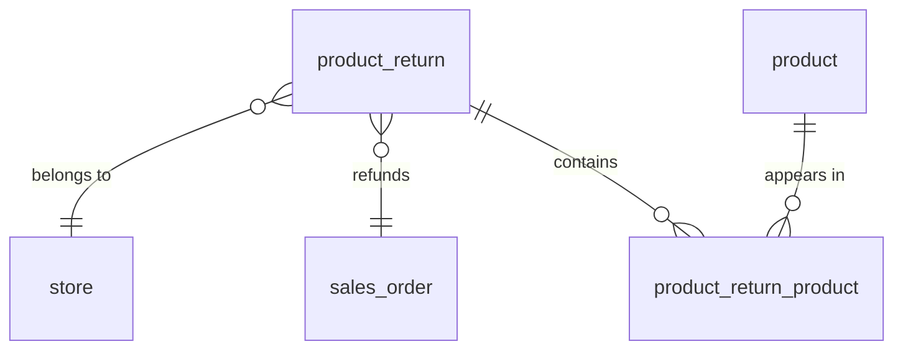

## Tables

PostgreSQL `CREATE TABLE` statements. Only keys and structurally-important fields are
included; descriptive columns (name, description, address, etc.) are added later.

Note: `user` is a reserved word in Postgres, so the table name is quoted as `"user"` in DDL.

## Auth / RBAC

```sql
CREATE TABLE "user" (
    user_id BIGINT GENERATED ALWAYS AS IDENTITY PRIMARY KEY
);

CREATE TABLE role (
    role_id         BIGINT GENERATED ALWAYS AS IDENTITY PRIMARY KEY,
    organization_id BIGINT REFERENCES organization (organization_id),
    store_id        BIGINT REFERENCES store (store_id),
    is_managed      BOOLEAN NOT NULL DEFAULT FALSE,
    -- Owner rule, enforced by the DB:
    --   managed role (is_managed=true): BOTH owner columns NULL
    --   custom role  (is_managed=false): EXACTLY ONE owner column set, never both
    -- The `<>` (XOR) means exactly one of the two is NOT NULL.
    CHECK (
        (is_managed = TRUE  AND organization_id IS NULL AND store_id IS NULL)
        OR (is_managed = FALSE AND (organization_id IS NOT NULL) <> (store_id IS NOT NULL))
    )
);

CREATE TABLE permission (
    permission_id BIGINT GENERATED ALWAYS AS IDENTITY PRIMARY KEY,
    subject       TEXT NOT NULL,   -- e.g. store, organization
    action        TEXT NOT NULL,   -- e.g. refund, edit
    UNIQUE (subject, action)
);

CREATE TABLE user_role (
    user_role_id    BIGINT GENERATED ALWAYS AS IDENTITY PRIMARY KEY,
    user_id         BIGINT NOT NULL REFERENCES "user" (user_id),
    role_id         BIGINT NOT NULL REFERENCES role (role_id),
    organization_id BIGINT REFERENCES organization (organization_id),
    store_id        BIGINT REFERENCES store (store_id),
    -- the place is organization_id OR store_id: EXACTLY ONE set, never both, never neither.
    -- The `<>` (XOR) means exactly one of the two is NOT NULL.
    CHECK ((organization_id IS NOT NULL) <> (store_id IS NOT NULL))
);

-- prevent the same role being granted twice to a user at the same place
-- (two partial indexes because the place lives in one of two nullable columns)
CREATE UNIQUE INDEX user_role_store_uq
    ON user_role (user_id, role_id, store_id)
    WHERE store_id IS NOT NULL;

CREATE UNIQUE INDEX user_role_org_uq
    ON user_role (user_id, role_id, organization_id)
    WHERE organization_id IS NOT NULL;

CREATE TABLE role_permission (
    role_id       BIGINT NOT NULL REFERENCES role (role_id),
    permission_id BIGINT NOT NULL REFERENCES permission (permission_id),
    PRIMARY KEY (role_id, permission_id)
);
```

## Plans / Features

```sql
CREATE TABLE plan (
    plan_id BIGINT GENERATED ALWAYS AS IDENTITY PRIMARY KEY
);

CREATE TABLE feature (
    feature_id BIGINT GENERATED ALWAYS AS IDENTITY PRIMARY KEY
);

CREATE TABLE plan_feature (
    plan_id    BIGINT NOT NULL REFERENCES plan (plan_id),
    feature_id BIGINT NOT NULL REFERENCES feature (feature_id),
    PRIMARY KEY (plan_id, feature_id)
);
```

## Organization

```sql
CREATE TABLE organization (
    organization_id BIGINT GENERATED ALWAYS AS IDENTITY PRIMARY KEY,
    plan_id         BIGINT REFERENCES plan (plan_id),
    owner_user_id   BIGINT REFERENCES "user" (user_id)
);
```

## Store

```sql
CREATE TABLE store (
    store_id        BIGINT GENERATED ALWAYS AS IDENTITY PRIMARY KEY,
    organization_id BIGINT NOT NULL REFERENCES organization (organization_id)
);

CREATE TABLE product (
    product_id BIGINT GENERATED ALWAYS AS IDENTITY PRIMARY KEY,
    store_id   BIGINT NOT NULL REFERENCES store (store_id),
    sku        TEXT,
    UNIQUE (store_id, sku)   -- sku is unique within a store
);

CREATE TABLE customer (
    customer_id BIGINT GENERATED ALWAYS AS IDENTITY PRIMARY KEY,
    store_id    BIGINT NOT NULL REFERENCES store (store_id)
);

CREATE TABLE sales_order (
    order_id    BIGINT GENERATED ALWAYS AS IDENTITY PRIMARY KEY,
    store_id    BIGINT NOT NULL REFERENCES store (store_id),
    customer_id BIGINT REFERENCES customer (customer_id),
    status      TEXT NOT NULL   -- e.g. open / paid / refunded
);

CREATE TABLE sales_order_product (
    order_id   BIGINT NOT NULL REFERENCES sales_order (order_id),
    product_id BIGINT NOT NULL REFERENCES product (product_id),
    quantity   INTEGER NOT NULL,
    unit_price NUMERIC(12, 2) NOT NULL,   -- snapshots the price at sale time
    PRIMARY KEY (order_id, product_id)
);

CREATE TABLE product_return (
    return_id BIGINT GENERATED ALWAYS AS IDENTITY PRIMARY KEY,
    store_id  BIGINT NOT NULL REFERENCES store (store_id),
    order_id  BIGINT NOT NULL REFERENCES sales_order (order_id)
);

CREATE TABLE product_return_product (
    return_id  BIGINT NOT NULL REFERENCES product_return (return_id),
    product_id BIGINT NOT NULL REFERENCES product (product_id),
    quantity   INTEGER NOT NULL,
    PRIMARY KEY (return_id, product_id)
);
```

## Indexes

Postgres indexes primary keys and unique constraints automatically, but **not** foreign-key
columns. Every FK we filter or join on needs an explicit index, or queries on the big tables
become full-table scans. (See the Performance section for why each is needed.)

A composite primary key already indexes its **leftmost** column, so `sales_order_product`
and `product_return_product` don't need an extra index on `order_id` / `return_id`, only on
the other column.

```sql
-- RBAC
CREATE INDEX ON store           (organization_id);
CREATE INDEX ON user_role       (user_id);
CREATE INDEX ON role            (organization_id);
CREATE INDEX ON role            (store_id);
CREATE INDEX ON role_permission (permission_id);   -- role_id covered by PK

-- Organization
CREATE INDEX ON organization (plan_id);
CREATE INDEX ON organization (owner_user_id);
CREATE INDEX ON plan_feature (feature_id);         -- plan_id covered by PK

-- Store data (the big tables — these matter most)
CREATE INDEX ON product                (store_id);
CREATE INDEX ON customer               (store_id);
CREATE INDEX ON sales_order            (store_id);
CREATE INDEX ON sales_order            (customer_id);
CREATE INDEX ON sales_order_product    (product_id);   -- order_id covered by PK
CREATE INDEX ON product_return         (store_id);
CREATE INDEX ON product_return         (order_id);
CREATE INDEX ON product_return_product (product_id);   -- return_id covered by PK

-- Composite indexes for the common sorted lists (list newest-first / alphabetical)
CREATE INDEX ON product     (store_id, name);
CREATE INDEX ON sales_order  (store_id, order_id DESC);
```


# ER Diagrams

One diagram per entity, showing that entity's own relationships. Legend: `}o--||` means **many-to-one** — the crow's-foot (`}o`) side is the "many," the `||` side is the "one."


## Organization




## Store




## Plan




## User Role




## Role




## Order




## Return




# Queries

Each query returns flat joined rows with all the columns a screen needs. The API layer
groups/combines these rows (e.g. collapsing a user's many roles into one object), so the
SQL stays plain joins — no aggregation here.

Bind parameters: `:organization_id`, `:store_id`, `:user_id`, `:order_id`.

These examples use descriptive columns (`name`, `email`, `phone`, `price`, etc.) that
are added to the tables later — the schema above lists keys only.


## Products for every store in an organization

Each product with its price/stock and which store it's in.

```sql
SELECT p.product_id,
       p.name,
       p.sku,
       p.price,
       p.quantity,
       s.store_id,
       s.name AS store_name
FROM product p
JOIN store s ON s.store_id = p.store_id
WHERE s.organization_id = :organization_id
ORDER BY s.name, p.name;
```


## A user's full access (everything the app loads at login)

One row per permission, tagged with the place it applies to (a store or the org) and
that place's name. The API groups these by place to build the per-place permission lists.

```sql
SELECT ur.organization_id,
       o.name AS organization_name,
       ur.store_id,
       s.name AS store_name,
       p.subject,
       p.action
FROM user_role ur
JOIN role_permission rp ON rp.role_id = ur.role_id
JOIN permission p       ON p.permission_id = rp.permission_id
LEFT JOIN organization o ON o.organization_id = ur.organization_id
LEFT JOIN store s        ON s.store_id        = ur.store_id
WHERE ur.user_id = :user_id;
```


## Users in a store (with their info and roles)

For a store's "staff" screen. One row per user-role, with the user's details. A user with
two roles at the store returns two rows; the API groups them into one user with a role
list.

```sql
SELECT u.user_id,
       u.name,
       u.email,
       u.phone,
       r.role_id,
       r.name AS role_name
FROM "user" u
JOIN user_role ur ON ur.user_id = u.user_id
JOIN role r       ON r.role_id  = ur.role_id
WHERE ur.store_id = :store_id
ORDER BY u.name;
```


## Users in an organization (with info, and where they work)

Every person in the org — at the org level, or at any store under it — one row per grant
with the user's details, the role, and the place. The API groups by user.

```sql
SELECT u.user_id,
       u.name,
       u.email,
       u.phone,
       r.name AS role_name,
       ur.organization_id,
       o.name AS organization_name,
       ur.store_id,
       s.name AS store_name
FROM "user" u
JOIN user_role ur        ON ur.user_id = u.user_id
JOIN role r              ON r.role_id  = ur.role_id
LEFT JOIN organization o ON o.organization_id = ur.organization_id
LEFT JOIN store s        ON s.store_id        = ur.store_id
WHERE ur.organization_id = :organization_id
   OR s.organization_id   = :organization_id
ORDER BY u.name;
```


## Roles available to a store (with their permissions)

The built-in (managed) roles plus this store's own custom roles. One row per
role-permission; the API groups by role.

```sql
SELECT r.role_id,
       r.name,
       r.is_managed,
       p.subject,
       p.action
FROM role r
LEFT JOIN role_permission rp ON rp.role_id = r.role_id
LEFT JOIN permission p       ON p.permission_id = rp.permission_id
WHERE r.is_managed = TRUE          -- built-in roles
   OR r.store_id   = :store_id     -- this store's custom roles
ORDER BY r.is_managed DESC, r.name;
```


## Roles available to an organization (with their permissions)

The built-in roles, the org's own custom roles, and the custom roles created by any store
under the org — so an org admin sees every role in their organization. One row per
role-permission; the API groups by role.

```sql
SELECT r.role_id,
       r.name,
       r.is_managed,
       p.subject,
       p.action
FROM role r
LEFT JOIN role_permission rp ON rp.role_id = r.role_id
LEFT JOIN permission p       ON p.permission_id = rp.permission_id
WHERE r.is_managed = TRUE                     -- built-in roles
   OR r.organization_id = :organization_id    -- the org's own custom roles
   OR r.store_id IN (                          -- custom roles of stores under the org
        SELECT store_id FROM store
        WHERE organization_id = :organization_id
      )
ORDER BY r.is_managed DESC, r.name;
```


## An order with its line items (receipt / order detail)

The order, who placed it, and one row per line item. The API groups the lines under the
order and sums the total.

```sql
SELECT so.order_id,
       so.status,
       c.customer_id,
       c.name AS customer_name,
       p.product_id,
       p.name AS product_name,
       sop.quantity,
       sop.unit_price
FROM sales_order so
LEFT JOIN customer c         ON c.customer_id = so.customer_id
JOIN sales_order_product sop ON sop.order_id = so.order_id
JOIN product p               ON p.product_id = sop.product_id
WHERE so.order_id = :order_id;
```


## Products in a store (catalog / inventory list)

The main product list for a single store's catalog or inventory screen.

```sql
SELECT product_id,
       name,
       sku,
       price,
       quantity
FROM product
WHERE store_id = :store_id
ORDER BY name;
```


## Search products in a store

Type-ahead / search box on the product list. Matches name or SKU.

```sql
SELECT product_id,
       name,
       sku,
       price,
       quantity
FROM product
WHERE store_id = :store_id
  AND (name ILIKE '%' || :search || '%' OR sku ILIKE '%' || :search || '%')
ORDER BY name
LIMIT 50;
```


## Customers in a store

The customer list for a store.

```sql
SELECT customer_id,
       name,
       email,
       phone
FROM customer
WHERE store_id = :store_id
ORDER BY name;
```


## Orders for a store (order list)

The orders screen for a store, newest first, with the customer's name.

```sql
SELECT so.order_id,
       so.status,
       c.name AS customer_name
FROM sales_order so
LEFT JOIN customer c ON c.customer_id = so.customer_id
WHERE so.store_id = :store_id
ORDER BY so.order_id DESC;
```


## Orders for a customer (customer history)

Every order a single customer has placed.

```sql
SELECT order_id,
       status
FROM sales_order
WHERE customer_id = :customer_id
ORDER BY order_id DESC;
```


## Returns for a store (returns list)

The returns screen for a store, with the order each return refunds.

```sql
SELECT pr.return_id,
       pr.order_id
FROM product_return pr
WHERE pr.store_id = :store_id
ORDER BY pr.return_id DESC;
```


## A return with its line items (return detail)

The return, the order it refunds, and one row per returned item. The API groups the lines
under the return.

```sql
SELECT pr.return_id,
       pr.order_id,
       p.product_id,
       p.name AS product_name,
       prp.quantity
FROM product_return pr
JOIN product_return_product prp ON prp.return_id = pr.return_id
JOIN product p                  ON p.product_id = prp.product_id
WHERE pr.return_id = :return_id;
```


## Stores in an organization (store switcher / store list)

The list of stores for an org — used by the org dashboard and the place switcher.

```sql
SELECT store_id,
       name
FROM store
WHERE organization_id = :organization_id
ORDER BY name;
```


## A role with its permissions (role detail / edit)

For viewing or editing a single role. One row per permission; the API groups them under
the role.

```sql
SELECT r.role_id,
       r.name,
       r.is_managed,
       p.subject,
       p.action
FROM role r
LEFT JOIN role_permission rp ON rp.role_id = r.role_id
LEFT JOIN permission p       ON p.permission_id = rp.permission_id
WHERE r.role_id = :role_id;
```


## All available permissions (role builder)

The full list of permissions the UI offers when building or editing a role.

```sql
SELECT permission_id,
       subject,
       action
FROM permission
ORDER BY subject, action;
```


## An organization's plan and its features

For a billing / plan screen: the org's plan and the features it includes.

```sql
SELECT pl.plan_id,
       pl.name AS plan_name,
       f.feature_id,
       f.name AS feature_name
FROM organization o
JOIN plan pl         ON pl.plan_id = o.plan_id
LEFT JOIN plan_feature pf ON pf.plan_id = pl.plan_id
LEFT JOIN feature f       ON f.feature_id = pf.feature_id
WHERE o.organization_id = :organization_id
ORDER BY f.name;
```


# Performance

How the schema and queries hold up at scale. This is the analysis we use to decide which
indexes are required and which queries need rethinking.

## Scale we're designing for

| Entity | Count | How we got it |
|--------|-------|---------------|
| organization | 10,000 | given |
| store | 50,000 | ~5 stores/org |
| user | 250,000 | given (~5 users/store) |
| user_role | ~375,000 | ~1.5 grants/user |
| role | small | a handful built-in + a few custom per org/store |
| permission | small | fixed catalog (tens) |
| product | ~25,000,000 | ~500 products × 50k stores |
| customer | ~50,000,000 | ~1,000 customers × 50k stores |
| sales_order | ~500,000,000 / yr | ~10k orders/yr × 50k stores |
| sales_order_product | ~1,500,000,000 / yr | ~3 lines/order |

The big tables are **product, customer, sales_order, sales_order_product**. Everything in
Auth/RBAC stays small and is effectively free to query. The whole risk is in store-owned
data, and almost all of it comes down to one thing: **is the query anchored on an indexed
`store_id` (or `organization_id`), or does it scan?**

## The golden rule: index every foreign key

Postgres does **not** auto-create indexes on foreign-key columns (it only indexes primary
keys and unique constraints). Without these, every "list X for a store" query becomes a
full-table scan of a multi-million-row table — the single biggest performance cliff in this
schema. All required FK indexes (plus the composite indexes for sorted lists) are defined in
the **Indexes** block under the schema above. With those in place, the store-scoped queries
go from scanning millions of rows to reading the few hundred that belong to one store.

## Query-by-query verdict

| Query | At scale | Why |
|-------|----------|-----|
| Products in a store | **Fast** | `WHERE store_id = ?` hits the `product(store_id)` index; returns ~500 rows |
| Search products in a store | **OK → needs care** | `store_id` index narrows to one store first, then filters ~500 rows. `ILIKE '%x%'` can't use a normal index, but on ~500 rows that's fine. Becomes slow only for cross-store search (see below) |
| Customers in a store | **Fast** | `customer(store_id)` index; ~1,000 rows |
| Orders for a store | **Fast** | `sales_order(store_id)` index. Add `(store_id, order_id DESC)` for the newest-first sort |
| Orders for a customer | **Fast** | `sales_order(customer_id)` index |
| Order / return detail | **Fast** | Anchored on one `order_id` / `return_id`; a handful of line rows |
| User's full access (login) | **Fast** | `user_role(user_id)` index → ~1.5 rows → tiny role/permission joins |
| Users in a store | **Fast** | small join off `user_role` |
| Roles for a store / org | **Fast** | `role` table is small |
| Stores in an org | **Fast** | `store(organization_id)` index; ~5 rows |
| **Products across a whole org** | **Slower** | See below |
| **Org owner "see everything"** | **Slowest** | See below |

## The queries that hurt — and the fix

Two patterns scan across many stores instead of one. They're the federated reads the
architecture doc flagged as "fine now, add a read layer later." At 50k stores, "later" is
closer.

**1. Products for every store in an organization.**
`WHERE store IN (the org's stores)` then read products for all of them. For a 5-store org
that's ~2,500 product rows — fine. The risk is a *large* org (a chain with hundreds of
stores) or org-wide search/reporting, where you scan hundreds of thousands of rows and sort
them on every request.

**2. Org owner "see everything across all stores."**
Same shape, but across orders/returns too — potentially millions of rows for a big org,
recomputed live on each page load. This does **not** scale as a live query for large orgs.

**Fixes, in order of effort:**

- **Composite indexes** for the common access pattern, e.g. `product (store_id, name)` so
  the per-store list is already sorted, and `sales_order (store_id, order_id DESC)` for the
  order list. Cheap, do these now.
- **Keyset (cursor) pagination** instead of `OFFSET` for long lists — `WHERE order_id < :cursor
  ORDER BY order_id DESC LIMIT 50`. `OFFSET 100000` re-scans 100k rows; keyset doesn't.
- **A read model for org-wide views.** For the owner dashboard and org-wide search, don't
  query the live tables. Maintain a denormalized/summary table (or a search index such as
  Postgres full-text, or an external one) updated on write or by a periodic job. This is the
  "pre-built read copy" the architecture doc describes; it's the real answer for large-org
  reporting and cross-store search.
- **Partitioning** `sales_order` and `sales_order_product` by time (e.g. monthly range
  partitions) once they reach hundreds of millions of rows. Keeps each query touching only
  recent partitions and makes archiving old data cheap.

## How many requests per second can it handle?

Throughput depends on three things: how heavy each query is, how many connections the
database can run at once, and the hardware. Here is a realistic estimate for a single
mid-size Postgres instance (e.g. ~8 vCPU, 32 GB RAM, SSD/NVMe storage).

**Two classes of query, very different cost:**

| Class | Examples | Cost per query | Throughput on one instance |
|-------|----------|----------------|----------------------------|
| Indexed point/range reads | login access, product/customer/order list, order detail, role lookups | sub-millisecond to a few ms; touches hundreds of rows via an index | **thousands–tens of thousands / sec** |
| Org-wide aggregate reads | owner "see everything", cross-store search/reporting | tens of ms to seconds; scans across many stores | **single-digit to low-hundreds / sec** |

**The connection limit is the real ceiling.** Postgres handles a limited number of
*concurrent* queries well — roughly `2–4 × CPU cores` actively running (so ~16–32 for an
8-core box). Throughput is then:

```
requests/sec  ≈  concurrent_queries  /  avg_query_time

e.g.  32 concurrent  /  0.003 s (3 ms indexed read)  ≈  ~10,000 indexed reads/sec
      32 concurrent  /  0.300 s (300 ms org report)  ≈  ~100 org reports/sec
```

Always put a **connection pooler** (PgBouncer) in front — web apps open far more
connections than Postgres should run at once; the pooler funnels them into a small active
set. Without it, a few thousand app connections will exhaust the database long before CPU
does.

**What this means at our scale (250k users):**

- Assume ~10% active in a busy hour = 25k users, each doing ~1 action / 30 s →
  **~800 requests/sec** at peak, almost all of them cheap indexed reads.
- A single well-indexed, pooled Postgres instance handles that **comfortably** — it's an
  order of magnitude under the ~10k/sec indexed-read ceiling.
- The instance only struggles if a lot of those requests are the **org-wide aggregate**
  kind. A handful of big-org dashboards refreshing live can saturate CPU while the cheap
  reads still have headroom. That's exactly why org-wide views go through a **read model /
  cache**, not the live tables — it converts the expensive class back into the cheap class.

**Scaling past one instance** (only needed well beyond this point):

- **Read replicas** — send list/read traffic to replicas, keep writes on the primary.
  Multiplies read throughput nearly linearly.
- **Connection pooling** — already assumed; non-negotiable at this scale.
- **Caching** — cache a user's access payload and other hot, rarely-changing reads (Redis)
  so they never hit Postgres at all.
- **Sharding by organization** — the last resort. `organization_id` is a clean shard key
  because the data is naturally tenant-isolated, but you won't need it at 10k orgs.

**Rough verdict:** one properly indexed + pooled Postgres instance comfortably serves this
workload (~hundreds–low-thousands of req/s of indexed reads) with room to spare, **provided
org-wide views are served from a read model rather than scanned live.** Read replicas extend
that several-fold before sharding is ever a consideration.

## Write & storage notes

- `sales_order_product` grows ~1.5B rows/year. Plan for **table partitioning + an archival
  policy** (move/drop partitions older than N months) before it becomes unmanageable.
- Write throughput: orders are the main write path (~500M/yr ≈ tens of writes/sec on
  average, with peaks far higher). A single primary handles this fine; each insert touches
  few rows. Keep the index count lean — every extra index taxes every write.
- Every index speeds reads but slows writes and uses disk. The list above is the minimum
  needed; avoid adding indexes that no query uses.
- `NUMERIC(12,2)` for money is correct (exact); don't switch to float.

## Summary

- **Auth/RBAC and all single-store screens scale fine** — they're anchored on an indexed
  `store_id`/`user_id` and touch hundreds of rows, not millions. Just add the FK indexes.
- **The only real scaling risk is org-wide reads** (owner dashboard, cross-store search,
  org-wide reporting). The design already calls for a separate read model there; at this
  scale that read model becomes a requirement, not an optional optimization.
- **The huge transactional tables (orders, order lines) need partitioning + archiving**
  as a capacity-planning item, independent of query shape.
