## Tables

PostgreSQL `CREATE TABLE` statements. Only keys and structurally-important fields are
included; descriptive columns (name, description, address, etc.) are added later.

Note: `user` is a reserved word in Postgres, so the table name is quoted as `"user"` in DDL.

## Auth / RBAC

```sql
-- `user` is the GLOBAL identity table for the whole system (one login per person), not an
-- org-owned table. Provenance fields record where the account originated, so even after
-- every membership is removed we still know the user's home org and who created them.
CREATE TABLE "user" (
    user_id            BIGINT GENERATED ALWAYS AS IDENTITY PRIMARY KEY,
    organization_id    BIGINT NOT NULL REFERENCES organization (organization_id),  -- home org (set once, immutable)
    created_by_user_id BIGINT REFERENCES "user" (user_id),     -- the org admin who created this account
    created_at         TIMESTAMPTZ NOT NULL DEFAULT now()
);

-- Roles are managed: we build and ship them; customers assign them, they don't author roles.
CREATE TABLE role (
    role_id BIGINT GENERATED ALWAYS AS IDENTITY PRIMARY KEY
);

-- A permission is subject:resource:action (e.g. store:product:read, organization:role:assign).
--   subject  = the scope: 'store' or 'organization' (store:*:* acts on a store, organization:*:* on the org)
--   resource = what's acted on: product, order, role, ...
--   action   = the verb: read, create, refund, assign, ...
CREATE TABLE permission (
    permission_id BIGINT GENERATED ALWAYS AS IDENTITY PRIMARY KEY,
    subject       TEXT NOT NULL,   -- scope: store | organization
    resource      TEXT NOT NULL,   -- e.g. product, order, role
    action        TEXT NOT NULL,   -- e.g. read, create, refund, assign
    UNIQUE (subject, resource, action)
);

CREATE TABLE role_permission (
    role_id       BIGINT NOT NULL REFERENCES role (role_id),
    permission_id BIGINT NOT NULL REFERENCES permission (permission_id),
    PRIMARY KEY (role_id, permission_id)
);

-- A user belongs to a place (a store OR the org), independent of any role.
-- Like an IAM user: the membership exists on its own; roles are layered on top.
-- Removing all of a user's roles at a place leaves this row intact, so the user
-- still belongs there with no access.
CREATE TABLE membership (
    membership_id   BIGINT GENERATED ALWAYS AS IDENTITY PRIMARY KEY,
    user_id         BIGINT NOT NULL REFERENCES "user" (user_id),
    organization_id BIGINT REFERENCES organization (organization_id),
    store_id        BIGINT REFERENCES store (store_id),
    is_active       BOOLEAN NOT NULL DEFAULT TRUE,
    deleted_at      TIMESTAMPTZ,   -- soft delete: NULL = live, set = removed (kept for history)
    -- Two distinct switches:
    --   is_active  = suspended but still belongs here (temporary; reversible toggle).
    --   deleted_at = removed from this place, but the row is retained for audit/history.
    -- A live membership has deleted_at IS NULL. Every access query must filter
    -- deleted_at IS NULL, or a removed membership would still grant access.
    -- the place is organization_id OR store_id: EXACTLY ONE set, never both, never neither.
    -- The `<>` (XOR) means exactly one of the two is NOT NULL.
    CHECK ((organization_id IS NOT NULL) <> (store_id IS NOT NULL))
);

-- one LIVE membership per user per place. Soft-deleted rows (deleted_at set) are excluded,
-- so removing then re-adding a user at the same place doesn't collide with the old tombstone.
CREATE UNIQUE INDEX membership_store_uq
    ON membership (user_id, store_id)
    WHERE store_id IS NOT NULL AND deleted_at IS NULL;

CREATE UNIQUE INDEX membership_org_uq
    ON membership (user_id, organization_id)
    WHERE organization_id IS NOT NULL AND deleted_at IS NULL;

-- A role granted on a membership. Zero or more per membership.
-- Losing a role = deleting its row here; the membership above is untouched.
CREATE TABLE membership_role (
    membership_id BIGINT NOT NULL REFERENCES membership (membership_id),
    role_id       BIGINT NOT NULL REFERENCES role (role_id),
    PRIMARY KEY (membership_id, role_id)   -- same role can't be granted twice here
);

-- Level-specific membership fields live in side tables, so the shared `membership`
-- table stays free of nulls. A membership has a detail row in exactly ONE of these,
-- matching its place: store memberships get a store_membership_detail row, org
-- memberships get an organization_membership_detail row. One row per membership, so
-- membership_id is both the PK and the FK. Screens join the one that matches the place
-- they're already querying — the two detail tables never overlap, so no UNION.
CREATE TABLE store_membership_detail (
    membership_id BIGINT PRIMARY KEY REFERENCES membership (membership_id),
    store_pin     TEXT
    -- ...other store-only member fields go here
);

CREATE TABLE organization_membership_detail (
    membership_id BIGINT PRIMARY KEY REFERENCES membership (membership_id)
    -- ...org-only member fields go here
);

```

## Plans / Features

```sql
CREATE TABLE plan (
    plan_id BIGINT GENERATED ALWAYS AS IDENTITY PRIMARY KEY
);

CREATE TABLE feature (
    feature_id BIGINT GENERATED ALWAYS AS IDENTITY PRIMARY KEY
);

CREATE TABLE plan_feature (
    plan_id    BIGINT NOT NULL REFERENCES plan (plan_id),
    feature_id BIGINT NOT NULL REFERENCES feature (feature_id),
    PRIMARY KEY (plan_id, feature_id)
);
```

## Organization

```sql
CREATE TABLE organization (
    organization_id  BIGINT GENERATED ALWAYS AS IDENTITY PRIMARY KEY,
    owner_user_id    BIGINT REFERENCES "user" (user_id),
    default_store_id BIGINT REFERENCES store (store_id)
    -- Every org gets a default ("main") store created on onboarding — the store it sells and
    -- purchases through by default. default_store_id points at it; the owner can promote a
    -- different store later. Nullable only because the org row may be inserted just before its
    -- first store in the same onboarding transaction.
    -- no plan here: billing is per-store, so the plan lives on `store`.
    -- customers, suppliers, and the product catalog are all org-level and visible to every
    -- store (tightly-coupled single company), so there's no per-store sharing flag.
);
```

## Store

```sql
CREATE TABLE store (
    store_id         BIGINT GENERATED ALWAYS AS IDENTITY PRIMARY KEY,
    organization_id  BIGINT NOT NULL REFERENCES organization (organization_id),
    plan_id          BIGINT REFERENCES plan (plan_id),   -- each store is billed on its own plan
    region           TEXT,                               -- grouping label, e.g. 'NorthWest'
    sub_region       TEXT,                               -- finer grouping, e.g. 'Seattle-Metro'
    purchase_balance NUMERIC(12, 2),                     -- delegated inventory-buying allowance; NULL = unlimited
    expense_balance  NUMERIC(12, 2)                      -- delegated expense-spending allowance; NULL = unlimited
    -- The org is the single source of funds; a store has no account of its own. These two are
    -- how much spending power the org admin delegates to this store, each DEPLETING independently:
    --   purchase_balance -> inventory buys (purchase_order); each PO decrements it.
    --   expense_balance  -> non-inventory spend (expense, e.g. furniture); each expense decrements it.
    -- A purchase/expense is rejected if its total exceeds the matching balance (when not NULL).
    -- On success, the record is inserted AND the matching balance decremented in one transaction.
    -- The owner "tops up" by raising the number. NULL = no limit.
    -- region/sub_region are descriptive tags for filtering and reports, NOT places you can
    -- grant roles at. If a region ever needs to OWN access (a real district manager role)
    -- it graduates to its own entity; until then it's just a label on the store.
);

-- Free-form labels on a store (e.g. 'flagship', 'airport', 'pilot-program'). Many tags
-- per store. Kept separate from region/sub_region so a store can carry any number of them.
CREATE TABLE store_tag (
    store_id BIGINT NOT NULL REFERENCES store (store_id),
    tag      TEXT   NOT NULL,
    PRIMARY KEY (store_id, tag)   -- a store can't have the same tag twice
);

-- Product is an ORG-level identity (one catalog for the whole org), deduped on SKU — one
-- 'Coke SKU-123' shared across all stores. Each store sets its own quantity and price via
-- product_store. This fits a tightly-coupled single company: one catalog, per-store stock.
CREATE TABLE product (
    product_id      BIGINT GENERATED ALWAYS AS IDENTITY PRIMARY KEY,
    organization_id BIGINT NOT NULL REFERENCES organization (organization_id),
    sku             TEXT,
    UNIQUE (organization_id, sku)   -- sku is unique within the org (the dedup key)
);

-- A store's stock and price for a product. One row per (product, store) the store carries.
CREATE TABLE product_store (
    product_id BIGINT NOT NULL REFERENCES product (product_id),
    store_id   BIGINT NOT NULL REFERENCES store (store_id),
    quantity   INTEGER NOT NULL DEFAULT 0,   -- this store's own stock (independent per store)
    price      NUMERIC(12, 2),               -- this store's own price
    PRIMARY KEY (product_id, store_id)
);

-- Customer is an ORG-level identity: one account per person for the whole org, visible to
-- every store. Walk into any store, use the same account. No per-store customer data.
CREATE TABLE customer (
    customer_id     BIGINT GENERATED ALWAYS AS IDENTITY PRIMARY KEY,
    organization_id BIGINT NOT NULL REFERENCES organization (organization_id)
);

-- Supplier is an ORG-level vendor record, visible to every store. No per-store terms.
CREATE TABLE supplier (
    supplier_id     BIGINT GENERATED ALWAYS AS IDENTITY PRIMARY KEY,
    organization_id BIGINT NOT NULL REFERENCES organization (organization_id)
);

CREATE TABLE sales_order (
    order_id    BIGINT GENERATED ALWAYS AS IDENTITY PRIMARY KEY,
    store_id    BIGINT NOT NULL REFERENCES store (store_id),
    customer_id BIGINT REFERENCES customer (customer_id),
    status      TEXT NOT NULL   -- e.g. open / paid / refunded
);

CREATE TABLE sales_order_product (
    order_id   BIGINT NOT NULL REFERENCES sales_order (order_id),
    product_id BIGINT NOT NULL REFERENCES product (product_id),
    quantity   INTEGER NOT NULL,
    unit_price NUMERIC(12, 2) NOT NULL,   -- snapshots the price at sale time
    PRIMARY KEY (order_id, product_id)
);

CREATE TABLE sales_order_return (
    return_id BIGINT GENERATED ALWAYS AS IDENTITY PRIMARY KEY,
    store_id  BIGINT NOT NULL REFERENCES store (store_id),
    order_id  BIGINT NOT NULL REFERENCES sales_order (order_id)
);

CREATE TABLE sales_order_return_product (
    return_id  BIGINT NOT NULL REFERENCES sales_order_return (return_id),
    product_id BIGINT NOT NULL REFERENCES product (product_id),
    quantity   INTEGER NOT NULL,
    PRIMARY KEY (return_id, product_id)
);

-- A store buying inventory from an org supplier (inventory-IN, the counterpart to sales_order).
-- Spends the org's funds against the store's delegated purchase_balance: on creation we insert
-- this + its lines AND decrement store.purchase_balance in one transaction, rejecting the
-- purchase if its total exceeds the balance (when the balance isn't NULL = unlimited).
CREATE TABLE purchase_order (
    purchase_order_id BIGINT GENERATED ALWAYS AS IDENTITY PRIMARY KEY,
    store_id          BIGINT NOT NULL REFERENCES store (store_id),       -- the store that ordered
    supplier_id       BIGINT NOT NULL REFERENCES supplier (supplier_id), -- the org supplier bought from
    total             NUMERIC(12, 2) NOT NULL,   -- order total (what's deducted from purchase_balance)
    status            TEXT NOT NULL,             -- e.g. ordered / received / cancelled
    created_at        TIMESTAMPTZ NOT NULL DEFAULT now()
);

CREATE TABLE purchase_order_product (
    purchase_order_id BIGINT NOT NULL REFERENCES purchase_order (purchase_order_id),
    product_id        BIGINT NOT NULL REFERENCES product (product_id),
    quantity          INTEGER NOT NULL,
    unit_cost         NUMERIC(12, 2) NOT NULL,   -- cost per unit at purchase time
    PRIMARY KEY (purchase_order_id, product_id)
);

-- Non-inventory spending (furniture, computers, utilities, SaaS, accountant fees, etc.) —
-- money OUT that is NOT resold and does NOT touch stock, so it's separate from purchase_order.
-- No product lines: just a category and amount. An expense belongs to EITHER a store OR the
-- org directly:
--   store_id set   -> a store expense (location accounting; depletes that store's expense_balance)
--   store_id NULL  -> an ORG-level expense (HQ overhead: the POS subscription, accountant,
--                     company-wide software) — no store, so no per-store balance is depleted.
-- organization_id is always set so org-level expenses (store_id NULL) still have an owner.
CREATE TABLE expense (
    expense_id      BIGINT GENERATED ALWAYS AS IDENTITY PRIMARY KEY,
    organization_id BIGINT NOT NULL REFERENCES organization (organization_id),  -- always the owning org
    store_id        BIGINT REFERENCES store (store_id),       -- set = store expense; NULL = org-level expense
    supplier_id     BIGINT REFERENCES supplier (supplier_id), -- the vendor (Amazon, Staples, ...); optional
    category        TEXT NOT NULL,             -- e.g. 'furniture', 'equipment', 'utilities', 'software'
    amount          NUMERIC(12, 2) NOT NULL,   -- store expense: deducted from the store's expense_balance
    created_at      TIMESTAMPTZ NOT NULL DEFAULT now()
    -- when store_id is set, its store must belong to organization_id (enforced on the write path)
);
```

## Indexes

Postgres indexes primary keys and unique constraints automatically, but **not** foreign-key
columns. Every FK we filter or join on needs an explicit index, or queries on the big tables
become full-table scans. (See the Performance section for why each is needed.)

A composite primary key already indexes its **leftmost** column, so `sales_order_product`
and `sales_order_return_product` don't need an extra index on `order_id` / `return_id`, only on
the other column.

```sql
-- RBAC
CREATE INDEX ON store           (organization_id);
CREATE INDEX ON "user"          (organization_id);   -- users in their home org
CREATE INDEX ON "user"          (created_by_user_id);
CREATE INDEX ON membership      (user_id);
CREATE INDEX ON membership_role (role_id);          -- membership_id covered by PK
-- store_membership_detail / organization_membership_detail: membership_id is the PK,
-- already indexed; no extra index needed
CREATE INDEX ON role_permission (permission_id);   -- role_id covered by PK

-- Organization
CREATE INDEX ON store        (plan_id);
CREATE INDEX ON store        (organization_id, region);   -- group an org's stores by region
CREATE INDEX ON store_tag    (tag);                       -- find stores by tag (store_id covered by PK)
CREATE INDEX ON organization (owner_user_id);
CREATE INDEX ON organization (default_store_id);
CREATE INDEX ON plan_feature (feature_id);         -- plan_id covered by PK

-- Org-level identities (customers, suppliers, product catalog)
CREATE INDEX ON customer (organization_id);
CREATE INDEX ON supplier (organization_id);
CREATE INDEX ON product  (organization_id);

-- Store data (the big tables — these matter most)
CREATE INDEX ON product_store          (store_id);     -- a store's catalog (product_id covered by PK)
CREATE INDEX ON sales_order            (store_id);
CREATE INDEX ON sales_order            (customer_id);
CREATE INDEX ON sales_order_product    (product_id);   -- order_id covered by PK
CREATE INDEX ON sales_order_return         (store_id);
CREATE INDEX ON sales_order_return         (order_id);
CREATE INDEX ON sales_order_return_product (product_id);   -- return_id covered by PK
CREATE INDEX ON purchase_order             (store_id);
CREATE INDEX ON purchase_order             (supplier_id);
CREATE INDEX ON purchase_order_product     (product_id);   -- purchase_order_id covered by PK
CREATE INDEX ON expense                    (organization_id);   -- org-level expenses (store_id NULL)
CREATE INDEX ON expense                    (store_id);
CREATE INDEX ON expense                    (supplier_id);

-- Composite indexes for the common sorted lists (list newest-first / alphabetical)
CREATE INDEX ON product        (organization_id, name);    -- the org catalog, alphabetical
CREATE INDEX ON sales_order     (store_id, order_id DESC);
CREATE INDEX ON purchase_order  (store_id, purchase_order_id DESC);   -- a store's purchases, newest first
```


# ER Diagrams

One diagram per entity, showing that entity's own relationships. Legend: `}o--||` means **many-to-one** — the crow's-foot (`}o`) side is the "many," the `||` side is the "one."


## User

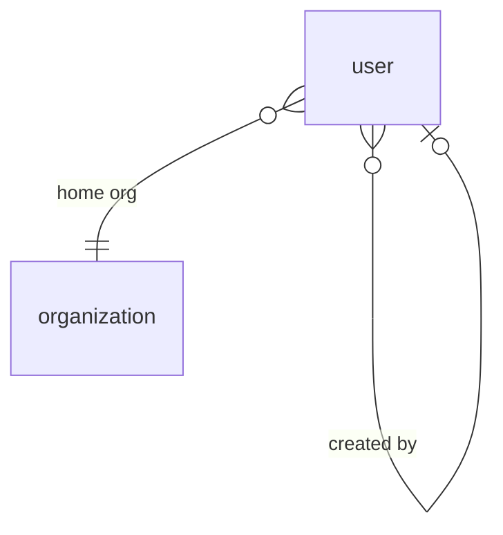


## Organization

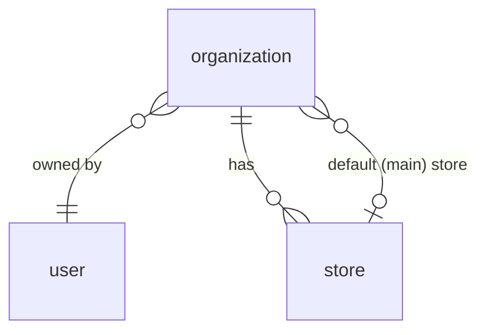


## Store

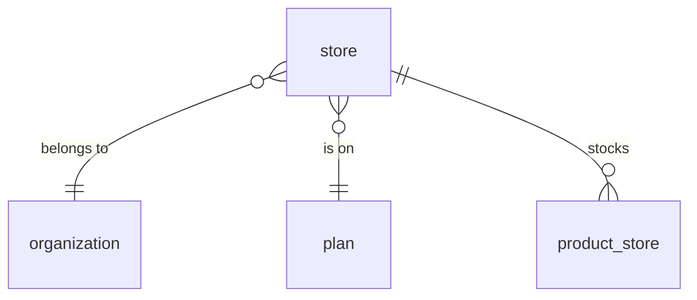


## Product

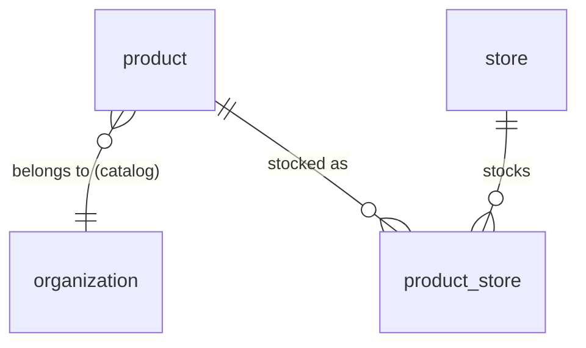


## Customer

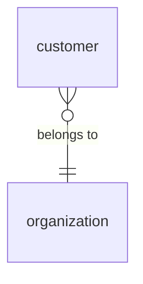


## Supplier

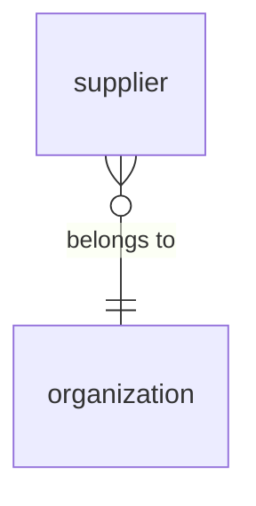


## Plan

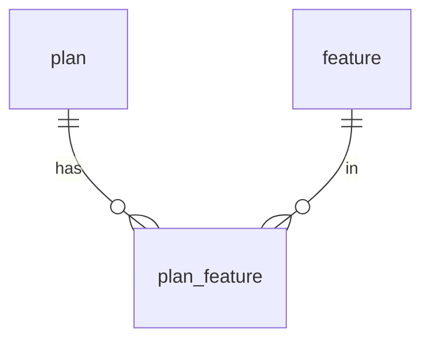


## Membership

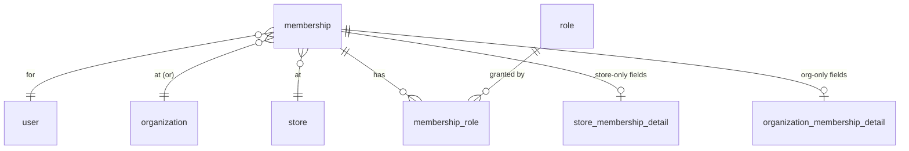


## Role

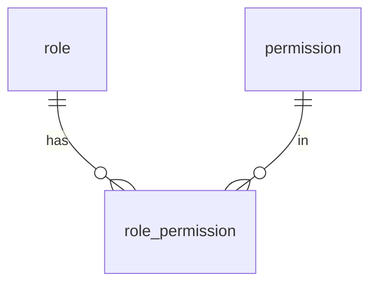


## Order

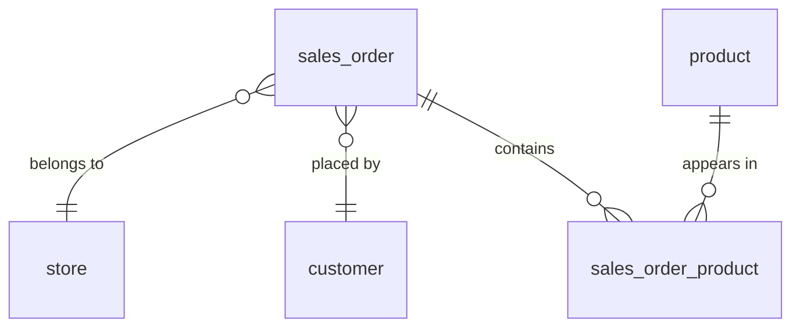


## Return

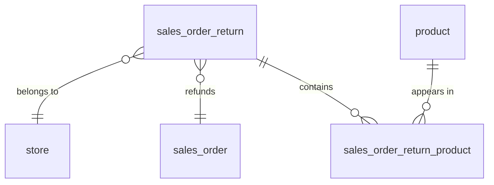


## Purchase Order

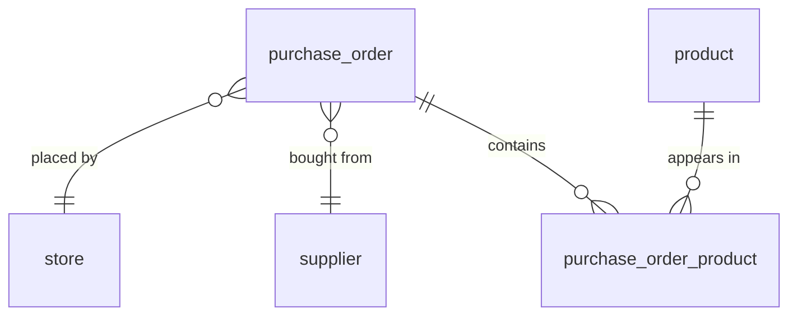


## Expense

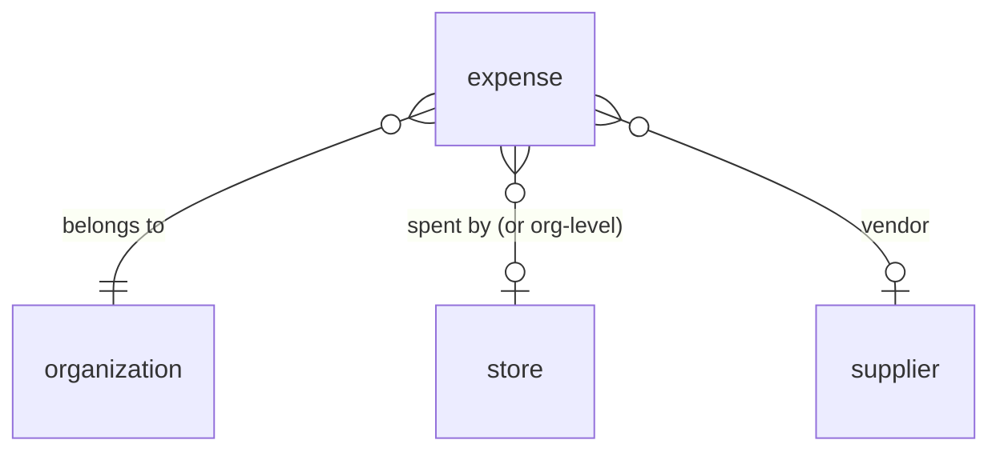


# Queries
 add later


# Audit Logging & Tracing (TODO)

We need an audit trail that records **who did what, when, and to which record** — for security,
debugging, accountability, and especially money-related accountability (every balance top-up,
purchase, expense, role grant, and membership change should be traceable). This is a TODO; the
notes below are what to design when we build it.

## Why we need it
- **Money trail** — top-ups to `purchase_balance` / `expense_balance`, purchases, expenses:
  who changed a limit, who approved a spend, how a balance reached its current value.
- **Access changes** — role grants/revokes, membership add/remove (soft-delete already keeps
  the row, but not *who* removed it or *when* in a queryable log).
- **Security / forensics** — trace suspicious activity back to a user, time, and place.
- **Support / debugging** — reconstruct "how did this record get into this state."

## What to add later
- [ ] An **`audit_log`** table — at minimum:
      `audit_id`, `organization_id`, `store_id` (nullable, the place), `actor_user_id`
      (who), `action` (e.g. `expense.created`, `purchase_balance.topped_up`, `role.granted`),
      `entity_type` + `entity_id` (what record), `before`/`after` (JSONB snapshot or diff),
      `created_at`.
- [ ] Decide **capture mechanism** — application-layer writes (explicit, intentional) vs.
      database triggers (catches everything, harder to give business context). Likely app-layer
      for business events + a generic fallback.
- [ ] **Event taxonomy** — the canonical list of auditable actions (money, access, data) and
      a consistent naming aligned with the permission `subject:resource:action` style.
- [ ] **Immutability / retention** — audit rows are append-only (never updated/deleted);
      decide retention period and whether to archive cold logs.
- [ ] **Balance-change specifics** — for `purchase_balance` / `expense_balance`, log the old
      value, new value, delta, and reason, so a balance is fully reconcilable from the log.
- [ ] **Actor context** — capture acting user, the membership/role used, IP / session if useful.
- [ ] **Performance** — high write volume; index by `(organization_id, created_at)` and
      `(entity_type, entity_id)`; consider partitioning by time (see Performance section).
- [ ] **Tracing** — correlation/request id threaded through actions so a single user operation
      that touches several tables can be followed end to end.
- [ ] Relationship to the **workflow engine** — many audit events are also workflow triggers;
      decide whether the audit log *is* the event source or a separate sink (see `post-mvp.md`).