## Tables

PostgreSQL `CREATE TABLE` statements. Only keys and structurally-important fields are
included; descriptive columns (name, description, address, etc.) are added later.

Note: `user` is a reserved word in Postgres, so the table name is quoted as `"user"` in DDL.

## Auth / RBAC

```sql
-- role_level is a small lookup table (not an enum) so its label can be edited and it can
-- grow its own fields later (display name, description, sort order). Seeded with two rows:
-- 'ORGANIZATION' and 'STORE'. Both `role` and `permission` reference it by role_level_id, so
-- the vocabulary lives in one place; the write path compares permission.role_level_id to
-- role.role_level_id.
CREATE TABLE role_level (
    role_level_id BIGINT GENERATED ALWAYS AS IDENTITY PRIMARY KEY,
    code          TEXT NOT NULL UNIQUE   -- 'ORGANIZATION' | 'STORE' (extra fields like name can be added later)
);

-- `user` is the GLOBAL identity table for the whole system (one login per person), not an
-- org-owned table. Provenance fields record where the account originated, so even after
-- every membership is removed we still know the user's home org and who created them.
CREATE TABLE "user" (
    user_id            BIGINT GENERATED ALWAYS AS IDENTITY PRIMARY KEY,
    organization_id    BIGINT NOT NULL REFERENCES organization (organization_id),  -- origin/home org (set once, immutable)
    origin_store_id    BIGINT REFERENCES store (store_id),     -- the store they were created at, if any (NULL for org-created)
    created_by_user_id BIGINT REFERENCES "user" (user_id),     -- who created this account (NULL for self-signup / first owner)
    created_at         TIMESTAMPTZ NOT NULL DEFAULT now()
);

CREATE TABLE role (
    role_id         BIGINT GENERATED ALWAYS AS IDENTITY PRIMARY KEY,
    organization_id BIGINT REFERENCES organization (organization_id),
    store_id        BIGINT REFERENCES store (store_id),
    is_managed      BOOLEAN NOT NULL DEFAULT FALSE,   -- TRUE = we built it, FALSE = a customer did
    role_level_id   BIGINT NOT NULL REFERENCES role_level (role_level_id),  -- ORGANIZATION | STORE
    created_user_id BIGINT REFERENCES "user" (user_id),  -- who made it (NULL for ones we ship)
    -- Two independent ideas:
    --   is_managed    = who OWNS the role (us vs a customer)
    --   role_level_id = the LEVEL it applies at, and the only level it can be granted at
    -- Owner-column rule, enforced by the DB (the owner column also reflects the level):
    --   is_managed = TRUE  (we built it):  BOTH owner columns NULL, any level
    --   is_managed = FALSE (a customer's): exactly ONE owner column set
    -- (matching role_level_id to the right owner column — ORG level -> organization_id set,
    --  STORE level -> store_id set — is enforced on the write path, since role_level_id
    --  values aren't known literals the CHECK can compare to.)
    CHECK (
        (is_managed = TRUE  AND organization_id IS NULL AND store_id IS NULL)
        OR (is_managed = FALSE AND (organization_id IS NOT NULL) <> (store_id IS NOT NULL))
    )
);

CREATE TABLE permission (
    permission_id BIGINT GENERATED ALWAYS AS IDENTITY PRIMARY KEY,
    subject       TEXT NOT NULL,   -- e.g. store, organization
    action        TEXT NOT NULL,   -- e.g. refund, edit
    role_level_id BIGINT NOT NULL REFERENCES role_level (role_level_id),  -- ORGANIZATION | STORE
    -- the level this permission applies at. A role may only hold permissions whose
    -- role_level_id matches the role's role_level_id (enforced on the write path when a role
    -- is created/edited), so e.g. a STORE role can never contain an ORGANIZATION permission.
    UNIQUE (subject, action)
);

CREATE TABLE role_permission (
    role_id       BIGINT NOT NULL REFERENCES role (role_id),
    permission_id BIGINT NOT NULL REFERENCES permission (permission_id),
    PRIMARY KEY (role_id, permission_id)
);

-- A user belongs to a place (a store OR the org), independent of any role.
-- Like an IAM user: the membership exists on its own; roles are layered on top.
-- Removing all of a user's roles at a place leaves this row intact, so the user
-- still belongs there with no access.
CREATE TABLE membership (
    membership_id   BIGINT GENERATED ALWAYS AS IDENTITY PRIMARY KEY,
    user_id         BIGINT NOT NULL REFERENCES "user" (user_id),
    organization_id BIGINT REFERENCES organization (organization_id),
    store_id        BIGINT REFERENCES store (store_id),
    is_active       BOOLEAN NOT NULL DEFAULT TRUE,
    deleted_at      TIMESTAMPTZ,   -- soft delete: NULL = live, set = removed (kept for history)
    -- Two distinct switches:
    --   is_active  = suspended but still belongs here (temporary; reversible toggle).
    --   deleted_at = removed from this place, but the row is retained for audit/history.
    -- A live membership has deleted_at IS NULL. Every access query must filter
    -- deleted_at IS NULL, or a removed membership would still grant access.
    -- the place is organization_id OR store_id: EXACTLY ONE set, never both, never neither.
    -- The `<>` (XOR) means exactly one of the two is NOT NULL.
    CHECK ((organization_id IS NOT NULL) <> (store_id IS NOT NULL))
);

-- one LIVE membership per user per place. Soft-deleted rows (deleted_at set) are excluded,
-- so removing then re-adding a user at the same place doesn't collide with the old tombstone.
CREATE UNIQUE INDEX membership_store_uq
    ON membership (user_id, store_id)
    WHERE store_id IS NOT NULL AND deleted_at IS NULL;

CREATE UNIQUE INDEX membership_org_uq
    ON membership (user_id, organization_id)
    WHERE organization_id IS NOT NULL AND deleted_at IS NULL;

-- A role granted on a membership. Zero or more per membership.
-- Losing a role = deleting its row here; the membership above is untouched.
CREATE TABLE membership_role (
    membership_id BIGINT NOT NULL REFERENCES membership (membership_id),
    role_id       BIGINT NOT NULL REFERENCES role (role_id),
    PRIMARY KEY (membership_id, role_id)   -- same role can't be granted twice here
);

-- Level-specific membership fields live in side tables, so the shared `membership`
-- table stays free of nulls. A membership has a detail row in exactly ONE of these,
-- matching its place: store memberships get a store_membership_detail row, org
-- memberships get an organization_membership_detail row. One row per membership, so
-- membership_id is both the PK and the FK. Screens join the one that matches the place
-- they're already querying — the two detail tables never overlap, so no UNION.
CREATE TABLE store_membership_detail (
    membership_id BIGINT PRIMARY KEY REFERENCES membership (membership_id),
    store_pin     TEXT
    -- ...other store-only member fields go here
);

CREATE TABLE organization_membership_detail (
    membership_id BIGINT PRIMARY KEY REFERENCES membership (membership_id)
    -- ...org-only member fields go here
);

```

## Plans / Features

```sql
CREATE TABLE plan (
    plan_id BIGINT GENERATED ALWAYS AS IDENTITY PRIMARY KEY
);

CREATE TABLE feature (
    feature_id BIGINT GENERATED ALWAYS AS IDENTITY PRIMARY KEY
);

CREATE TABLE plan_feature (
    plan_id    BIGINT NOT NULL REFERENCES plan (plan_id),
    feature_id BIGINT NOT NULL REFERENCES feature (feature_id),
    PRIMARY KEY (plan_id, feature_id)
);
```

## Organization

```sql
CREATE TABLE organization (
    organization_id BIGINT GENERATED ALWAYS AS IDENTITY PRIMARY KEY,
    owner_user_id   BIGINT REFERENCES "user" (user_id)
    -- no plan here: billing is per-store, so the plan lives on `store`.
    -- customers, suppliers, and the product catalog are all org-level and visible to every
    -- store (tightly-coupled single company), so there's no per-store sharing flag.
);
```

## Store

```sql
CREATE TABLE store (
    store_id        BIGINT GENERATED ALWAYS AS IDENTITY PRIMARY KEY,
    organization_id BIGINT NOT NULL REFERENCES organization (organization_id),
    plan_id         BIGINT REFERENCES plan (plan_id),   -- each store is billed on its own plan
    region          TEXT,                               -- grouping label, e.g. 'NorthWest'
    sub_region      TEXT                                -- finer grouping, e.g. 'Seattle-Metro'
    -- region/sub_region are descriptive tags for filtering and reports, NOT places you can
    -- grant roles at. If a region ever needs to OWN access (a real district manager role)
    -- it graduates to its own entity; until then it's just a label on the store.
);

-- Free-form labels on a store (e.g. 'flagship', 'airport', 'pilot-program'). Many tags
-- per store. Kept separate from region/sub_region so a store can carry any number of them.
CREATE TABLE store_tag (
    store_id BIGINT NOT NULL REFERENCES store (store_id),
    tag      TEXT   NOT NULL,
    PRIMARY KEY (store_id, tag)   -- a store can't have the same tag twice
);

-- Product is an ORG-level identity (one catalog for the whole org), deduped on SKU — one
-- 'Coke SKU-123' shared across all stores. Each store sets its own quantity and price via
-- product_store. This fits a tightly-coupled single company: one catalog, per-store stock.
CREATE TABLE product (
    product_id      BIGINT GENERATED ALWAYS AS IDENTITY PRIMARY KEY,
    organization_id BIGINT NOT NULL REFERENCES organization (organization_id),
    sku             TEXT,
    UNIQUE (organization_id, sku)   -- sku is unique within the org (the dedup key)
);

-- A store's stock and price for a product. One row per (product, store) the store carries.
CREATE TABLE product_store (
    product_id BIGINT NOT NULL REFERENCES product (product_id),
    store_id   BIGINT NOT NULL REFERENCES store (store_id),
    quantity   INTEGER NOT NULL DEFAULT 0,   -- this store's own stock (independent per store)
    price      NUMERIC(12, 2),               -- this store's own price
    PRIMARY KEY (product_id, store_id)
);

-- Customer is an ORG-level identity: one account per person for the whole org, visible to
-- every store. Walk into any store, use the same account. No per-store customer data.
CREATE TABLE customer (
    customer_id     BIGINT GENERATED ALWAYS AS IDENTITY PRIMARY KEY,
    organization_id BIGINT NOT NULL REFERENCES organization (organization_id)
);

-- Supplier is an ORG-level vendor record, visible to every store. No per-store terms.
CREATE TABLE supplier (
    supplier_id     BIGINT GENERATED ALWAYS AS IDENTITY PRIMARY KEY,
    organization_id BIGINT NOT NULL REFERENCES organization (organization_id)
);

CREATE TABLE sales_order (
    order_id    BIGINT GENERATED ALWAYS AS IDENTITY PRIMARY KEY,
    store_id    BIGINT NOT NULL REFERENCES store (store_id),
    customer_id BIGINT REFERENCES customer (customer_id),
    status      TEXT NOT NULL   -- e.g. open / paid / refunded
);

CREATE TABLE sales_order_product (
    order_id   BIGINT NOT NULL REFERENCES sales_order (order_id),
    product_id BIGINT NOT NULL REFERENCES product (product_id),
    quantity   INTEGER NOT NULL,
    unit_price NUMERIC(12, 2) NOT NULL,   -- snapshots the price at sale time
    PRIMARY KEY (order_id, product_id)
);

CREATE TABLE sales_order_return (
    return_id BIGINT GENERATED ALWAYS AS IDENTITY PRIMARY KEY,
    store_id  BIGINT NOT NULL REFERENCES store (store_id),
    order_id  BIGINT NOT NULL REFERENCES sales_order (order_id)
);

CREATE TABLE sales_order_return_product (
    return_id  BIGINT NOT NULL REFERENCES sales_order_return (return_id),
    product_id BIGINT NOT NULL REFERENCES product (product_id),
    quantity   INTEGER NOT NULL,
    PRIMARY KEY (return_id, product_id)
);
```

## Indexes

Postgres indexes primary keys and unique constraints automatically, but **not** foreign-key
columns. Every FK we filter or join on needs an explicit index, or queries on the big tables
become full-table scans. (See the Performance section for why each is needed.)

A composite primary key already indexes its **leftmost** column, so `sales_order_product`
and `sales_order_return_product` don't need an extra index on `order_id` / `return_id`, only on
the other column.

```sql
-- RBAC
CREATE INDEX ON store           (organization_id);
CREATE INDEX ON "user"          (organization_id);   -- users in their home org
CREATE INDEX ON "user"          (origin_store_id);
CREATE INDEX ON "user"          (created_by_user_id);
CREATE INDEX ON membership      (user_id);
CREATE INDEX ON membership_role (role_id);          -- membership_id covered by PK
-- store_membership_detail / organization_membership_detail: membership_id is the PK,
-- already indexed; no extra index needed
CREATE INDEX ON role            (organization_id);
CREATE INDEX ON role            (store_id);
CREATE INDEX ON role            (created_user_id);
CREATE INDEX ON role            (role_level_id);
CREATE INDEX ON permission      (role_level_id);
CREATE INDEX ON role_permission (permission_id);   -- role_id covered by PK

-- Organization
CREATE INDEX ON store        (plan_id);
CREATE INDEX ON store        (organization_id, region);   -- group an org's stores by region
CREATE INDEX ON store_tag    (tag);                       -- find stores by tag (store_id covered by PK)
CREATE INDEX ON organization (owner_user_id);
CREATE INDEX ON plan_feature (feature_id);         -- plan_id covered by PK

-- Org-level identities (customers, suppliers, product catalog)
CREATE INDEX ON customer (organization_id);
CREATE INDEX ON supplier (organization_id);
CREATE INDEX ON product  (organization_id);

-- Store data (the big tables — these matter most)
CREATE INDEX ON product_store          (store_id);     -- a store's catalog (product_id covered by PK)
CREATE INDEX ON sales_order            (store_id);
CREATE INDEX ON sales_order            (customer_id);
CREATE INDEX ON sales_order_product    (product_id);   -- order_id covered by PK
CREATE INDEX ON sales_order_return         (store_id);
CREATE INDEX ON sales_order_return         (order_id);
CREATE INDEX ON sales_order_return_product (product_id);   -- return_id covered by PK

-- Composite indexes for the common sorted lists (list newest-first / alphabetical)
CREATE INDEX ON product     (organization_id, name);    -- the org catalog, alphabetical
CREATE INDEX ON sales_order  (store_id, order_id DESC);
```


# ER Diagrams

One diagram per entity, showing that entity's own relationships. Legend: `}o--||` means **many-to-one** — the crow's-foot (`}o`) side is the "many," the `||` side is the "one."


## User

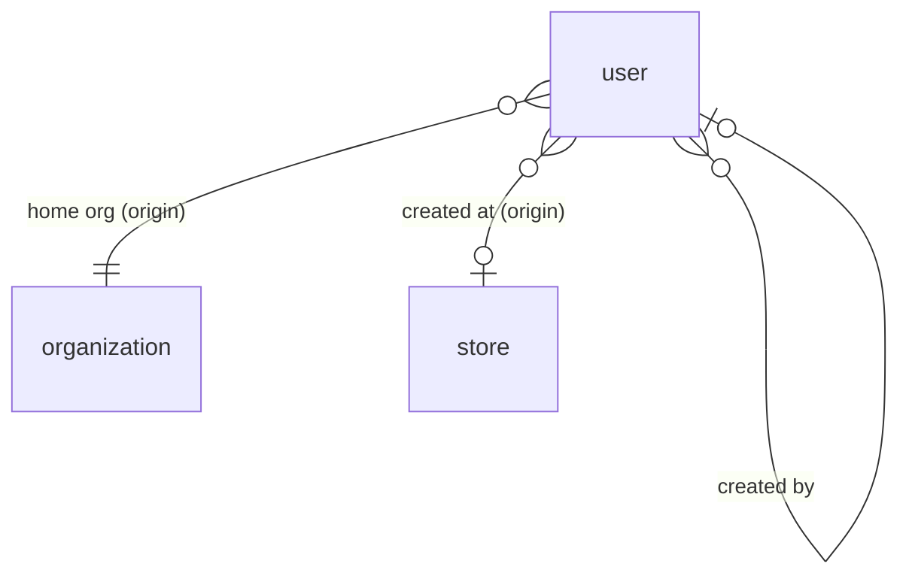


## Organization

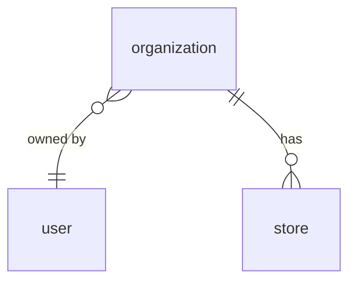


## Store

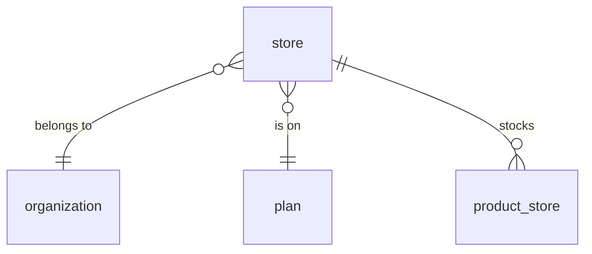


## Product

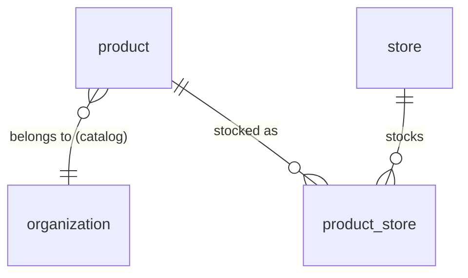


## Customer

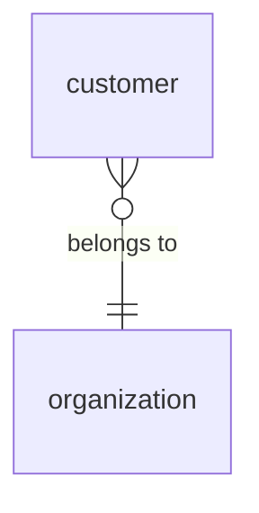


## Supplier

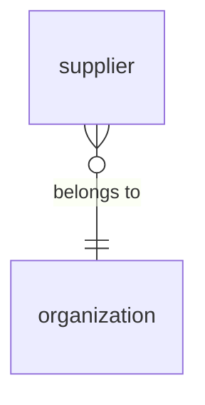


## Plan

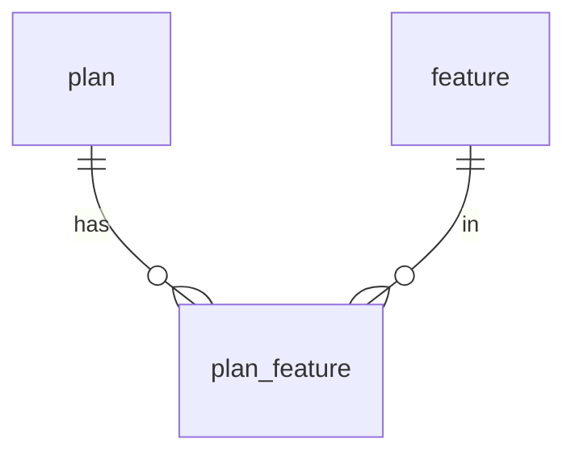


## Membership

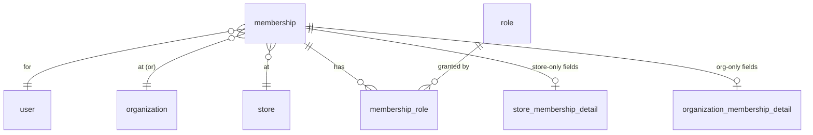


## Role

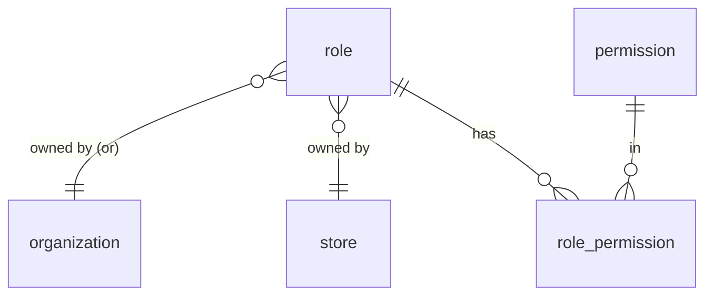


## Order

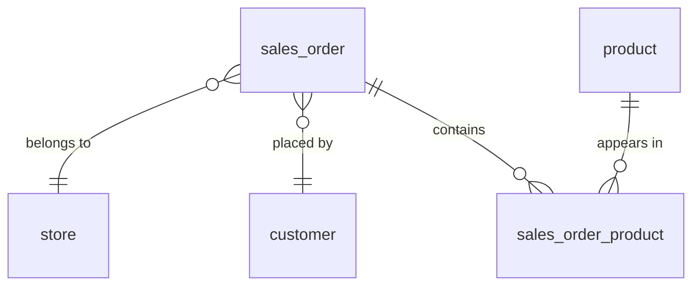


## Return

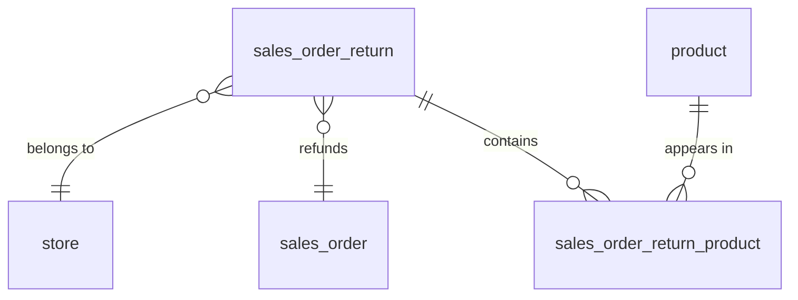


# Queries
 add later