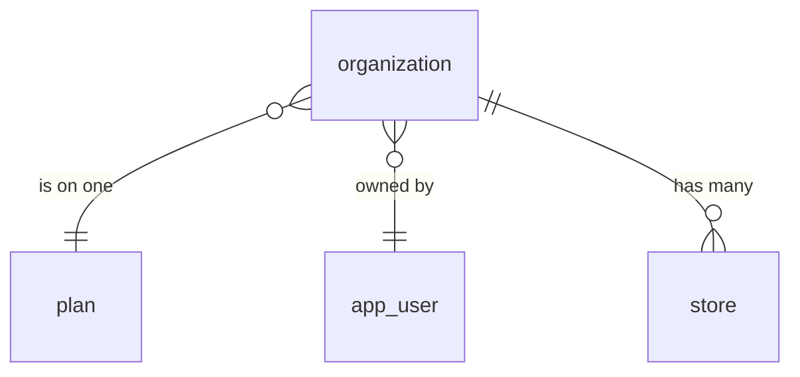
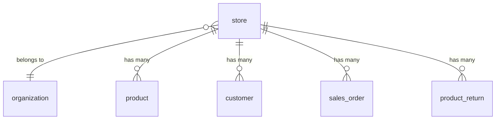
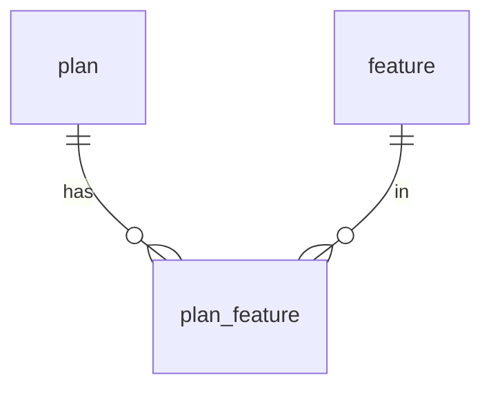
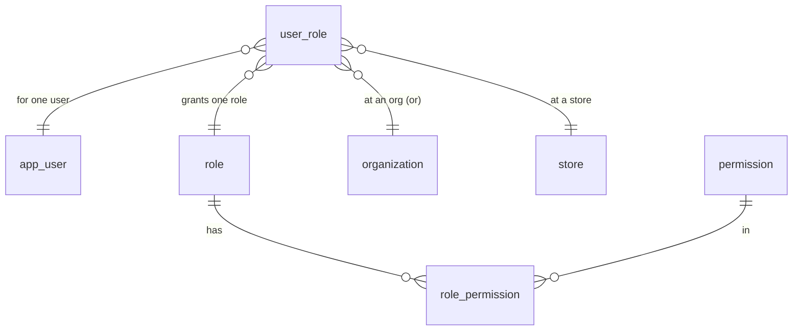
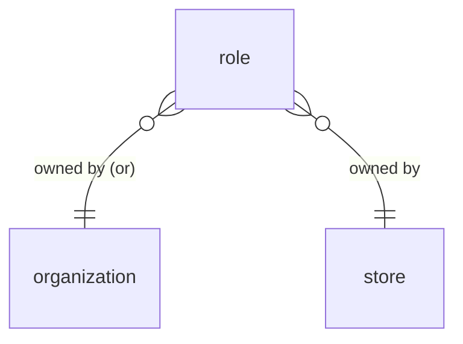
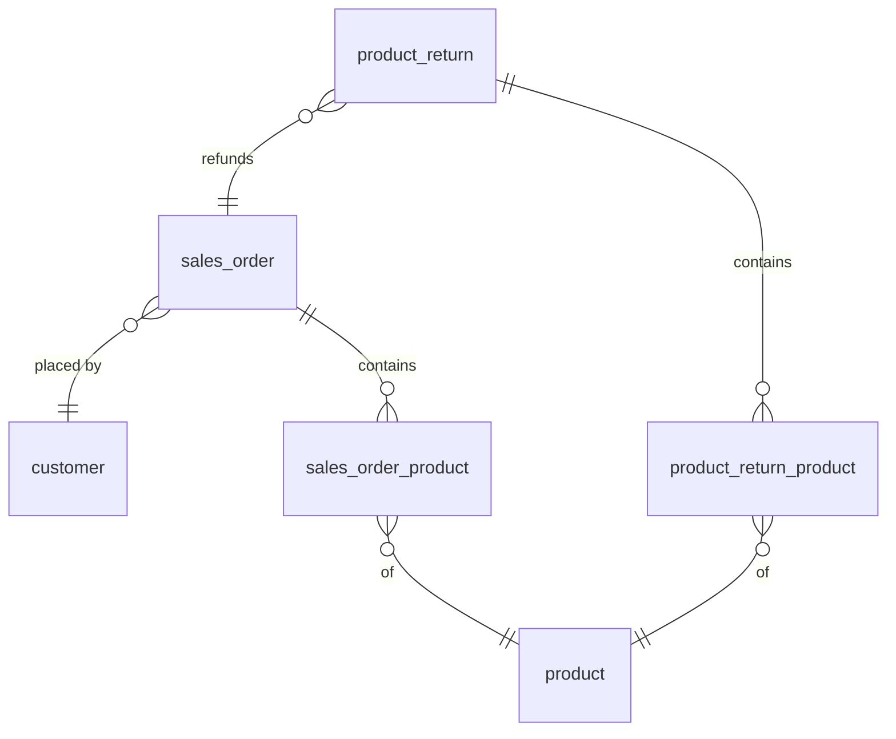

## Tables

PostgreSQL `CREATE TABLE` statements. Only keys and structurally-important fields are
included; descriptive columns (name, description, address, etc.) are added later.

Note: `app_user` is used instead of `user` because `user` is a reserved word in Postgres.

### Auth / RBAC

```sql
CREATE TABLE app_user (
    user_id BIGINT GENERATED ALWAYS AS IDENTITY PRIMARY KEY
);

CREATE TABLE role (
    role_id         BIGINT GENERATED ALWAYS AS IDENTITY PRIMARY KEY,
    organization_id BIGINT REFERENCES organization (organization_id),
    store_id        BIGINT REFERENCES store (store_id),
    is_managed      BOOLEAN NOT NULL DEFAULT FALSE,
    -- owner is organization_id OR store_id, or neither when is_managed = true
    CHECK (
        (is_managed = TRUE  AND organization_id IS NULL AND store_id IS NULL)
        OR (is_managed = FALSE AND (organization_id IS NOT NULL) <> (store_id IS NOT NULL))
    )
);

CREATE TABLE permission (
    permission_id BIGINT GENERATED ALWAYS AS IDENTITY PRIMARY KEY,
    subject       TEXT NOT NULL,   -- e.g. store, organization
    action        TEXT NOT NULL,   -- e.g. refund, edit
    UNIQUE (subject, action)
);

CREATE TABLE user_role (
    user_role_id    BIGINT GENERATED ALWAYS AS IDENTITY PRIMARY KEY,
    user_id         BIGINT NOT NULL REFERENCES app_user (user_id),
    role_id         BIGINT NOT NULL REFERENCES role (role_id),
    organization_id BIGINT REFERENCES organization (organization_id),
    store_id        BIGINT REFERENCES store (store_id),
    -- the place is organization_id OR store_id (exactly one set)
    CHECK ((organization_id IS NOT NULL) <> (store_id IS NOT NULL))
);

CREATE TABLE role_permission (
    role_id       BIGINT NOT NULL REFERENCES role (role_id),
    permission_id BIGINT NOT NULL REFERENCES permission (permission_id),
    PRIMARY KEY (role_id, permission_id)
);
```

### Plans / Features

```sql
CREATE TABLE plan (
    plan_id BIGINT GENERATED ALWAYS AS IDENTITY PRIMARY KEY
);

CREATE TABLE feature (
    feature_id BIGINT GENERATED ALWAYS AS IDENTITY PRIMARY KEY
);

CREATE TABLE plan_feature (
    plan_id    BIGINT NOT NULL REFERENCES plan (plan_id),
    feature_id BIGINT NOT NULL REFERENCES feature (feature_id),
    PRIMARY KEY (plan_id, feature_id)
);
```

### Organization

```sql
CREATE TABLE organization (
    organization_id BIGINT GENERATED ALWAYS AS IDENTITY PRIMARY KEY,
    plan_id         BIGINT REFERENCES plan (plan_id),
    owner_user_id   BIGINT REFERENCES app_user (user_id)
);
```

### Store

```sql
CREATE TABLE store (
    store_id        BIGINT GENERATED ALWAYS AS IDENTITY PRIMARY KEY,
    organization_id BIGINT NOT NULL REFERENCES organization (organization_id)
);

CREATE TABLE product (
    product_id BIGINT GENERATED ALWAYS AS IDENTITY PRIMARY KEY,
    store_id   BIGINT NOT NULL REFERENCES store (store_id),
    sku        TEXT,
    UNIQUE (store_id, sku)   -- sku is unique within a store
);

CREATE TABLE customer (
    customer_id BIGINT GENERATED ALWAYS AS IDENTITY PRIMARY KEY,
    store_id    BIGINT NOT NULL REFERENCES store (store_id)
);

CREATE TABLE sales_order (
    order_id    BIGINT GENERATED ALWAYS AS IDENTITY PRIMARY KEY,
    store_id    BIGINT NOT NULL REFERENCES store (store_id),
    customer_id BIGINT REFERENCES customer (customer_id),
    status      TEXT NOT NULL   -- e.g. open / paid / refunded
);

CREATE TABLE sales_order_product (
    order_id   BIGINT NOT NULL REFERENCES sales_order (order_id),
    product_id BIGINT NOT NULL REFERENCES product (product_id),
    quantity   INTEGER NOT NULL,
    unit_price NUMERIC(12, 2) NOT NULL,   -- snapshots the price at sale time
    PRIMARY KEY (order_id, product_id)
);

CREATE TABLE product_return (
    return_id BIGINT GENERATED ALWAYS AS IDENTITY PRIMARY KEY,
    store_id  BIGINT NOT NULL REFERENCES store (store_id),
    order_id  BIGINT NOT NULL REFERENCES sales_order (order_id)
);

CREATE TABLE product_return_product (
    return_id  BIGINT NOT NULL REFERENCES product_return (return_id),
    product_id BIGINT NOT NULL REFERENCES product (product_id),
    quantity   INTEGER NOT NULL,
    PRIMARY KEY (return_id, product_id)
);
```


# ER Diagrams

### Organization



- An organization is on exactly one plan.
- An organization is owned by one user.
- An organization has many stores.


### Store



- A store belongs to one organization.
- A store has its own products, customers, orders, and returns (all scoped by `store_id`).


### Plans & Features



- `plan_feature` links plans and features (many-to-many).
- An organization's features come from its plan (see the Organization diagram for `organization → plan`).


### Access — who can do what, and where



- A `user_role` grants one user one role at one **place** — that place is an organization **or** a store (exactly one is set).
- `role_permission` links roles and permissions (many-to-many).


### Custom Roles — owned by an org or a store



- A custom role is owned by an organization **or** a store (exactly one).
- A built-in/managed role has no owner (both empty).


### Orders & Returns — the line items



- An order is placed by a customer and contains many line items (`sales_order_product`), each for one product with a quantity and unit_price.
- A return refunds one order and contains many returned line items (`product_return_product`).


# Queries
