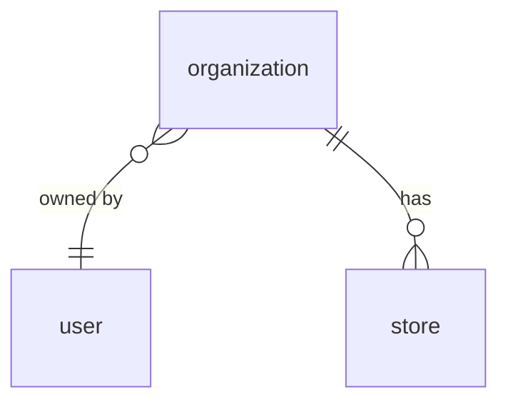
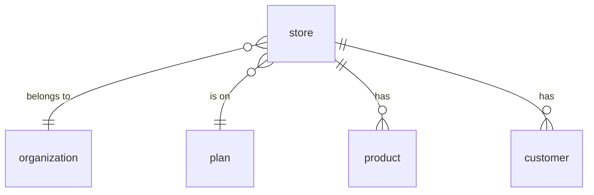
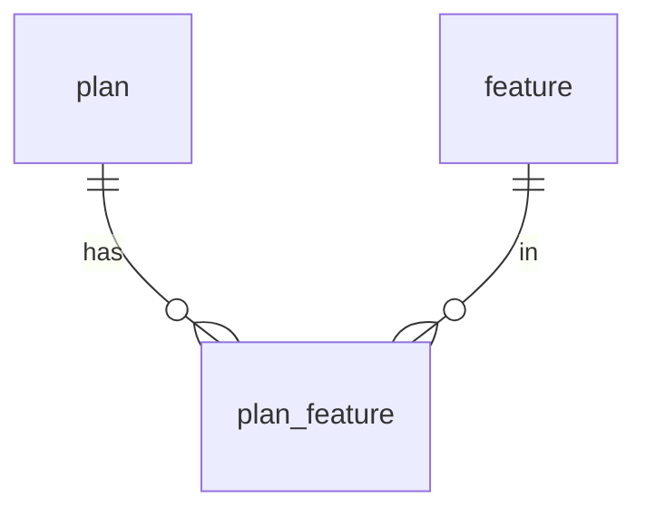
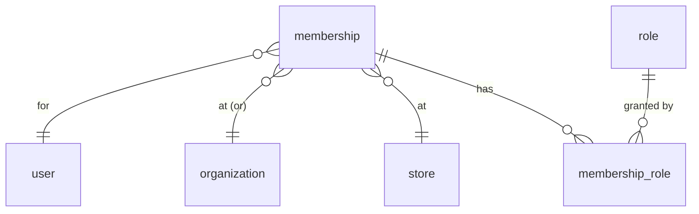
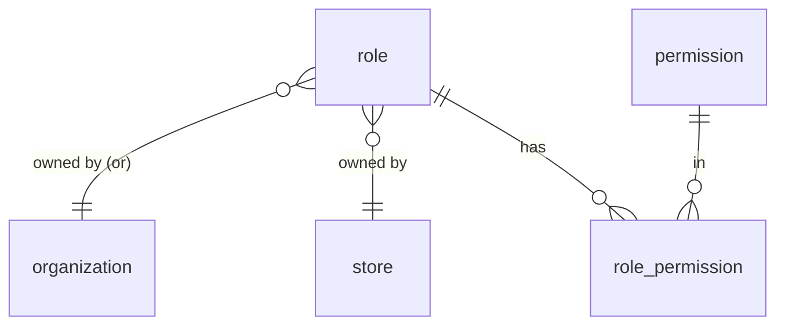
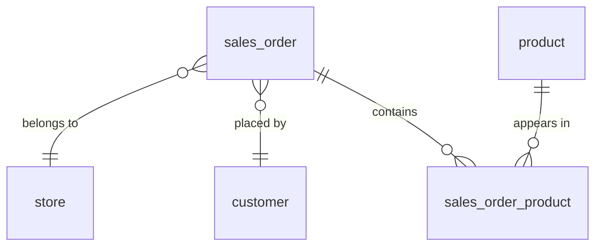
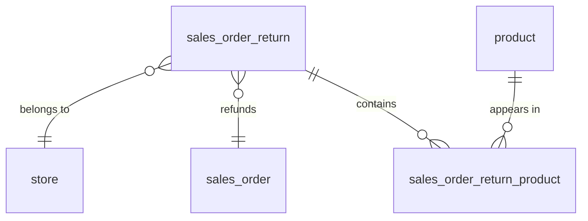

## Tables

PostgreSQL `CREATE TABLE` statements. Only keys and structurally-important fields are
included; descriptive columns (name, description, address, etc.) are added later.

Note: `user` is a reserved word in Postgres, so the table name is quoted as `"user"` in DDL.

## Auth / RBAC

```sql
CREATE TABLE "user" (
    user_id BIGINT GENERATED ALWAYS AS IDENTITY PRIMARY KEY
);

CREATE TABLE role (
    role_id         BIGINT GENERATED ALWAYS AS IDENTITY PRIMARY KEY,
    organization_id BIGINT REFERENCES organization (organization_id),
    store_id        BIGINT REFERENCES store (store_id),
    is_managed      BOOLEAN NOT NULL DEFAULT FALSE,   -- TRUE = we built it, FALSE = a customer did
    scope           TEXT NOT NULL CHECK (scope IN ('ORGANIZATION', 'STORE')),
    created_user_id BIGINT REFERENCES "user" (user_id),  -- who made it (NULL for ones we ship)
    -- Two independent ideas:
    --   is_managed = who OWNS the role (us vs a customer)
    --   scope      = the LEVEL it applies at, and the only level it can be granted at
    -- Owner-column rule, enforced by the DB:
    --   is_managed = TRUE  (we built it): BOTH owner columns NULL, any scope
    --   is_managed = FALSE (a customer's): exactly ONE owner column set, and it must
    --                                      match the scope (STORE->store_id, ORG->organization_id)
    CHECK (
        (is_managed = TRUE  AND organization_id IS NULL AND store_id IS NULL)
        OR (is_managed = FALSE AND scope = 'ORGANIZATION' AND organization_id IS NOT NULL AND store_id IS NULL)
        OR (is_managed = FALSE AND scope = 'STORE'        AND store_id IS NOT NULL        AND organization_id IS NULL)
    )
);

CREATE TABLE permission (
    permission_id BIGINT GENERATED ALWAYS AS IDENTITY PRIMARY KEY,
    subject       TEXT NOT NULL,   -- e.g. store, organization
    action        TEXT NOT NULL,   -- e.g. refund, edit
    UNIQUE (subject, action)
);

CREATE TABLE role_permission (
    role_id       BIGINT NOT NULL REFERENCES role (role_id),
    permission_id BIGINT NOT NULL REFERENCES permission (permission_id),
    PRIMARY KEY (role_id, permission_id)
);

-- A user belongs to a place (a store OR the org), independent of any role.
-- Like an IAM user: the membership exists on its own; roles are layered on top.
-- Removing all of a user's roles at a place leaves this row intact, so the user
-- still belongs there with no access.
CREATE TABLE membership (
    membership_id   BIGINT GENERATED ALWAYS AS IDENTITY PRIMARY KEY,
    user_id         BIGINT NOT NULL REFERENCES "user" (user_id),
    organization_id BIGINT REFERENCES organization (organization_id),
    store_id        BIGINT REFERENCES store (store_id),
    status          TEXT NOT NULL DEFAULT 'ACTIVE'
                    CHECK (status IN ('ACTIVE', 'INACTIVE')),
    -- status is the "is this person active at this place" switch: suspend someone
    -- without deleting the membership or re-adding their roles later.
    -- the place is organization_id OR store_id: EXACTLY ONE set, never both, never neither.
    -- The `<>` (XOR) means exactly one of the two is NOT NULL.
    CHECK ((organization_id IS NOT NULL) <> (store_id IS NOT NULL))
);

-- one membership per user per place (no duplicate placements)
CREATE UNIQUE INDEX membership_store_uq
    ON membership (user_id, store_id)
    WHERE store_id IS NOT NULL;

CREATE UNIQUE INDEX membership_org_uq
    ON membership (user_id, organization_id)
    WHERE organization_id IS NOT NULL;

-- A role granted on a membership. Zero or more per membership.
-- Losing a role = deleting its row here; the membership above is untouched.
CREATE TABLE membership_role (
    membership_id BIGINT NOT NULL REFERENCES membership (membership_id),
    role_id       BIGINT NOT NULL REFERENCES role (role_id),
    PRIMARY KEY (membership_id, role_id)   -- same role can't be granted twice here
);

```

## Plans / Features

```sql
CREATE TABLE plan (
    plan_id BIGINT GENERATED ALWAYS AS IDENTITY PRIMARY KEY
);

CREATE TABLE feature (
    feature_id BIGINT GENERATED ALWAYS AS IDENTITY PRIMARY KEY
);

CREATE TABLE plan_feature (
    plan_id    BIGINT NOT NULL REFERENCES plan (plan_id),
    feature_id BIGINT NOT NULL REFERENCES feature (feature_id),
    PRIMARY KEY (plan_id, feature_id)
);
```

## Organization

```sql
CREATE TABLE organization (
    organization_id BIGINT GENERATED ALWAYS AS IDENTITY PRIMARY KEY,
    owner_user_id   BIGINT REFERENCES "user" (user_id)
    -- no plan here: billing is per-store, so the plan lives on `store`.
);
```

## Store

```sql
CREATE TABLE store (
    store_id        BIGINT GENERATED ALWAYS AS IDENTITY PRIMARY KEY,
    organization_id BIGINT NOT NULL REFERENCES organization (organization_id),
    plan_id         BIGINT REFERENCES plan (plan_id)   -- each store is billed on its own plan
);

CREATE TABLE product (
    product_id BIGINT GENERATED ALWAYS AS IDENTITY PRIMARY KEY,
    store_id   BIGINT NOT NULL REFERENCES store (store_id),
    sku        TEXT,
    UNIQUE (store_id, sku)   -- sku is unique within a store
);

CREATE TABLE customer (
    customer_id BIGINT GENERATED ALWAYS AS IDENTITY PRIMARY KEY,
    store_id    BIGINT NOT NULL REFERENCES store (store_id)
);

CREATE TABLE sales_order (
    order_id    BIGINT GENERATED ALWAYS AS IDENTITY PRIMARY KEY,
    store_id    BIGINT NOT NULL REFERENCES store (store_id),
    customer_id BIGINT REFERENCES customer (customer_id),
    status      TEXT NOT NULL   -- e.g. open / paid / refunded
);

CREATE TABLE sales_order_product (
    order_id   BIGINT NOT NULL REFERENCES sales_order (order_id),
    product_id BIGINT NOT NULL REFERENCES product (product_id),
    quantity   INTEGER NOT NULL,
    unit_price NUMERIC(12, 2) NOT NULL,   -- snapshots the price at sale time
    PRIMARY KEY (order_id, product_id)
);

CREATE TABLE sales_order_return (
    return_id BIGINT GENERATED ALWAYS AS IDENTITY PRIMARY KEY,
    store_id  BIGINT NOT NULL REFERENCES store (store_id),
    order_id  BIGINT NOT NULL REFERENCES sales_order (order_id)
);

CREATE TABLE sales_order_return_product (
    return_id  BIGINT NOT NULL REFERENCES sales_order_return (return_id),
    product_id BIGINT NOT NULL REFERENCES product (product_id),
    quantity   INTEGER NOT NULL,
    PRIMARY KEY (return_id, product_id)
);
```

## Indexes

Postgres indexes primary keys and unique constraints automatically, but **not** foreign-key
columns. Every FK we filter or join on needs an explicit index, or queries on the big tables
become full-table scans. (See the Performance section for why each is needed.)

A composite primary key already indexes its **leftmost** column, so `sales_order_product`
and `sales_order_return_product` don't need an extra index on `order_id` / `return_id`, only on
the other column.

```sql
-- RBAC
CREATE INDEX ON store           (organization_id);
CREATE INDEX ON membership      (user_id);
CREATE INDEX ON membership_role (role_id);          -- membership_id covered by PK
CREATE INDEX ON role            (organization_id);
CREATE INDEX ON role            (store_id);
CREATE INDEX ON role            (created_user_id);
CREATE INDEX ON role_permission (permission_id);   -- role_id covered by PK

-- Organization
CREATE INDEX ON store        (plan_id);
CREATE INDEX ON organization (owner_user_id);
CREATE INDEX ON plan_feature (feature_id);         -- plan_id covered by PK

-- Store data (the big tables — these matter most)
CREATE INDEX ON product                (store_id);
CREATE INDEX ON customer               (store_id);
CREATE INDEX ON sales_order            (store_id);
CREATE INDEX ON sales_order            (customer_id);
CREATE INDEX ON sales_order_product    (product_id);   -- order_id covered by PK
CREATE INDEX ON sales_order_return         (store_id);
CREATE INDEX ON sales_order_return         (order_id);
CREATE INDEX ON sales_order_return_product (product_id);   -- return_id covered by PK

-- Composite indexes for the common sorted lists (list newest-first / alphabetical)
CREATE INDEX ON product     (store_id, name);
CREATE INDEX ON sales_order  (store_id, order_id DESC);
```


# ER Diagrams

One diagram per entity, showing that entity's own relationships. Legend: `}o--||` means **many-to-one** — the crow's-foot (`}o`) side is the "many," the `||` side is the "one."


## Organization




## Store




## Plan




## Membership




## Role




## Order




## Return




# Queries

Each query returns flat joined rows with all the columns a screen needs. The API layer
groups/combines these rows (e.g. collapsing a user's many roles into one object), so the
SQL stays plain joins — no aggregation here.

Bind parameters: `:organization_id`, `:store_id`, `:user_id`, `:order_id`.

These examples use descriptive columns (`name`, `email`, `phone`, `price`, etc.) that
are added to the tables later — the schema above lists keys only.


## Products for every store in an organization

Each product with its price/stock and which store it's in.

```sql
SELECT p.product_id,
       p.name,
       p.sku,
       p.price,
       p.quantity,
       s.store_id,
       s.name AS store_name
FROM product p
JOIN store s ON s.store_id = p.store_id
WHERE s.organization_id = :organization_id
ORDER BY s.name, p.name;
```


## A user's full access (everything the app loads at login)

One row per permission, tagged with the place it applies to (a store or the org) and
that place's name. The API groups these by place to build the per-place permission lists.

```sql
SELECT ur.organization_id,
       o.name AS organization_name,
       ur.store_id,
       s.name AS store_name,
       p.subject,
       p.action
FROM membership ur
JOIN membership_role mr ON mr.membership_id = ur.membership_id
JOIN role_permission rp ON rp.role_id = mr.role_id
JOIN permission p       ON p.permission_id = rp.permission_id
LEFT JOIN organization o ON o.organization_id = ur.organization_id
LEFT JOIN store s        ON s.store_id        = ur.store_id
WHERE ur.user_id = :user_id
  AND ur.status  = 'ACTIVE';   -- suspended memberships grant no access
```


## Users in a store (with their info and roles)

For a store's "staff" screen. One row per user-role, with the user's details. A user with
two roles at the store returns two rows; the API groups them into one user with a role
list. A user who belongs to the store but has no roles still appears (one row, role
columns NULL) — the LEFT JOIN to `membership_role` keeps role-less members visible.

```sql
SELECT u.user_id,
       u.name,
       u.email,
       u.phone,
       r.role_id,
       r.name AS role_name
FROM membership m
JOIN "user" u                 ON u.user_id = m.user_id
LEFT JOIN membership_role mr  ON mr.membership_id = m.membership_id
LEFT JOIN role r              ON r.role_id = mr.role_id
WHERE m.store_id = :store_id
ORDER BY u.name;
```


## Users in an organization (with info, and where they work)

Every person in the org — at the org level, or at any store under it — one row per grant
with the user's details, the role, and the place. The API groups by user.

```sql
SELECT u.user_id,
       u.name,
       u.email,
       u.phone,
       r.name AS role_name,
       ur.organization_id,
       o.name AS organization_name,
       ur.store_id,
       s.name AS store_name
FROM membership ur
JOIN "user" u                ON u.user_id = ur.user_id
LEFT JOIN membership_role mr ON mr.membership_id = ur.membership_id
LEFT JOIN role r             ON r.role_id  = mr.role_id
LEFT JOIN organization o     ON o.organization_id = ur.organization_id
LEFT JOIN store s            ON s.store_id        = ur.store_id
WHERE ur.organization_id = :organization_id
   OR s.organization_id   = :organization_id
ORDER BY u.name;
```


## Roles a store can assign (with their permissions)

Only **store-level** roles (`scope = 'STORE'`): the built-in store roles we ship plus this
store's own custom roles. Organization-level roles are excluded, so a store admin can never
grant an org role to a store user. One row per role-permission; the API groups by role.

```sql
SELECT r.role_id,
       r.name,
       r.is_managed,
       p.subject,
       p.action
FROM role r
LEFT JOIN role_permission rp ON rp.role_id = r.role_id
LEFT JOIN permission p       ON p.permission_id = rp.permission_id
WHERE r.scope = 'STORE'                        -- store-level roles only
  AND (r.is_managed = TRUE                      -- built-in store roles
       OR r.store_id = :store_id)               -- this store's custom roles
ORDER BY r.is_managed DESC, r.name;
```


## Roles an organization can assign (with their permissions)

Only **organization-level** roles (`scope = 'ORGANIZATION'`): the built-in org roles we ship
plus this org's own custom roles. One row per role-permission; the API groups by role.

```sql
SELECT r.role_id,
       r.name,
       r.is_managed,
       p.subject,
       p.action
FROM role r
LEFT JOIN role_permission rp ON rp.role_id = r.role_id
LEFT JOIN permission p       ON p.permission_id = rp.permission_id
WHERE r.scope = 'ORGANIZATION'                 -- org-level roles only
  AND (r.is_managed = TRUE                      -- built-in org roles
       OR r.organization_id = :organization_id) -- this org's own custom roles
ORDER BY r.is_managed DESC, r.name;
```


## An order with its line items (receipt / order detail)

The order, who placed it, and one row per line item. The API groups the lines under the
order and sums the total.

```sql
SELECT so.order_id,
       so.status,
       c.customer_id,
       c.name AS customer_name,
       p.product_id,
       p.name AS product_name,
       sop.quantity,
       sop.unit_price
FROM sales_order so
LEFT JOIN customer c         ON c.customer_id = so.customer_id
JOIN sales_order_product sop ON sop.order_id = so.order_id
JOIN product p               ON p.product_id = sop.product_id
WHERE so.order_id = :order_id;
```


## Products in a store (catalog / inventory list)

The main product list for a single store's catalog or inventory screen.

```sql
SELECT product_id,
       name,
       sku,
       price,
       quantity
FROM product
WHERE store_id = :store_id
ORDER BY name;
```


## Search products in a store

Type-ahead / search box on the product list. Matches name or SKU.

```sql
SELECT product_id,
       name,
       sku,
       price,
       quantity
FROM product
WHERE store_id = :store_id
  AND (name ILIKE '%' || :search || '%' OR sku ILIKE '%' || :search || '%')
ORDER BY name
LIMIT 50;
```


## Customers in a store

The customer list for a store.

```sql
SELECT customer_id,
       name,
       email,
       phone
FROM customer
WHERE store_id = :store_id
ORDER BY name;
```


## Orders for a store (order list)

The orders screen for a store, newest first, with the customer's name.

```sql
SELECT so.order_id,
       so.status,
       c.name AS customer_name
FROM sales_order so
LEFT JOIN customer c ON c.customer_id = so.customer_id
WHERE so.store_id = :store_id
ORDER BY so.order_id DESC;
```


## Orders for a customer (customer history)

Every order a single customer has placed.

```sql
SELECT order_id,
       status
FROM sales_order
WHERE customer_id = :customer_id
ORDER BY order_id DESC;
```


## Returns for a store (returns list)

The returns screen for a store, with the order each return refunds.

```sql
SELECT pr.return_id,
       pr.order_id
FROM sales_order_return pr
WHERE pr.store_id = :store_id
ORDER BY pr.return_id DESC;
```


## A return with its line items (return detail)

The return, the order it refunds, and one row per returned item. The API groups the lines
under the return.

```sql
SELECT pr.return_id,
       pr.order_id,
       p.product_id,
       p.name AS product_name,
       prp.quantity
FROM sales_order_return pr
JOIN sales_order_return_product prp ON prp.return_id = pr.return_id
JOIN product p                      ON p.product_id = prp.product_id
WHERE pr.return_id = :return_id;
```


## Stores in an organization (store switcher / store list)

The list of stores for an org — used by the org dashboard and the place switcher.

```sql
SELECT store_id,
       name
FROM store
WHERE organization_id = :organization_id
ORDER BY name;
```


## A role with its permissions (role detail / edit)

For viewing or editing a single role. One row per permission; the API groups them under
the role.

```sql
SELECT r.role_id,
       r.name,
       r.is_managed,
       p.subject,
       p.action
FROM role r
LEFT JOIN role_permission rp ON rp.role_id = r.role_id
LEFT JOIN permission p       ON p.permission_id = rp.permission_id
WHERE r.role_id = :role_id;
```


## All available permissions (role builder)

The full list of permissions the UI offers when building or editing a role.

```sql
SELECT permission_id,
       subject,
       action
FROM permission
ORDER BY subject, action;
```


## A store's plan and its features

For a billing / plan screen: the store's plan and the features it includes. Billing is
per-store, so each store has its own plan and its own feature set.

```sql
SELECT pl.plan_id,
       pl.name AS plan_name,
       f.feature_id,
       f.name AS feature_name
FROM store st
JOIN plan pl              ON pl.plan_id = st.plan_id
LEFT JOIN plan_feature pf ON pf.plan_id = pl.plan_id
LEFT JOIN feature f       ON f.feature_id = pf.feature_id
WHERE st.store_id = :store_id
ORDER BY f.name;
```


# Performance
