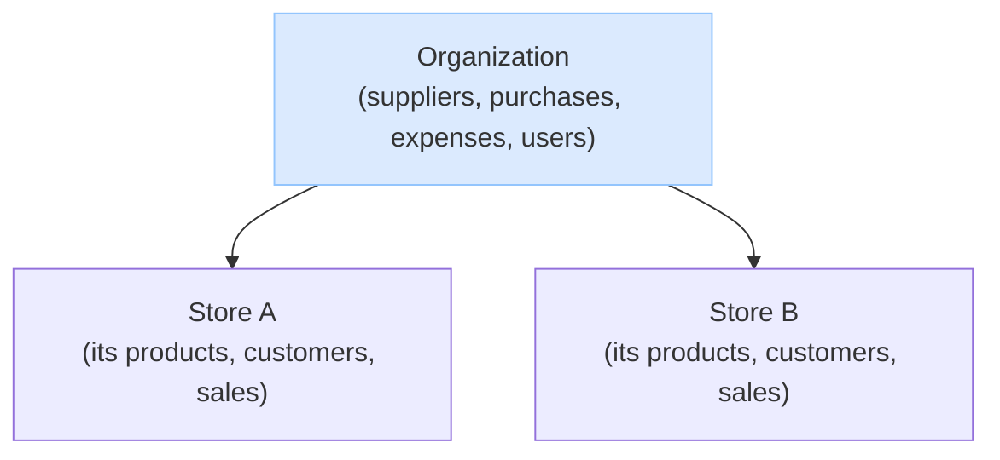

| | |
|---|---|
| **Project** | GekkoSuite |
| **Author** | Salman Hoosein |
| **Version** | 1.0 |
| **Description** | Easy to use and simply CRM/PoS that provides features to serve the daily operations of small organizations that can have up to multiple stores. |

# Overview

- **Organization**

An **organization** is the business. It owns many **stores** and **handles adminstration**: owns the suppliers, does all purchasing, expense spending, manages stores, creates users, etc...

| Feature | What it allows |
|---|---|
| Act on any store | Perform any store action on any of the org's stores — an org role reaches all of them. |
| Cross-store reports | Aggregate reports rolled up across all stores (sales, inventory, performance); the org Dashboard is the company-wide overview. |
| Purchase orders | Buy inventory from suppliers; each purchase optionally attributed to a store. |
| Expenses | Record non-inventory spending; each expense optionally attributed to a store. |
| Suppliers | Create and manage the org's suppliers. |
| Users | Create and manage users (both org and store users). |
| Roles | Assign roles to users |
| Stores | Create and manage stores. |
| Products | Manage Products across all stores. |
| Customers | Manage Customers across all stores. |
| Plan | Hold the org's plan; every store inherits its features. |
| AI Chatbot | Feed KB to AI chatbot, and let each store owner chat with it. |
| AI Recommendations | Get Organization based Recommendations. |
| Org-level scope | Make org-level changes |

- **Store** 

A **store** is where selling happens, you can't sell at the organization level. Each **store owns its own selling data**: its products (each with their own stock and price), its customers, and its sales and returns.

| Feature | What it allows |
|---|---|
| Sell | Ring up sales at the store. |
| Returns | Process returns and refunds for the store's own orders. |
| Products | Manage the store's own products (SKUs, stock, price). With sharing on, a new product is also added to the org-wide catalog; stock and price stay the store's own. |
| AI Chatbot | Chat with Organization AI KB for support. |
| AI Recommendations | Get Store Based Recommendations. |
| Customers | Manage the store's own customers. With sharing on, a new customer is also recognized org-wide. |
| Customer Requests | Let customer make requests about what they need and want. |
| Reports | View the store's own reports, plus the purchases/expenses attributed to it. |
| Store-only scope | A store user only ever acts on their own store's data |

# Documentation 

The detail lives in focused docs:

- **`auth.md`** — users, memberships, roles, permissions, and access (authn & authz).
- **`plans.md`** — plans, features, and billing.
- **`database.md`** — the database schema (tables, indexes, RLS).
- **`post-mvp.md`** — deferred features and the rationale.
