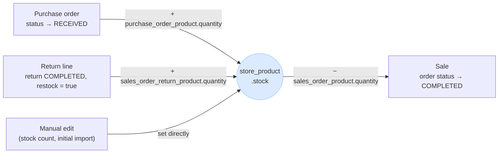

# Product schema: what the real data says we need

`store_product` used to be a thin sketch — no `name`, even — and the shared `product` table was
referenced (`store_product.product_id REFERENCES product`) but never actually defined. This plan closed
both gaps, grounded in `reference_store_data/product-export.csv`: a real export from the production
system GekkoSuite is replacing — **26,685 products across 31 stores**, one smoke/vape/CBD retail chain.
Both tables are now migrated (`tools/GekkoSuite.Database/Migrations/1_0_0.sql`), in the same spirit as
`docs/customers.md`. `supplier_id` is the one field deferred — see Summary: build order.

## The source data, in brief

It's a Vend/Lightspeed-Retail-style export: one row per **sellable SKU**, plus a repeating 6-column
block (tax, stock, reorder settings) for each of the 31 stores. That per-store block is the strongest
real-world evidence for GekkoSuite's store-level/shared split — production tracks **stock and tax per
outlet**, but keeps everything else (name, price, cost, category, brand) as one shared value.

**Well-used fields** (worth building):

| Field | Coverage | What it tells us |
|---|---|---|
| `sku`, `name`, `active`, `track_inventory`, `supply_price`, `retail_price` | 100% | Core of every row. Price/cost show up as **one value per product, not per store** in this export — but that's the legacy system never exercising per-outlet pricing, not a requirement to copy. See "Two design calls the data settles." |
| `handle` | 100% | Just `slugify(name)` — groups variant rows, carries no extra info. |
| `variant_option_one_name/value` | 85% | e.g. `Flavor`, `STRAIN`, `COLOR`, `TYPE`, `MG` |
| `tags` | 67% | Semicolon-delimited, e.g. `14G;FLOWER;Shake` |
| `product_category` | 62% | Free text, **275 distinct values**, badly normalized (see Data quality). |
| `brand_name` | 74% | Free text, high cardinality (LOST MARY, GEEKBAR, SMOK, RAW...). |
| `supplier_name` | 49% | Free text, but maps directly onto GekkoSuite's existing `supplier` table. |
| `variant_option_two_name/value` | 19% | |
| `inventory_<store>` | 100% | Range **−209 to 360** — negative = oversold/backorder, not an error. |
| `outlet_tax_<store>` | 100% | Almost always `"Default Tax"`; a **named** rate, not a raw percentage. |

**Barely- or never-used fields** (skip for MVP):

| Field | Coverage | Verdict |
|---|---|---|
| `description` | 0.6% | Not worth a required field, but keep it optional. |
| `variant_option_three_name/value` | 1.3% | Rare, but keep the 3rd slot — costs nothing, matches the model. |
| `reorder_point_<store>` | 0.3% | Keep as one optional field; see below. |
| `reorder_quantity`, `min_quantity`, `max_quantity` (per store) | 0–0.3% | Skip entirely. |
| `supplier_code` | 0.5% | Skip; revisit if purchase-order matching needs it. |
| `weight`, `dimensions`, `active_online` | 0–19%, and `active_online` is **always 0** | Skip — this chain doesn't ship product or sell online. |
| `account_code`, `account_code_purchase` | 0% | Skip — no accounting integration today. |
| `composite_name/sku/quantity` (kit/bundle products) | 0% | Skip — available in the source system, **never used once**. |

## Two design calls the data settles

**Variants don't need a new table.** 7,581 distinct `handle`s, 3,133 of them grouping more than one
row (max 196 variants under one handle). Since `handle` is just `slugify(name)`, grouping variants
under one parent card is a **display concern** — the UI clusters `store_product` rows by matching
`name` within a store. Each row keeps its own three nullable variant-option name/value pairs; no
parent-row indirection needed.

**`store_product` has to stand alone.** `product` (shared) is only written when
`organization.allow_share_products` is on — **off by default** (`auth.md`). Most of the time a
`store_product` row has no shared parent at all, so every identity field (`name`, `category`, `brand`,
variant options) has to live on `store_product` directly. The shared `product` table mirrors those same
fields for when sharing *is* on — never price, stock, or tax, which stay per-store either way
(`CLAUDE.md`).

**Price/cost per store — ✅ resolved.** `CLAUDE.md`'s "stock and price always stay per-store" stands as
originally designed; `store_product.price`/`cost` needed no change. The production export's single
shared price wasn't evidence against per-store pricing — it's this chain (or its tier of the legacy
system) simply never turning per-outlet pricing on. Confirmed directly rather than inferred from the
export.

## How variants work

There's no variant table and no parent/child relationship — each variant is just its own complete
`store_product` row. `local/mock_data.sql` has a real example: three rows, one product.

| `store_product_id` | `name` | `sku` | `variant_option_one_name` | `variant_option_one_value` | `stock` |
|---|---|---|---|---|---|
| `...0016` | Flavored Syrup 750ml | SYRUP-VAN | Flavor | Vanilla | 24 |
| `...0017` | Flavored Syrup 750ml | SYRUP-CAR | Flavor | Caramel | 18 |
| `...0018` | Flavored Syrup 750ml | SYRUP-HAZ | Flavor | Hazelnut | 0 |

**What ties them together:** matching `name`. Nothing else — no foreign key between the rows, no shared
parent row. `variant_option_one_name` holds the dimension's *label* ("Flavor"); `variant_option_one_value`
holds *this row's value* ("Vanilla"). Two more slots (`_two`, `_three`) exist for products that vary
along more than one dimension at once (e.g. Flavor **and** Size) — see "Two design calls the data
settles" for why 3 slots, not an unlimited generic options table.

**Grouping happens in the UI, not in SQL.** To show "Flavored Syrup 750ml" as one card with a flavor
picker, the app queries `store_product` for the store and clusters rows sharing the same `name`. There's
no `product_group_id` — deliberately, since the production export's own grouping key (`handle`) turned
out to just be `slugify(name)`, so a separate table would only add a join for information the name
column already carries.

**Consequences worth knowing:**
- Renaming the product means updating every variant row's `name` to keep them grouped — no single row
  owns "the product name" the way a parent row would.
- Each variant sells out, goes inactive, or changes price **independently** — they're full rows, not
  lines under a parent, so Hazelnut hitting `stock = 0` above doesn't touch Vanilla or Caramel at all.
- Two unrelated products that happen to share a `name` would get grouped together in the UI too — the
  tradeoff for not having an explicit parent row.
- The shared `product` table is a separate concern from variant grouping: if sharing is on, each variant
  *row* can independently link to its own `product_id` (org-wide recognition of that one SKU), but
  variant grouping itself stays a `store_product`-level, per-store, name-matching operation regardless of
  whether sharing is on.

## How `product` and `store_product` connect

The only link is `store_product.product_id`, a nullable foreign key to `product.product_id` — set when
`allow_share_products` is on, `NULL` otherwise. Multiple `store_product` rows (one per store) can point
to the same `product_id`; that shared row is what lets the org ask "how many of *this* item do we sell,
across every store" instead of fuzzy-matching by name string.

**Who can create where:** `product:create` is a normal, non-elevated store permission (`auth.md`) — a
`STORE`-typed Manager role only reaches the one store its membership is tied to, so a Manager can only
create products at their own store. An `ORGANIZATION` membership reaches every store in the org
(`CLAUDE.md`), so an org-level user whose role grants `product:create` can create into *any* store the
same way — `POST /stores/{storeId}/products` for whichever `{storeId}` they choose, no separate "org
create" endpoint. This is the main real-world case for the shared `product` table to matter: an org-level
user seeding the same item into several stores at once is a far more likely source of "the same product
across stores" than several cashiers independently typing in identical data by coincidence.

**Why both tables carry the same fields, then:** `store_product`'s copy is the operational one — what
the till actually reads, and what a store can edit locally (rename it, recategorize it) without touching
any other store. `product`'s copy is the canonical org-wide one, used for cross-store search/reporting
and for seeding a new store's catalog. They're allowed to drift; nothing forces them back in sync,
same as `sales_order_product` snapshots a price instead of reading it live.

**Open gap, not yet solved by this plan:** `auth.md`'s write flow (`allow_share_products ON → INSERT
product, then INSERT store_product linked to it`) creates a **new** shared row every time, 1:1 with
whichever store_product triggered it. It never looks up an *existing* shared product to link to instead.
So if Store A creates "Bic Lighter Blue" and Store B independently creates its own "Bic Lighter Blue,"
sharing does not merge them — each store gets its own private mirror, and `product_id` never becomes the
multi-store hub it's meant to be. See Open questions.

## Proposed schema

### `product` — shared, org-level identity (written only when sharing is on)

| Field | Type | Required | Notes |
|---|---|---|---|
| `product_id` | UUID | PK | |
| `organization_id` | UUID | required | FK → `organization` |
| `name` | TEXT | required | |
| `description` | TEXT | optional | 0.6% usage in source data — rarely filled in |
| `category` | TEXT | optional | Free text by design — see Data quality |
| `brand` | TEXT | optional | Free text — see Open questions |
| `supplier_id` | UUID | optional, **deferred** | FK → `supplier`. Org owns purchasing, so this is org-level, not free text — not in the migration yet since `supplier` itself isn't migrated (see Summary: build order) |
| `variant_option_one_name` / `_value` | TEXT / TEXT | optional | e.g. `Flavor` / `Blue Raspberry` |
| `variant_option_two_name` / `_value` | TEXT / TEXT | optional | |
| `variant_option_three_name` / `_value` | TEXT / TEXT | optional | Rare (1.3%) but cheap to include |
| `created_at`, `updated_at` | TIMESTAMPTZ | required | Default `now()` |
| `is_deleted`, `deleted_at` | BOOLEAN / TIMESTAMPTZ | required / optional | Standard soft-delete pattern |

Indexes: `organization_id`.

### `store_product` — store-level (always written)

| Field | Type | Required | Notes |
|---|---|---|---|
| `store_product_id` | UUID | PK | |
| `store_id` | UUID | required | FK → `store` |
| `organization_id` | UUID | required | FK → `organization` |
| `product_id` | UUID | optional | FK → `product`; set only when sharing is on |
| `sku` | TEXT | optional | Unique per store — see Data quality (case collisions) |
| `barcode` | TEXT | optional | Manufacturer UPC/EAN; distinct from `sku`. Unique per store |
| `name` | TEXT | **required** | Missing from today's sketch — needed since sharing is off by default |
| `description` | TEXT | optional | |
| `category` | TEXT | optional | Free text — see Data quality |
| `brand` | TEXT | optional | |
| `supplier_id` | UUID | optional, **deferred** | FK → `supplier`; not in the migration yet, same reason as above |
| `variant_option_one_name` / `_value` | TEXT / TEXT | optional | |
| `variant_option_two_name` / `_value` | TEXT / TEXT | optional | |
| `variant_option_three_name` / `_value` | TEXT / TEXT | optional | |
| `stock` | INTEGER | required, default `0` | **Allowed to go negative** — production data ranges to −209. Do not add a `>= 0` check. (Matches the already-migrated column name — see `database.md`'s `quantity` sketch, which this doc no longer follows) |
| `price` | NUMERIC(12,2) | optional | |
| `cost` | NUMERIC(12,2) | optional | What this store paid per unit; for margin reporting, not shown at checkout |
| `track_inventory` | BOOLEAN | required, default `TRUE` | Whether stock decrements on sale at all |
| `is_taxable` | BOOLEAN | required, default `TRUE` | `FALSE` = always tax-exempt, regardless of `tax_rate` |
| `tax_rate` | NUMERIC(5,2) | required, default `0` | Percentage, e.g. `8.25` |
| `is_active` | BOOLEAN | required, default `TRUE` | Sellable toggle, independent of soft-delete |
| `reorder_point` | INTEGER | optional | Low-stock threshold. Only reorder field kept — see below |
| `created_at`, `updated_at` | TIMESTAMPTZ | required | Default `now()` |
| `is_deleted`, `deleted_at` | BOOLEAN / TIMESTAMPTZ | required / optional | Missing from today's sketch; every other table has this |

Constraints & indexes: `UNIQUE (store_id, sku)`; `UNIQUE (store_id, barcode)` where `barcode IS NOT
NULL`; index on `store_id`, `organization_id`, and `product_id` (where not null).

RLS follows the pattern already in `database.md`: `store_product` policies on `store_id`, `product`
policies on `organization_id` — no change needed there.

## How `store_product.stock` changes over time

`stock` isn't set once and left alone — four flows touch it, each documented elsewhere in this repo.
This diagram pulls them into one picture, since nothing currently shows them together:

| Flow | Fires on | Effect | Source |
|---|---|---|---|
| **Receiving inventory** | `purchase_order.status` moves to `RECEIVED` | `+= purchase_order_product.quantity` for each line | `database.md`'s `purchase_order_product` ("stock lands at that store") |
| **Selling** | `sales_order.status` moves to `COMPLETED` | `−= sales_order_product.quantity` for each line | `returns.md`'s Phase 0 (order creation "decrements `store_product.stock`") |
| **Returning** | `sales_order_return.status` moves to `COMPLETED`, and only for lines with `restock = true` | `+= sales_order_return_product.quantity` | `returns.md` Phase 1 ("restocking... only take effect when status moves to `COMPLETED`") |
| **Manual correction** | Staff edits the product directly | Set to whatever they enter | Covers initial catalog import and stock recounts/shrinkage — no dedicated adjustment table today |

**The pattern to preserve across all three status-driven flows:** the `stock` change happens **in the
same transaction as the status flip**, not when the line is first inserted. A `DRAFT` purchase order, an
`OPEN` sale, or a `PENDING` return all have their line items on record already, but none of them have
touched `stock` yet — only crossing into `RECEIVED` / `COMPLETED` does. A `CANCELLED` purchase order or
a `VOIDED` sale/return never reaches that transition, so it never touches stock; nothing needs to be
"undone." This is why negative `stock` is expected, not a bug (see the field table above) — a sale can
still complete when stock is already at 0 or wrong, and the negative number is the honest signal that a
recount is overdue.

## Data quality (what an importer needs to guard against)

The export has real defects worth designing around, not discovering during import:

- **Case-insensitive SKU collisions.** `HIDRIPS` / `HiDrips` / `Hidrips` are three rows for the same
  item. `UNIQUE (store_id, sku)` is case-**sensitive** and would let all three coexist — normalize SKU
  casing on write, or use `citext`.
- **Literal duplicate rows.** Two "KRAZY LION 1G" rows repeat the exact same barcode-as-SKU under
  different `id`s, three times over. An importer needs an explicit dedupe/merge decision, not a raw insert.
- **Corrupt export rows exist.** One row appears twice — once with a `handle`, once without, with the
  second copy blank on `active`/`track_inventory`. Import should tolerate and skip/merge partial rows
  rather than fail the whole batch.
- **`product_category` isn't a controlled vocabulary.** 275 distinct values include near-duplicates from
  free-text entry (`THC-A PRE ROLLS` / `THCA` / `THC A FLOWER` / `THC A PRE ROLL`, one with a double
  space). Keeping `category` free text is still the right MVP call, but don't trust the raw string for
  anything that needs to roll up cleanly — trim/normalize whitespace and casing at minimum.

## Open questions

1. **How does a second store link to an *existing* shared product instead of creating a duplicate one?**
   `auth.md`'s write flow inserts a brand-new `product` row every time sharing is on, 1:1 with the
   store_product that triggered it — it never matches against an existing shared product first. Without
   a matching step (by SKU/barcode, or an explicit "link to existing" action in the UI), `product_id`
   never becomes the multi-store hub sharing is supposed to provide — two stores independently creating
   "the same" item just get two private mirrors instead of one shared identity. This needs an answer
   before sharing ships; it sits next to `auth.md`'s existing open risk about editing/deleting a shared
   record.
2. **Does tax need a named-rate lookup instead of a raw percentage?** Production assigns a *named* rate
   per outlet (`"Default Tax"`, `"Regular Tax Rate"`), implying rates are managed centrally. Only 2 names
   appear here, so `is_taxable` + numeric `tax_rate` is likely fine for MVP; a `tax_rate` lookup table is
   a reasonable phase-later.
3. **Does `brand` deserve its own table?** Free text for MVP, same call as `category`. Revisit only if
   brand-level reporting/filtering becomes a real feature.
4. **`supplier_code`** (the supplier's own SKU) — 0.5% usage, likely only matters once purchase-order
   matching against supplier catalogs is built. Add later if that need shows up.

## Summary: build order

1. ✅ **Done** — `name` and the rest of the identity fields added to `store_product`; it can now stand
   alone with no `product` row, matching sharing being off by default.
2. ✅ **Done** — the shared `product` table migrated for real, mirroring the identity fields — never
   price/stock/tax.
3. **Pending** — migrate `supplier` for real, then wire `supplier_id` onto both `product` and
   `store_product` as a real foreign key (`ALTER TABLE ... ADD COLUMN supplier_id UUID REFERENCES
   supplier (supplier_id)`). Deferred out of this migration only because `supplier` doesn't exist yet —
   not because the free-text alternative is fine long-term (see Data quality).
4. **Pending** — import-time: normalize SKU casing before enforcing `UNIQUE (store_id, sku)`, and decide
   a dedupe rule for literal duplicate rows — both are proven failure modes in the reference export, not
   hypotheticals.
5. **Pending** — resolve Open question #1 (matching an existing shared `product` on create) before
   `allow_share_products` ships — otherwise the org-level multi-store seeding case this table exists for
   doesn't actually work.
