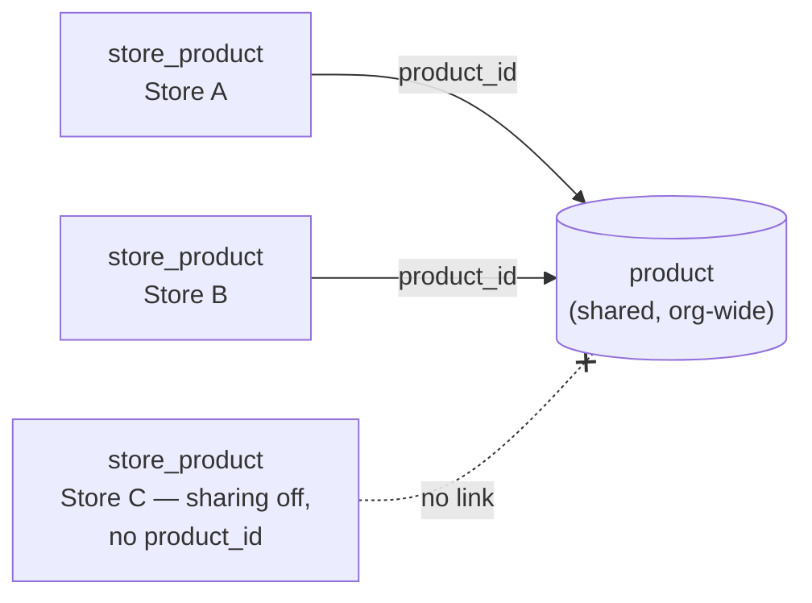
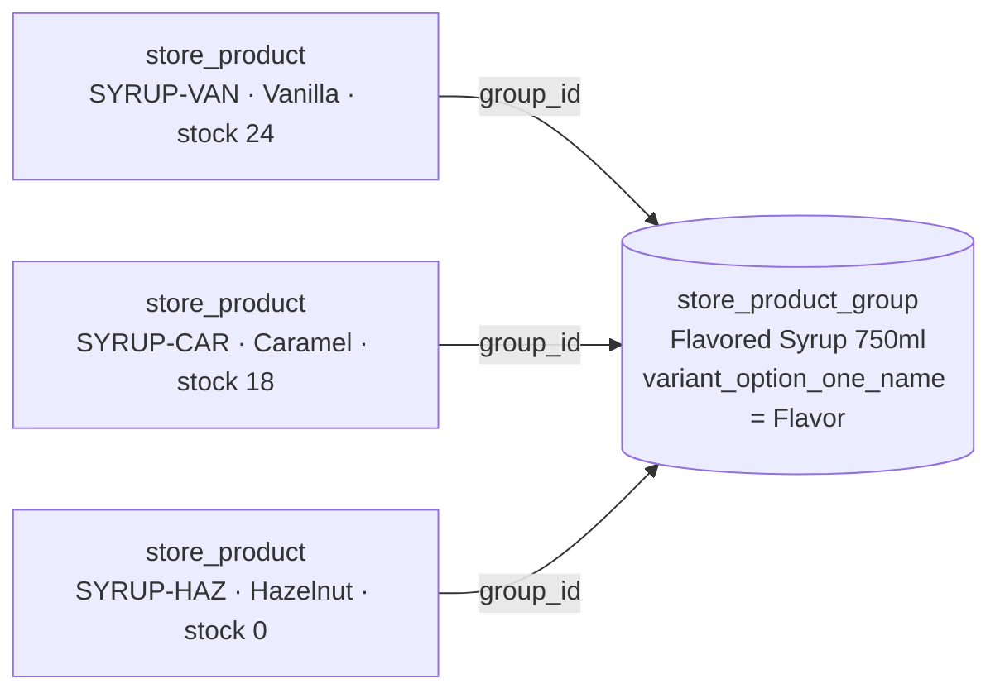
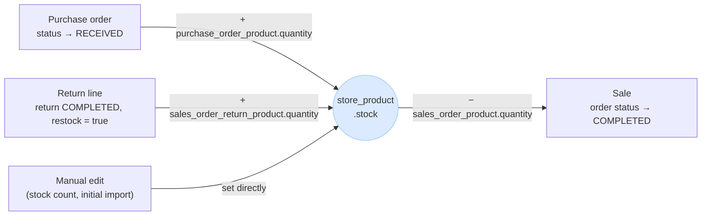

# Product schema

A product lives across up to three tables:

| Table | Written | Scope |
|---|---|---|
| `store_product` | Always, on every product create | One store, its own stock, price, and cost |
| `store_product_group` | Only when the product has variants (see [Variants](#variants)) | One store, groups a family of `store_product` rows |
| `product` | Only when `organization.allow_share_products` is on (off by default) | Org-wide, one shared identity, no stock/price/cost |

`store_product` never needs a `product` row to function. Every field a till or a storefront needs
(name, category, brand) lives directly on `store_product`, or on its `store_product_group` when the
product has variants. The shared `product` table only exists to let an org recognize "the same item"
across multiple stores; stock, price, and cost always stay per-store regardless of sharing (`CLAUDE.md`).
Sharing and variant grouping are independent of each other — see [Variants](#variants) for why.

Migrated in `tools/GekkoSuite.Database/Migrations/1_0_0.sql`; `store_product_group` and
`store_product.group_id` were added in `1_0_4.sql`.

## `store_product` — the store's own copy (always written)

| Field | Type | Required | Notes |
|---|---|---|---|
| `store_product_id` | UUID | PK | |
| `store_id` | UUID | Yes | FK → `store` |
| `organization_id` | UUID | Yes | FK → `organization` (tenant stamp, for RLS) |
| `product_id` | UUID | No | FK → `product`; set only when sharing is on |
| `group_id` | UUID | No | FK → `store_product_group`; set only when this row is one variant in a family — see [Variants](#variants) |
| `name` | VARCHAR(256) | See note | Display name. Required when `group_id` is NULL; must be NULL when `group_id` is set — the group owns naming for grouped variants |
| `description` | VARCHAR(1024) | No | Same NULL-when-grouped rule as `name` |
| `sku` | VARCHAR(64) | No | This store's own product code. Unique per store |
| `barcode` | VARCHAR(64) | No | Manufacturer UPC/EAN — what a barcode scan looks up, not `sku`. Unique per store |
| `category` | VARCHAR(128) | No | Free text, e.g. `Beverages`. Same NULL-when-grouped rule as `name` |
| `brand` | VARCHAR(128) | No | Free text, e.g. `Lavazza`. Same NULL-when-grouped rule as `name` |
| `variant_option_{one,two,three}_value` | VARCHAR | No | This variant's value along each dimension, e.g. `Vanilla`. The dimension *names* (e.g. `Flavor`) live once on `store_product_group`, not repeated per row — see [Variants](#variants) |
| `price` | NUMERIC | Yes | This store's selling price |
| `cost` | NUMERIC | No | What this store paid per unit — margin reporting, never shown at checkout |
| `stock` | INTEGER | Yes | Units on hand at this store. Can go negative (oversold/backorder) — never add a `>= 0` check |
| `track_inventory` | BOOLEAN | Yes, default `TRUE` | `FALSE` = stock never decrements (e.g. a service, not a good) |
| `is_taxable` | BOOLEAN | Yes, default `TRUE` | `FALSE` = always tax-exempt, `tax_rate` ignored |
| `tax_rate` | NUMERIC(5,2) | Yes, default `0` | Percentage, e.g. `8.25` |
| `reorder_point` | INTEGER | No | Low-stock alert threshold |
| `is_active` | BOOLEAN | Yes | Sellable toggle, independent of soft-delete |
| `created_at` / `updated_at` | TIMESTAMPTZ | Yes | |
| `is_deleted` / `deleted_at` | BOOLEAN / TIMESTAMPTZ | Yes / No | Soft-delete |

**Indexes:**
- `store_id`
- Unique on `(store_id, sku)`, where SKU is set and the row is not deleted
- Unique on `(store_id, barcode)`, where barcode is set and the row is not deleted
- `product_id`, where set
- `group_id`, where set

**Invariant:** `CHECK ((group_id IS NULL) = (name IS NOT NULL))` (constraint
`store_product_group_name_xor`) — a row either stands alone and owns its own name, or belongs to a
group and defers naming to it. Never both, never neither.

## `store_product_group` — the variant parent

Groups a family of `store_product` rows that are really "the same product" sold in different variants
(flavor, size, color, ...). Store-scoped, matching the rest of the catalog's default-isolated model —
each store manages its own groups, the same way it manages its own `store_product` rows.

| Field | Type | Required | Notes |
|---|---|---|---|
| `group_id` | UUID | PK | |
| `store_id` | UUID | Yes | FK → `store` |
| `organization_id` | UUID | Yes | FK → `organization` (tenant stamp, for RLS) |
| `name` | VARCHAR(256) | Yes | The product's display name — owned here, once, instead of on every variant row |
| `description` | VARCHAR(1024) | No | |
| `category` | VARCHAR(128) | No | Free text, e.g. `Beverages` |
| `brand` | VARCHAR(128) | No | Free text, e.g. `Lavazza` |
| `variant_option_{one,two,three}_name` | VARCHAR | No | Up to 3 variant dimension *names* this product varies along, e.g. `Flavor`. Defined once per group; each `store_product` variant supplies the matching `_value` |
| `created_at` / `updated_at` | TIMESTAMPTZ | Yes | |
| `is_deleted` / `deleted_at` | BOOLEAN / TIMESTAMPTZ | Yes / No | Soft-delete |

**Indexes:** `store_id`.

**A group is never itself sellable.** It has no `price`, `sku`, `stock`, or tax fields — those stay on
the `store_product` variant rows, exactly like the shared `product` table today. `sales_order_product`
and every other line-item table keep referencing `store_product` only; nothing downstream of a sale
changes.

**Lifecycle rules:**
- A group is only ever created together with its first variant, in the same transaction — there is no
  "create an empty group" action. This mirrors the same lesson already learned from the shared `product`
  table's known linking gap (see below): a grouping concept that can exist without anything grouped
  invites orphaned, meaningless records.
- Deleting or deactivating the last live variant in a group does **not** cascade-delete the group. The
  group persists, empty, until someone explicitly removes it or adds a new variant to it. No automatic
  cleanup — consistent with the rest of the schema, which never auto-cascades soft-deletes across an
  optional FK.

## `product` — the shared, org-wide identity (written only when sharing is on)

| Field | Type | Required | Notes |
|---|---|---|---|
| `product_id` | UUID | PK | |
| `organization_id` | UUID | Yes | FK → `organization` |
| `name` | VARCHAR(256) | Yes | |
| `description` | VARCHAR(1024) | No | |
| `category` | VARCHAR(128) | No | |
| `brand` | VARCHAR(128) | No | |
| `variant_option_{one,two,three}_value` | VARCHAR | No | Mirrors `store_product`'s per-variant value fields — dimension *names* live on `store_product_group`, not here |
| `created_at` / `updated_at` | TIMESTAMPTZ | Yes | |
| `is_deleted` / `deleted_at` | BOOLEAN / TIMESTAMPTZ | Yes / No | Soft-delete |

**Indexes:** `organization_id`.

There are no `price`, `cost`, `stock`, or tax fields on this table, by design. Those stay on
`store_product` only, since every store sets its own.

## How the two tables connect

The only link is `store_product.product_id` → `product.product_id`, nullable, set only when sharing is
on. Multiple `store_product` rows (one per store) can point at the same `product_id` — that's what lets
the org ask "how many of *this* item do we sell, across every store" instead of fuzzy-matching by name.

Who writes what, and when (`auth.md`):

| `allow_share_products` | `POST /stores/{storeId}/products` does |
|---|---|
| Off (default) | `INSERT store_product` only |
| On | `INSERT product`, then `INSERT store_product` linked to it, in the same transaction |

`product:create` is an ordinary, non-elevated store permission. A store Manager can only create at
their own store, while an org-level user can create into any store in the org the same way, just with a
different `{storeId}`. That last case, one org-level user seeding the same item into several stores, is
the main real-world reason the shared table exists.

Known gap: creating with sharing on always inserts a new `product` row; it never looks up an existing
shared product to link to instead. Two stores independently creating "Bic Lighter Blue" get two separate
shared rows, not one. This needs a matching step (SKU or barcode, or an explicit "link to existing" UI
action) before sharing ships. See `auth.md`'s open risk on editing and deleting a shared record, which
has the same root cause.

## Variants

A real parent/child relationship, via `store_product_group` (above). `store_product.group_id` is a
structural FK, not a string match — a row's *type* (standalone product vs. one variant in a family) is
unambiguous from its data, instead of being inferred from whether its `name` happens to match another
row's.

| Group: `name` | Variant: `sku` | `variant_option_one_value` | `stock` |
|---|---|---|---|
| Flavored Syrup 750ml | SYRUP-VAN | Vanilla | 24 |
| Flavored Syrup 750ml | SYRUP-CAR | Caramel | 18 |
| Flavored Syrup 750ml | SYRUP-HAZ | Hazelnut | 0 |

- The product list clusters variant rows by their shared `group_id` under one header row (family name,
  variant count), each variant shown indented with its own sku/price/stock/status. The create flow (v1)
  only exposes the first dimension slot; `_two`/`_three` exist in the schema for products that vary
  along more than one axis (flavor and size together) but aren't wired into the UI yet.
- Renaming the product is a single update, on the group — fixes the flat-table version's problem where
  no row owned "the product name."
- Each variant still sells out, goes inactive, or changes price independently — they're full
  `store_product` rows, not child line items. Hazelnut hitting `stock = 0` above doesn't touch Vanilla or
  Caramel.
- Grouping is orthogonal to sharing. If sharing is on, each variant row still links to its own
  `product_id` independently of its `group_id` — one axis says "this store's rows are the same product
  across stores," the other says "these rows in *this* store are variants of each other." Conflating them
  was the flaw in an earlier version of this design (`product` would have had to double as the variant
  parent, but it's already written per-variant-row when sharing is on, not once per family).

**Creating a variant** (`POST /stores/{storeId}/products`): either `groupId` (add to an existing family —
validated to belong to this store, `BadRequestException` otherwise) or `newGroup` (create the family and
this first variant together, atomically, in one statement — see the lifecycle rule above) may be set, not
both; `name`/`description`/`category`/`brand` must be omitted whenever either is set, since the group owns
those. **Renaming a family** goes through the separate `PATCH /stores/{storeId}/product-groups/{groupId}`
endpoint (`product:edit`), never through the product endpoint.

## What else `store_product` connects to

| Connects to | Relationship |
|---|---|
| `organization` | `store_product.organization_id` / `product.organization_id` — tenant boundary |
| `store` | `store_product.store_id` — the one store that owns this row |
| `product` | `store_product.product_id` — optional shared identity, see above |
| `store_product_group` | `store_product.group_id` — optional variant parent, see [Variants](#variants) |
| `supplier` | Not wired up yet — `supplier_id` is planned on both tables but deferred until `supplier` itself is migrated. See Known limitations |
| Sales, purchases, returns | Not referenced directly from `store_product` — they reference it, and drive `stock` up or down. See below |

### How `store_product.stock` changes

Four flows touch `stock`, each documented elsewhere in this repo. This is the one place they're pulled
into a single picture:

| Flow | Fires on | Effect | Source |
|---|---|---|---|
| Receiving inventory | `purchase_order.status` → `RECEIVED` | `+= purchase_order_product.quantity` per line | `database.md` |
| Selling | `sales_order.status` → `COMPLETED` | `-= sales_order_product.quantity` per line | `returns.md` Phase 0 |
| Returning | `sales_order_return.status` → `COMPLETED`, lines with `restock = true` | `+= sales_order_return_product.quantity` | `returns.md` Phase 1 |
| Manual correction | Staff edits the product directly | Set to whatever they enter | Initial import, recounts, shrinkage |

The change always happens in the same transaction as the status flip, not when the line is first
inserted. A `DRAFT` purchase order or `OPEN` sale has its line items on record but hasn't touched stock
yet. A `CANCELLED` order or `VOIDED` sale/return never crosses that line, so there's nothing to undo.
This is also why negative `stock` is expected rather than a bug: a sale can complete even when the count
is already wrong, and the negative number is the signal that a recount is overdue.

## Known limitations

- SKU casing isn't normalized. `HIDRIPS`, `HiDrips`, and `Hidrips` can coexist as three different SKUs
  under today's case-sensitive unique index. Normalize casing on write, or switch to `citext`.
- No dedupe on import. Literal duplicate rows (same barcode-as-SKU, different id) need an explicit
  merge decision, not a raw insert.
- `category` and `brand` are free text, not controlled vocabularies. Fine for MVP, but don't roll
  them up for reporting without trimming and normalizing first.
- `supplier_id` isn't wired up. Planned as a real FK on both tables once `supplier` is migrated;
  today there's no supplier link at all.
- Sharing can't match an existing shared product — see "Known gap" above.
- No way to change a group's variant dimension *names* once it has variants, move a variant to a
  different group, or delete/merge a group — all deliberately deferred, not built.
- The create-product UI only exposes the first of the three variant dimension slots; a product varying
  along two axes at once (e.g. flavor and size) needs the other two set directly through the API for now.
