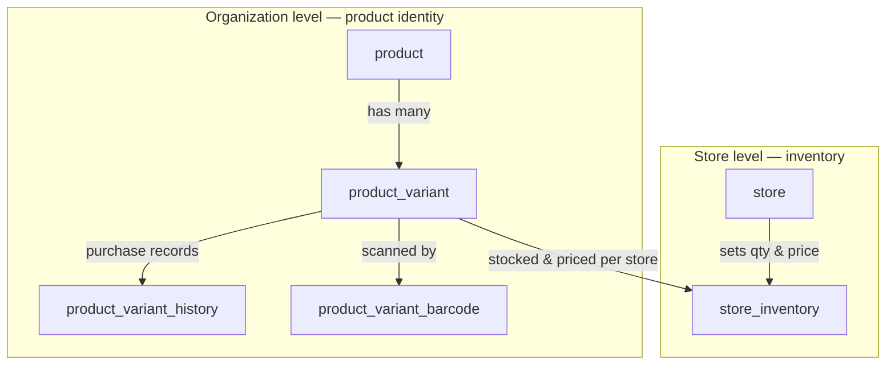

# Products & Inventory

How products are created at the **Organization** level, and how their inventory (quantity and price) is
managed per **Store**.

## The core split

- **Organization** defines *what exists* — products, their variants, SKUs, barcodes, and suppliers.
- **Store** decides *how much it has and what it charges* — the quantity and price of each variant it sells.

The same product/variant identity is shared org-wide, but **stock and price always live per-store**.

```
Organization  →  creates & owns Products and Variants (SKUs, barcodes, suppliers)
Store         →  sets quantity & price per variant (inventory)
```

## Products

A **product** is a good or service the organization wants to sell to its customers. It is created,
edited, and managed **only at the Organization level**; at the Store level, only its quantity and price
are set.

Internally, a product is just a **grouping of variants**. It carries a unique internal SKU that
identifies it for the organization, and by default we always create a **default variant** so it can be
sold as-is when it has no other options (e.g. a water bottle).

Products do **not** carry quantities from purchase orders — each variant carries its own quantity.

### Why products are managed at the Organization level

1. A product is something sold as part of the business.
2. It is usually created as a result of a Purchase Order to a Supplier — and both suppliers and purchase
   orders are managed at the Organization level.
3. Letting store-level users create or manage products risks them corrupting product details, SKUs, or
   variants — which can negatively impact stores across the whole organization.
4. Introducing a new product (NPI) is normally approved by an Organization user. It is rarely, if ever,
   the case that a store manager creates a product an Organization owner is unaware of.

## Variants

Products usually have many **variants** — a shirt has sizes, a phone has colors, a soda has flavors.
Rather than creating a separate product for every option, a product can have **unlimited variants**, each
with its own **unique SKU**.

- **Default variant** — every product gets a default variant matching the product's own SKU. For
  single-option products, store managers only need to stock this default variant.
- **Variant suppliers** — a variant can be purchased from many suppliers; 
- **Variant history** — to track purchases over time, we record the supplier, cost, date, and related
  purchase order for each variant.
- **Barcodes** — a variant can have many barcodes. A barcode is what a store cashier scans to find the
  variant SKU to sell, so multiple barcodes can point to the same variant SKU.

## Inventory

**Inventory** is what each store tracks on its own: the specific quantity and price of a given product
variant it has to sell.

When a store manager scans the barcode of a product shipment delivered to their store, the system finds
the matching variant SKU from the organization's product list and lets them set the **price and quantity
specific to their store**.

### Why inventory is managed at the Store level

1. Stock is physical and local — each store receives its own shipments and sells its own units, so
   quantity only makes sense per store, not org-wide.
2. Price varies by store — location, local demand, and costs mean the same variant can sell for
   different amounts at different stores.
3. It keeps stores independent — one store selling out or repricing a variant never affects another
   store's inventory.


# Database 

## ER Diagram

Each box is a table, grouped by the level that owns it. Everything about a product's **identity** lives in
the Organization block; the single **Store** block holds the only per-store table, `store_inventory`,
which sets quantity and price for a variant at a given store.



The one arrow crossing from the Organization block into the Store block — `product_variant →
store_inventory` — is the whole design: the org owns the variant's identity, the store owns its stock and
price.

## Schema