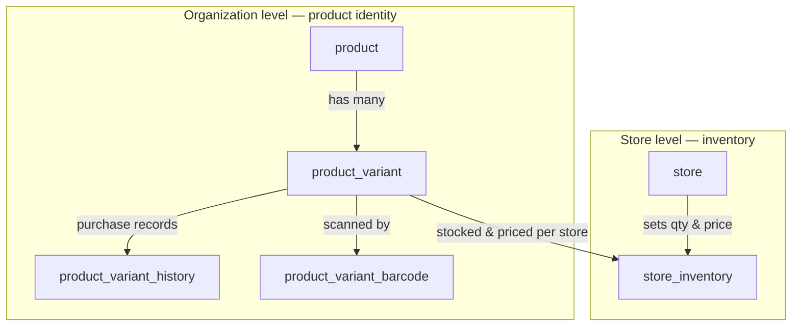

# Products & Inventory

How products are created at the **Organization** level, and how their inventory (quantity and price) is
managed per **Store**.

## The core split

- **Organization** defines *what exists* — products, their variants, SKUs, barcodes, and suppliers.
- **Store** decides *how much it has and what it charges* — the quantity and price of each variant it sells.

The same product/variant identity is shared org-wide, but **stock and price always live per-store**.

```
Organization  →  creates & owns Products and Variants (SKUs, barcodes, suppliers)
Store         →  sets quantity & price per variant (inventory)
```

## Products

A **product** is a good or service the organization wants to sell to its customers. It is created,
edited, and managed **only at the Organization level**; at the Store level, only its quantity and price
are set.

Internally, a product is just a **grouping of variants**. It carries a unique internal SKU that
identifies it for the organization, and by default we always create a **default variant** so it can be
sold as-is when it has no other options (e.g. a water bottle).

Products do **not** carry quantities from purchase orders — each variant carries its own quantity.

### Why products are managed at the Organization level

1. A product is something sold as part of the business.
2. It is usually created as a result of a Purchase Order to a Supplier — and both suppliers and purchase
   orders are managed at the Organization level.
3. Letting store-level users create or manage products risks them corrupting product details, SKUs, or
   variants — which can negatively impact stores across the whole organization.
4. Introducing a new product (NPI) is normally approved by an Organization user. It is rarely, if ever,
   the case that a store manager creates a product an Organization owner is unaware of.

## Variants

Products usually have many **variants** — a shirt has sizes, a phone has colors, a soda has flavors.
Rather than creating a separate product for every option, a product can have **unlimited variants**, each
with its own **unique SKU**.

- **Default variant** — every product gets a default variant matching the product's own SKU. For
  single-option products, store managers only need to stock this default variant.
- **Variant suppliers** — a variant can be purchased from many suppliers; 
- **Variant history** — to track purchases over time, we record the supplier, cost, date, and related
  purchase order for each variant.
- **Barcodes** — a variant can have many barcodes. A barcode is what a store cashier scans to find the
  variant SKU to sell, so multiple barcodes can point to the same variant SKU.

## Inventory

**Inventory** is what each store tracks on its own: the specific quantity and price of a given product
variant it has to sell.

When a store manager scans the barcode of a product shipment delivered to their store, the system finds
the matching variant SKU from the organization's product list and lets them set the **price and quantity
specific to their store**.

### Why inventory is managed at the Store level

1. Stock is physical and local — each store receives its own shipments and sells its own units, so
   quantity only makes sense per store, not org-wide.
2. Price varies by store — location, local demand, and costs mean the same variant can sell for
   different amounts at different stores.
3. It keeps stores independent — one store selling out or repricing a variant never affects another
   store's inventory.


# Database 

## ER Diagram

Each box is a table, grouped by the level that owns it. Everything about a product's **identity** lives in
the Organization block; the single **Store** block holds the only per-store table, `store_inventory`,
which sets quantity and price for a variant at a given store.



The one arrow crossing from the Organization block into the Store block — `product_variant →
store_inventory` — is the whole design: the org owns the variant's identity, the store owns its stock and
price.

## Schema


```sql
-- A product: a good or service the org sells. Org-level identity only — a grouping of variants. Stock and
-- price are NOT here; they live per-variant/per-store (see store_inventory).
CREATE TABLE product (
    -- product id
    product_id      UUID PRIMARY KEY,
    -- the owning org (the tenant boundary — stamped for RLS)
    organization_id UUID NOT NULL REFERENCES organization (organization_id),
    -- product display name, e.g. 'Cotton T-Shirt'
    name            VARCHAR(256) NOT NULL,
    -- optional human description
    description     VARCHAR(1024),
    -- internal stock-keeping unit; the org's own product code (unique per org — index below)
    sku             VARCHAR(64) NOT NULL,
    -- when the product was created (stored UTC)
    created_at      TIMESTAMPTZ NOT NULL,
    -- when it was last modified (stored UTC)
    updated_at      TIMESTAMPTZ NOT NULL,
    -- soft-delete flag; TRUE = removed but kept for history
    is_deleted      BOOLEAN NOT NULL,
    -- when it was soft-deleted (stored UTC); NULL while active
    deleted_at      TIMESTAMPTZ
);
CREATE INDEX ON product (organization_id);
-- a product SKU is unique within an org 
CREATE UNIQUE INDEX product_sku_per_org ON product (organization_id, sku);

-- A product_variant: one sellable option of a product (a size, color, flavor). Every product has a
-- DEFAULT variant matching the product's own SKU so single-option products just stock that one.
CREATE TABLE product_variant (
    -- variant id
    variant_id      UUID PRIMARY KEY,
    -- the product this variant belongs to
    product_id      UUID NOT NULL REFERENCES product (product_id),
    -- the owning org (the tenant boundary)
    organization_id UUID NOT NULL REFERENCES organization (organization_id),
    -- variant display name, e.g. 'Large / Black'
    name            VARCHAR(256) NOT NULL,
    -- variant stock-keeping unit; uniquely identifies this variant (unique per org — index below)
    sku             VARCHAR(64) NOT NULL,
    -- TRUE = the auto-created default variant (matches the product's SKU); exactly one per product
    is_default      BOOLEAN NOT NULL,
    -- when the variant was created (stored UTC)
    created_at      TIMESTAMPTZ NOT NULL,
    -- when it was last modified (stored UTC)
    updated_at      TIMESTAMPTZ NOT NULL,
    -- soft-delete flag; TRUE = removed but kept for history
    is_deleted      BOOLEAN NOT NULL,
    -- when it was soft-deleted (stored UTC); NULL while active
    deleted_at      TIMESTAMPTZ
);
CREATE INDEX ON product_variant (product_id);
-- a variant SKU is unique within an org 
-- @TODO: always has parent sku in front of it and "-" after, 
-- must be unique even for a product not just this table
CREATE UNIQUE INDEX product_variant_sku_per_org ON product_variant (organization_id, sku);
-- exactly one default variant per product 
CREATE UNIQUE INDEX product_variant_one_default_per_product ON product_variant (product_id) WHERE is_default;

-- A product_variant_barcode: a scannable code that resolves to a variant. Many barcodes can point to the
-- same variant (e.g. different packaging), so the barcode is the unique key.
CREATE TABLE product_variant_barcode (
    -- barcode id
    barcode_id      UUID PRIMARY KEY,
    -- the variant this barcode resolves to
    variant_id      UUID NOT NULL REFERENCES product_variant (variant_id),
    -- the owning org (the tenant boundary — stamped for RLS)
    organization_id UUID NOT NULL REFERENCES organization (organization_id),
    -- the scanned code (UPC/EAN/etc.); the cashier scans this to find the variant
    barcode         VARCHAR(128) NOT NULL,
    -- when the barcode was added (stored UTC)
    created_at      TIMESTAMPTZ NOT NULL,
    -- a barcode value is unique within an org (no two variants share a scannable code)
    UNIQUE (organization_id, barcode)
);
CREATE INDEX ON product_variant_barcode (variant_id);

-- A product_variant_history: an append-only record of each purchase of a variant — what it cost, when, and
-- from which supplier/purchase order. Used to track variant cost over time.
CREATE TABLE product_variant_history (
    -- history row id
    history_id        UUID PRIMARY KEY,
    -- the variant this purchase record is for
    variant_id        UUID NOT NULL REFERENCES product_variant (variant_id),
    -- the owning org (the tenant boundary — stamped for RLS)
    organization_id   UUID NOT NULL REFERENCES organization (organization_id),
    -- the supplier this quantity was sourced from
    supplier_id       UUID NOT NULL REFERENCES supplier (supplier_id),
    -- the purchase order this record came from
    purchase_order_id UUID NOT NULL REFERENCES purchase_order (purchase_order_id),
    -- units purchased in this record
    quantity          INTEGER NOT NULL,
    -- unit cost paid (what the org paid, not the store's selling price)
    unit_cost         NUMERIC NOT NULL,
    -- when the purchase occurred (stored UTC)
    purchased_at      TIMESTAMPTZ NOT NULL
);
CREATE INDEX ON product_variant_history (variant_id);

-- A store_inventory: a variant as stocked AT ONE STORE — its own quantity and price. The only per-store
-- product table; stock and price are ALWAYS per-store, never shared (see tenancy.md / CLAUDE.md).
CREATE TABLE store_inventory (
    -- store_inventory id
    store_inventory_id UUID PRIMARY KEY,
    -- the store this inventory row belongs to (its business unit)
    store_id           UUID NOT NULL REFERENCES store (store_id),
    -- the variant being stocked
    variant_id         UUID NOT NULL REFERENCES product_variant (variant_id),
    -- this store's selling price for the variant (never shared across stores)
    price              NUMERIC NOT NULL,
    -- units on hand at this store (never shared across stores)
    stock              INTEGER NOT NULL,
    -- listing toggle; FALSE = hidden from selling at this store but kept
    is_active          BOOLEAN NOT NULL,
    -- when the variant was first stocked at this store (stored UTC)
    created_at         TIMESTAMPTZ NOT NULL,
    -- when it was last modified (stored UTC)
    updated_at         TIMESTAMPTZ NOT NULL,
    -- soft-delete flag; TRUE = removed from this store but kept for history
    is_deleted         BOOLEAN NOT NULL,
    -- when it was soft-deleted (stored UTC); NULL while active
    deleted_at         TIMESTAMPTZ
);
CREATE INDEX ON store_inventory (store_id);
-- a variant is stocked at most once per store (only live rows count)
CREATE UNIQUE INDEX store_inventory_variant_per_store ON store_inventory (store_id, variant_id) WHERE NOT is_deleted;
```

`supplier` and `purchase_order` are referenced by `product_variant_history` but defined elsewhere (they're
Organization-level purchasing tables — see `docs/database.md`).