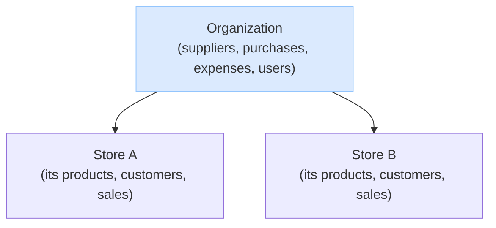

# Tenancy — Organizations & Stores

How the organization and its stores relate: who owns what, what each store manages on its own, and how money flows.

## The model

- An **organization** is the business. It owns many **stores**.
- A **store** is the real **business unit** — it's where selling happens. Selling always goes through a store; you can't sell "at the org."
- Each **store owns its own selling data**: its products (each with their own stock and price), its customers, and its sales and returns. Stores don't share these — Store A's products and customers are its own.
- The **organization handles everything central**: it owns the suppliers, does all purchasing (buying inventory) and expense spending, and manages stores and users.

So a store is an independent selling front; the organization sits above, owns the money side, and manages the company.

## The organization is the tenant

The **organization — not the store — is the tenant**: the unit of isolation. One org is one self-contained world, and nothing crosses between orgs. A user belongs to exactly one org (`user.organization_id`, set once and never changed), the login token carries that org id, and it is the hard boundary every request is checked against — you can never act on anything outside your own org.

A **store is not a tenant.** It's a **resource the org owns** — the one resource you can also **scope a person's access to** (you can be a member "at" a store). A person's reach within the org is set by their `user_type`: an organization user acts across the whole org, a store user is scoped to the specific store(s) they belong to.

# FAQ

## What does a store own, and what does the organization own?

**A store owns its selling data:** its products (`store_product` — each with its own SKU, stock, and price), its customers, and its sales and returns. These are the store's alone; other stores don't see them.

**The organization owns the central pieces:** suppliers, purchasing (`purchase_order`), expenses, and the management of stores and users. Money flowing *out* of the business — buying inventory and paying expenses — is an organization action, not a store one.

So a store is purely a **selling** unit; the organization handles **procurement, spending, and administration**.

## How do products, prices, and stock work?

Each **store has its own products**. A product (`store_product`) belongs to one store and carries that store's SKU, stock quantity, and price. Store A's "Coke" and Store B's "Coke" are separate records, each with their own stock — selling at Store A never touches Store B.

There is no shared org-wide catalog: stores stay in their own domain. (An optional org-wide sharing setting — one catalog across stores — is planned for after MVP; see `post-mvp.md`.)

## Are customers per-store or shared?

**Per-store.** A customer belongs to one store. The same person shopping at two stores is two customer records — each store keeps its own customer list, and other stores don't see it. (Org-wide customer sharing is a planned post-MVP setting; see `post-mvp.md`.)

## How does buying inventory and spending work?

**The organization is the single source of funds, and it does all the spending.** There's no per-store bank account; the real money lives in the company's own bank (outside this system) and we record what happens. Stores **sell**; the organization **buys and pays**.

Two kinds of org spending, kept separate for accounting:

- **Inventory** — recorded as a `purchase_order` (bought from a supplier). This is cost-of-goods.
- **Expenses** — non-inventory things like furniture, computers, utilities — recorded as an `expense`.

Both are created by **organization users**. Each can optionally be **attributed to a store** (a `store_id` on the record) and carry a **description** of why it was made — so the owner knows the reason, and a store admin can look up the purchases and expenses tied to their store. But the action itself, and the money, belong to the organization.
