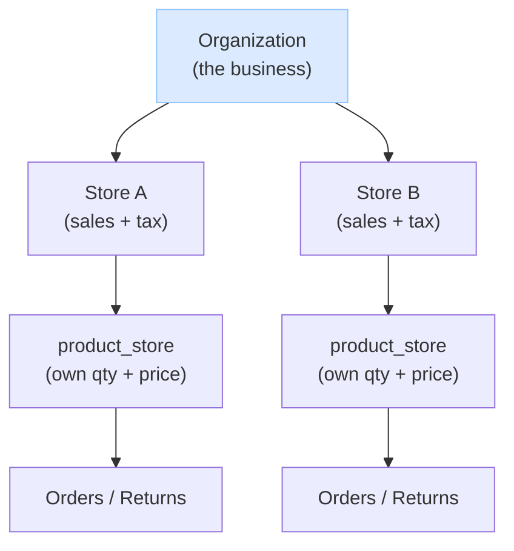
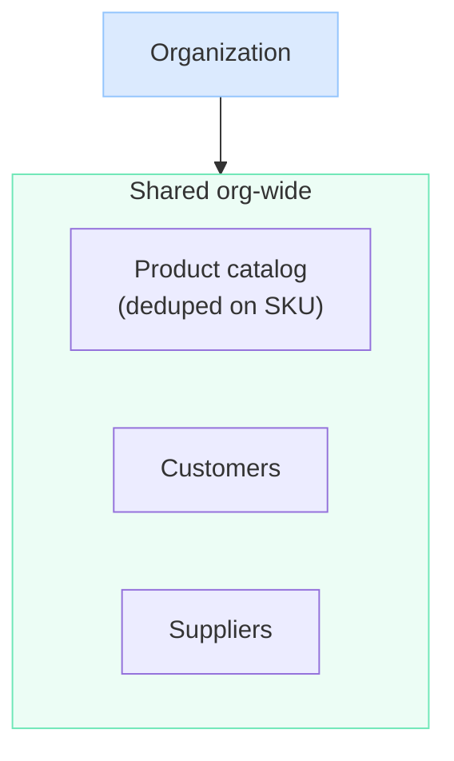

# Tenancy — Organizations & Stores

How the organization and its stores relate: who owns what, what's shared org-wide, what each store manages on its own, and how money flows.


## The model

- An **organization** is the business. It owns many **stores**.
- A **store** is the real **business unit** — it's where sales, tax, and money happen. Selling always goes through a store; you can't sell "at the org."
- The org is the **shared backbone**: people (users), the product catalog, customers, suppliers, and funds all live at the org and are visible to every store.
- Each **store runs its own day-to-day**: it sets its own stock and price for catalog products, and records its own sales, returns, and purchases.

So the org is the umbrella that holds everything shared; each store is an independent selling unit on top of it.


## The organization is the tenant

The **organization — not the store — is the tenant**: the unit of isolation. One org is one self-contained world, and nothing crosses between orgs. A user is born into exactly one org (`user.organization_id`, set once and never changed), the login token carries that org id, and it is the hard boundary every request is checked against — you can never act on anything outside your own org.

A **store is not a tenant.** It's a **resource the org owns**, like the product catalog, customers, suppliers, and orders. What makes a store a little special is that it's the one resource you can also **scope a person's access to** — you can be a member "at" a store. But that's an access scope *inside* the tenant, not a tenant of its own.

This is why a user having access to several stores doesn't break isolation: those stores are all resources inside the *same* org. Reaching many stores is ordinary access *within* one tenant — not access *across* tenants. Isolation is only ever about org-to-org; everything a user does among the stores and data of their own org is normal in-tenant authorization (see `auth.md`).

So the picture is: **one org = one isolated tenant; stores and all other entities are resources it owns; a store is the resource you can also scope membership to.** A person's reach within that tenant is set by their `user_type` — an organization user acts across the whole org, a store user is scoped to specific stores.




## What's shared org-wide

The product catalog, customers, and suppliers belong to the org and every store sees them — nothing is re-entered per store.



Each store draws from this shared data: it stocks products from the one catalog (setting its own qty/price in `product_store`), and reuses the org's customers and suppliers.

## How do products, prices, and stock work across stores?

There is **one product catalog for the whole organization** — a product (its SKU, name, description) is an org-level identity, deduped on SKU, so "Coke SKU-123" is a single catalog entry the whole org shares. No duplicating the same product in every store.

Each store then sets its **own price and quantity** for the products it carries. That per-store stock and price live in `product_store` (one row per product per store), independent of every other store:

```
product (org catalog)        product_store (per store)
 sku       name               store    sku        qty   price
 -------   -----              ------   --------    ---   -----
 SKU-123   Coke               StoreA   SKU-123     40    1.50
                              StoreB   SKU-123     12    1.75
```

So the *identity* is shared (one SKU across the org), but the *stock and price* are each store's own — selling at Store A doesn't touch Store B's quantity. (Cross-store stock sharing — e.g. an online store deducting a physical store — is deferred to the future workflow engine; see `post-mvp.md`.)


## Are customers and suppliers per-store or shared across the organization?

**Org-level and visible to every store.** A customer is one account for the whole organization — walk into any store and use the same account. A supplier is one vendor record the whole org deals with. Neither is duplicated per store, and the org admin sees all customers and suppliers across all stores at once.

This fits the niche (a tightly-coupled single company, not independent franchises): stores naturally work with the same customers and suppliers, so there's no per-store wall or visibility toggle. Per-store customer/supplier data (e.g. different reward tiers, store-specific vendor terms) is intentionally **not** modeled now; if it's ever needed it's an additive change, not a rework.


## How do store funds work, and how does a store buy inventory?

**The organization is the single source of funds.** There's no per-store bank account or balance — these are small businesses with one business account, and a store is just a selling front that operates against the org's money. The real money lives in the company's own bank (outside this system); we record what happens, we don't hold funds.

**Stores still operate on their own — that's permissions, not money.** A store manager can sell and buy inventory without the owner approving each action, because they hold store-level roles with the right permissions (`order:sell`, `purchase:create`, etc.). The owner delegates once by granting the role; they don't micromanage. (See `auth.md` for how roles and permissions work.)

**Two kinds of spending — inventory vs. expenses.** A store spends money two ways, and we keep them separate because they're different for accounting:

- **Inventory** it resells — recorded as a `purchase_order` (with product lines, affects stock). This is cost-of-goods.
- **Expenses** — non-resale things like furniture, computers, utilities — recorded as an `expense` (a category + amount, a vendor like Amazon/Staples, no product, no stock effect). These are operating expenses. An expense can belong to a **store** (location overhead, depletes that store's `expense_balance`) **or to the org directly** (HQ overhead with no store — the POS subscription, the accountant, company-wide software). Inventory (`purchase_order`) is always store-located; expenses can be org-level because some costs aren't tied to a location.

**Bounding a store's spending — two optional balances.** To control how much a store can spend without micromanaging, each store has two optional allowances the org admin sets:

- **`purchase_balance`** — caps inventory buying.
- **`expense_balance`** — caps non-inventory expense spending.

Each works the same way and **depletes independently**: when a store records a purchase (or expense), the system writes the record **and** subtracts its total from the matching balance, in one transaction. The action is **rejected if it exceeds the remaining balance**; at zero the store can't spend in that category until the owner raises the number ("tops up"). **`NULL` = unlimited** for either — a store the owner fully trusts has no cap.

So the owner sets each store's purchasing and expense power separately, the store spends autonomously, every purchase and expense is recorded (so the balances always reconcile to real records), and the money itself is always the org's.
