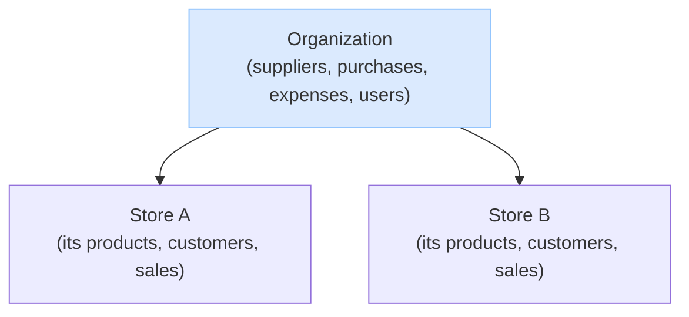

# Tenancy — Organizations & Stores

How the organization and its stores relate: who owns what, what each store manages on its own, and how money flows.

## The model

- An **organization** is the business. It owns many **stores**.
- A **store** is the real **business unit** — it's where selling happens. Selling always goes through a store; you can't sell "at the org."
- Each **store owns its own selling data**: its products (each with their own stock and price), its customers, and its sales and returns. By default stores don't share these — Store A's products and customers are its own.
- **Products and customers can optionally be shared org-wide.** An org can turn on sharing (per entity — products, customers, or both). With it off (the default), each store is isolated; with it on, a product or customer created at one store is recognized at every store. Stock and price stay per-store even when the catalog identity is shared.
- The **organization handles everything central**: it owns the suppliers, does all purchasing (buying inventory) and expense spending, and manages stores and users.

So a store is an independent selling front; the organization sits above, owns the money side, manages the company, and decides whether the catalog and customers are shared across its stores.

## The organization is the tenant

The **organization — not the store — is the tenant**: the unit of isolation. One org is one self-contained world, and nothing crosses between orgs. A user belongs to exactly one org (`user.organization_id`, set once and never changed), the login token carries that org id, and it is the hard boundary every request is checked against — you can never act on anything outside your own org.

A **store is not a tenant.** It's a **resource the org owns** — the one resource you can also **scope a person's access to** (you can be a member "at" a store). A person's reach within the org is set by their membership: an organization membership acts across the whole org, a store membership is scoped to the specific store(s) they belong to (see `auth.md`).

# FAQ

## What does a store own, and what does the organization own?

**The store owns selling; the organization owns the money and the admin.**

A **store** owns its selling data: its products (`store_product` — each with its own SKU, stock, and price), its customers (`store_customer`), and its sales and returns. By default these are the store's alone; other stores don't see them.

The **organization** owns the central pieces: suppliers, purchasing (`purchase_order`), expenses, and the management of stores and users — anything where money leaves the business or the company itself is being administered. It also holds the **sharing settings** and, when they're on, the **shared** product catalog (`product`) and customer base (`customer`).

So a store is purely a **selling** unit; the organization handles **procurement, spending, administration, and whether products and customers are shared**.

## How do products, prices, and stock work?

**Each store has its own product rows; whether they roll up into one shared catalog is an org setting.**

A store's products live in `store_product`, each carrying that store's SKU, stock, and price. Store A's "Coke" and Store B's "Coke" are separate rows with separate stock — selling at Store A never touches Store B. That's always true, **even when sharing is on**: stock and price are always per-store.

What the `share_products` setting changes is only whether stores share one *catalog identity*:

- **Off (default):** each store's products are entirely its own; there's no org-wide catalog.
- **On:** creating a product also writes a shared `product` row — the org-wide SKU identity — that the store's row links to. Now the same product is recognized across stores (useful for cross-store reporting and reuse), while each store still prices and stocks it independently.

## Are customers per-store or shared?

**By default per-store; the org can flip on sharing so a customer is recognized at every store.**

A store's customers always live in `store_customer`. The `share_customers` setting decides whether they also become an org-wide account:

- **Off (default):** a customer belongs to one store. The same person shopping at two stores is two separate records, and stores don't see each other's.
- **On:** creating a customer also writes a shared `customer` row that the store's row links to, so the customer is recognized at every store in the org (the basis for cross-store loyalty).

Either way the store keeps its own `store_customer` row; sharing just adds the org-wide `customer` link on top.

## How does buying inventory and spending work?

**The organization is the single source of funds and does all the spending — stores only sell.**

There's no per-store bank account. The real money lives in the company's own bank (outside this system); we just record what happens. The org's spending is split in two, kept separate for accounting:

- **Inventory** — a `purchase_order` (bought from a supplier). This is cost-of-goods.
- **Expenses** — non-inventory things like furniture, computers, or utilities — an `expense`.

Both are created by **organization users**. Each can optionally be **attributed to a store** (a `store_id` on the record) with a **description** of why — so the owner knows the reason and a store admin can look up the purchases and expenses tied to their store. But the action, and the money, belong to the organization. A store that needs something raises a request rather than spending directly.

## Can a store see or use another store's products or customers?

**Not by default — and only if the organization allows it.**

With sharing off, a store is fully isolated: it can't see another store's products or customers at all. Two ways the org can open that up:

- **Turn on sharing** (`share_products` / `share_customers`) — then the catalog or customer base is org-wide and every store sees it.
- **Grant scoped access** — the org can give a user a role (e.g. read-only products) at a *second* store, so they can view that store's data without sharing being on for everyone. Access to another store always comes from a membership there; there's no back door.
